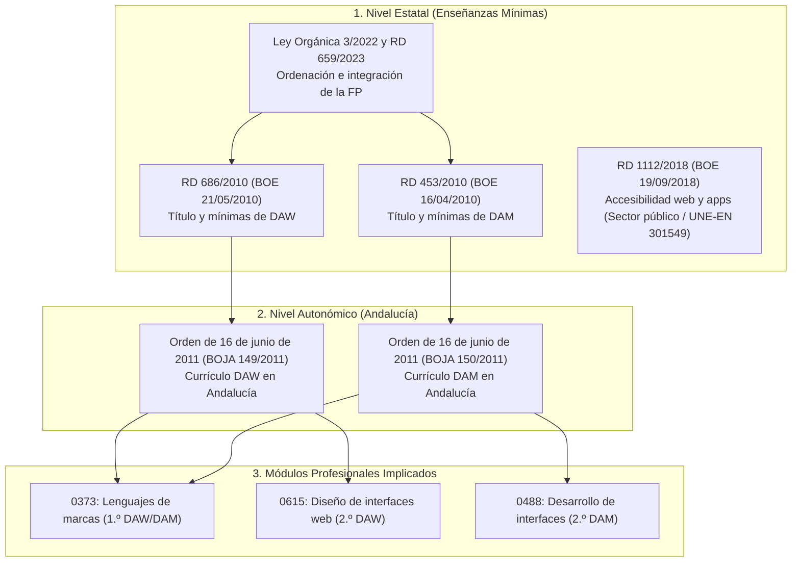

# Unidad 00 · Normativa y marco curricular

Antes de entrar en materia técnica, conviene situar **qué nos exige el currículo oficial**, **dónde se define** y **cómo se justifica** cada decisión de diseño y maquetación. En una prueba de evaluación, en un proyecto integrado o en una programación didáctica, saber citar la norma correcta y justificar el cumplimiento de los estándares y la legislación de accesibilidad es parte esencial de la competencia profesional técnica.

!!! note "Conocimientos previos"

    - Qué es un **módulo profesional**, un **resultado de aprendizaje (RA)** y un **criterio de evaluación (CE)**.
    - Diferenciar entre normativa estatal (**BOE**) y autonómica andaluza (**BOJA**).
    - Tu ciclo formativo: **DAW** (Desarrollo de Aplicaciones Web) o **DAM** (Desarrollo de Aplicaciones Multiplataforma), y tus módulos asociados: **0373 (LMSGI/LMH)** en 1.º, **0615 (DIW)** en 2.º de DAW o **0488 (DI)** en 2.º de DAM.

---

## 1. El marco normativo de la FP en Andalucía



### 1.1. Nivel estatal

| Norma | Qué establece |
|---|---|
| **Real Decreto 686/2010**, de 20 de mayo (BOE 21/05/2010) | Establece el título de **Técnico Superior en Desarrollo de Aplicaciones Web (DAW)** y fija sus enseñanzas mínimas: objetivos generales, módulos (2.000 h) y criterios de evaluación. |
| **Real Decreto 453/2010**, de 16 de abril (BOE 16/04/2010) | Establece el título de **Técnico Superior en Desarrollo de Aplicaciones Multiplataforma (DAM)** y fija sus enseñanzas mínimas correspondientes. |
| **Ley Orgánica 3/2022** y **Real Decreto 659/2023**, de 18 de julio | Marco general de ordenación del Sistema de Formación Profesional (modelo dual generalizado, competencias digitales, inclusión y sostenibilidad). |
| **Real Decreto 1112/2018**, de 7 de septiembre (BOE 19/09/2018) | Transposición de la Directiva (UE) 2016/2102 sobre **accesibilidad de los sitios web y aplicaciones para dispositivos móviles**, obligando al cumplimiento de la norma **UNE-EN 301549** (equivalente a WCAG 2.1 nivel AA). |

### 1.2. Nivel autonómico (Andalucía)

| Norma | Qué establece |
|---|---|
| **Orden de 16 de junio de 2011** (DAW, BOJA n.º 149, de 1 de agosto de 2011) | Desarrolla el currículo andaluz para **DAW**: fija los Resultados de Aprendizaje (RA), Criterios de Evaluación (CE), contenidos y orientaciones pedagógicas de los módulos **0373** y **0615**. |
| **Orden de 16 de junio de 2011** (DAM, BOJA n.º 150, de 2 de agosto de 2011) | Desarrolla el currículo andaluz para **DAM**: fija los RA, CE y contenidos de los módulos **0373** y **0488**. |
| Ley 17/2007 (LEA) y Decreto 436/2008 | Marco andaluz de educación y formación profesional inicial. |

> **Cadena de justificación normativa en examen / programación didáctica**:  
> `Reales Decretos estatales (RD 686/2010 / RD 453/2010) → Órdenes andaluzas de 16/06/2011 (BOJA 149 y 150) → Programación didáctica de departamento`.  
> Las 3 horas de libre configuración autonómica permiten justificar la incorporación de tecnologías punteras (Container Queries, Subgrid, `@layer`, espacios de color `oklch`).

---

## 2. Resultados de aprendizaje aplicables a CSS

### 2.1. Módulo 0373 — Lenguajes de marcas y sistemas de gestión de información (128 h, 7 ECTS)

El bloque de CSS corresponde al **Resultado de aprendizaje 2**:

> **«Utiliza lenguajes de marcas para la transmisión de información a través de la Web analizando la estructura de los documentos e identificando sus elementos».**

| CE | Texto curricular oficial | Unidades de estos apuntes |
|---|---|---|
| **2.g** | Se han identificado las **ventajas que aporta la utilización de hojas de estilo**. | **U01** (separación de responsabilidades, mantenibilidad, consistencia) |
| **2.h** | Se han **aplicado hojas de estilo**. | **U01–U12** (todo el cuerpo técnico del lenguaje) |
| **2.i** | Se han utilizado herramientas para verificar la sintaxis y accesibilidad. | **U14** (Validador W3C, DevTools, Lighthouse) |

---

### 2.2. Módulo 0615 — Diseño de interfaces web (80 h, 9 ECTS - 2.º DAW)

El módulo **0615 (DIW)** es el núcleo de la maquetación y el diseño en el ciclo DAW:

| RA | Enunciado | Criterios clave | Unidades |
|---|---|---|---|
| **RA 1** | Planifica la creación de una interfaz web valorando y aplicando especificaciones de diseño | Comunicación visual; selección de **colores y tipografías** para pantalla; **guía de estilo**; plantillas de diseño; maquetación y elementos de ordenación | **U08**, **U09**, **U10**, **U12** |
| **RA 2** | Crea interfaces Web homogéneos definiendo y aplicando estilos | Estilos directos; **hojas externas**; **hojas de estilo alternativas**; redefinición de estilos; **clases de estilos**; **validación**; guía de estilo | **U01**, **U02**, **U12**, **U14** |
| **RA 3 y 4** | Prepara e integra contenido multimedia en documentos Web | Formatos de imagen (AVIF, WebP, SVG); optimización; `object-fit`, `aspect-ratio`, filtros | **U09**, **U11** |
| **RA 5** | Desarrolla interfaces Web **accesibles** | W3C; **WCAG 2.1/2.2**; **RD 1112/2018**; ratios de contraste; foco visible (`:focus-visible`); modos de color adaptativo | **U13** |
| **RA 6** | Desarrolla interfaces Web **amigables** (usabilidad) | Uso de estándares; facilidad de navegación; diseño responsivo (Mobile-First, Container Queries); rendimiento web | **U10**, **U13**, **U14** |

> **Nota curricular sobre maquetación**: El RA 1 cita históricamente «marcos, tablas y capas». Los *frames* (`<frameset>`) están **obsoletos** y no se utilizan; las tablas se reservan exclusivamente a datos tabulares. El estándar moderno de maquetación se fundamenta en **CSS Grid** y **Flexbox** (unidades 05–07).

---

### 2.3. Módulo 0488 — Desarrollo de interfaces (140 h, 9 ECTS - 2.º DAM)

En 2.º curso de DAM, CSS es la tecnología base para el estilado de componentes web incrustados (*WebViews*, aplicaciones híbridas y escritorio multiplataforma):

- **RA 4:** Diseña interfaces gráficas adaptables a diferentes resoluciones, pantallas táctiles y densidades de píxel.
- **RA 5:** Desarrolla componentes de interfaz accesibles cumpliendo las pautas internacionales de usabilidad y diseño universal.

---

## 3. El W3C y la estandarización de CSS

CSS no es una invención de un navegador: es un **estándar abierto** desarrollado por el **World Wide Web Consortium (W3C)** a través del **CSS Working Group (CSS WG)**.

### 3.1. Proceso de estandarización

1. **Working Draft (WD):** Borrador de trabajo; en discusión y sujeto a cambios.
2. **Candidate Recommendation (CR / CRD):** Candidato a recomendación; los navegadores implementan la especificación de forma estable.
3. **Recommendation (REC):** Estándar oficial definitivo y maduro del W3C.

### 3.2. De CSS 2.1 a la modularización («CSS3 y CSS moderno»)

- **CSS1 (1996) y CSS2.1 (2011):** Documentos monolíticos únicos.
- **Modularización (a partir de 2011):** CSS se dividió en **módulos independientes** que evolucionan por separado con sus propios niveles (Selectors Level 4, Color Level 5, Grid Level 2, Cascade Level 5).
- **«CSS4» no existe como especificación cerrada:** Hoy se habla formalmente de **CSS Moderno** o de los **niveles de cada módulo específico**.

### 3.3. Módulos más relevantes en el currículo

| Módulo (Especificación) | Contenido clave | Estado W3C |
|---|---|---|
| **Selectors Level 4** | `:has()`, `:is()`, `:where()`, `:focus-visible`, `:user-invalid`, selectores estructurales | WD (Soporte universal) |
| **Color Level 4 / 5** | `oklch()`, `color-mix()`, `light-dark()` | WD (Soporte universal) |
| **Box Alignment Level 3** | `gap`, `place-items`, `place-content`, alineación moderna | WD (Soporte universal) |
| **Flexbox Level 1** | Modelo de cajas flexibles unidimensional | REC |
| **Grid Layout Level 2** | Cuadrícula bidimensional + **Subgrid** | CRD (Soporte universal) |
| **Containment Level 3** | **Container Queries (`@container`)**, `container-type`, unidades `cqw` | WD (Soporte universal) |
| **CSS Nesting Level 1** | Anidación nativa con `&` | WD (Soporte universal) |
| **Cascade & Inheritance Level 5/6** | Capas de cascada (**`@layer`**), `@scope`, especificidad | WD (Soporte universal) |
| **Scroll-driven Animations Level 1** | `animation-timeline: scroll()` / `view()` | WD |
| **Values & Units Level 4** | `clamp()`, `min()`, `max()`, unidades viewport dinámicas (`dvh`, `svh`) | WD (Soporte universal) |

---

## 4. Mapa de contenidos: de la norma a las unidades

```text title="mapa-curricular-css.txt"
Orden de 16 de junio de 2011 (BOJA 149 / BOJA 150)
│
├── Módulo 0373: Lenguajes de marcas y sist. gestión inf.
│   ├── RA 2.g: Ventajas de hojas de estilo ................... U01
│   ├── RA 2.h: Aplicación técnica del lenguaje .............. U01–U12
│   └── RA 2.i: Validación y sintaxis ......................... U14
│
├── Módulo 0615: Diseño de interfaces web (DAW)
│   ├── RA 1: Planificación, color y tipografía .............. U08, U09, U12
│   ├── RA 2: Hojas externas, alternativas y reglas .......... U01, U02, U12
│   ├── RA 3 y 4: Multimedia e imágenes ...................... U09, U11
│   ├── RA 5: Accesibilidad legal (RD 1112/2018, WCAG) ....... U13
│   └── RA 6: Usabilidad, responsivo y rendimiento ........... U10, U14
│
└── Módulo 0488: Desarrollo de interfaces (DAM)
    ├── RA 4: Interfaces adaptables y componentes ............ U03–U07, U10
    └── RA 5: Accesibilidad en interfaces de usuario ......... U13
```

---

## 5. Resumen ejecutivo

1. El currículo de CSS en Andalucía se fundamenta en los **RD 686/2010 (DAW)** y **RD 453/2010 (DAM)** a nivel estatal y en las **Órdenes de 16 de junio de 2011 (BOJA 149 y 150)** a nivel autonómico.
2. CSS es evaluado en el **módulo 0373 (LMSGI)** en 1.º curso y de forma exhaustiva en el **módulo 0615 (DIW)** en 2.º de DAW y **módulo 0488 (DI)** en 2.º de DAM.
3. CSS es un estándar del **W3C/CSS WG** organizado en **módulos independientes por niveles**, no una versión cerrada «CSS3» o «CSS4».
4. La accesibilidad web es un **requisito legal exigible** en España por el **Real Decreto 1112/2018** y la norma **UNE-EN 301549** (WCAG 2.1 nivel AA).

!!! success "Checklist de la unidad"

    - [ ] Cito correctamente el **RD 686/2010** (DAW), el **RD 453/2010** (DAM) y la **Orden de 16/06/2011 (BOJA 149/150)**.
    - [ ] Conozco el **Real Decreto 1112/2018** como marco legal de accesibilidad web en España.
    - [ ] Mapeo cada unidad de CSS con su Resultado de Aprendizaje y Criterio de Evaluación correspondiente.
    - [ ] Explico el modelo de modularización del W3C y por qué «CSS3» es un término de difusión comercial.

*[W3C]: World Wide Web Consortium
*[CSS WG]: CSS Working Group
*[RA]: Resultado de aprendizaje
*[CE]: Criterio de evaluación
*[LMSGI]: Lenguajes de marcas y sistemas de gestión de información
*[DIW]: Diseño de interfaces web
*[DI]: Desarrollo de interfaces
*[BOJA]: Boletín Oficial de la Junta de Andalucía
*[BOE]: Boletín Oficial del Estado
