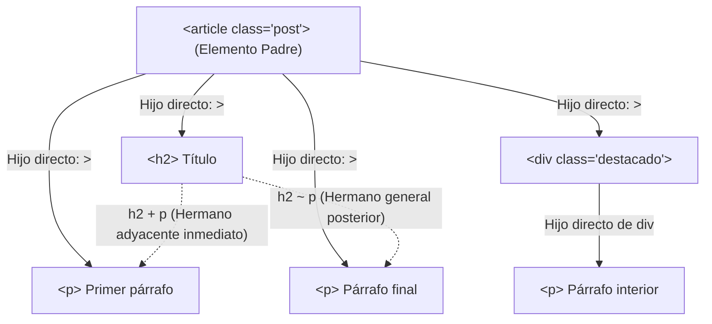

# Unidad 02 · Selectores

Los selectores definen **a qué elementos** se aplican las declaraciones. Dominarlos es la diferencia entre CSS mantenible y CSS con `!important` por todas partes: gana el selector **corto y semántico**.

!!! note "Conocimientos previos"

    - Anatomía de una regla CSS: **selector** y bloque de declaraciones (unidad 01).
    - Distinguir **clase** (`.boton`), **ID** (`#inicio`) y **tipo** (`p`).
    - Usar la pestaña **Elements** de las DevTools para ver qué selector coincide con un elemento.

## 1. Taxonomía general

Un ==selector complejo== se arma con **selectores simples** unidos por **combinadores**:

```text title="anatomia-selector.txt"
Selector complejo = [combinador] + simple(s)
Simple = tipo | universal | clase | ID | atributo | pseudo-clase | pseudo-elemento
```

Ejemplo anatómico: `nav > ul li a[href^="https"]:not(.externo)::after`

| Parte | Rol |
|---|---|
| `nav` | tipo (ancestro) |
| `>` | combinador hijo |
| `ul li` | descendientes |
| `a[href^="https"]` | elemento con atributo que empieza por… |
| `:not(.externo)` | negación funcional |
| `::after` | pseudo-elemento |

!!! info "Cómo se lee un selector"

    - Se lee de **derecha a izquierda**: el **último** elemento es el que se busca.
    - Lo que queda a la izquierda son **condiciones de contexto** (ancestro, padre, hermano) definidas por el **combinador** (`espacio`, `>`, `+`, `~`).

## 2. Selectores simples

### 2.1. Universal

```css title="estilos.css"
* { box-sizing: border-box; }
```

Selecciona todo. En resets modernos se usa con cuidado (ver unidad 14: coste de estilo en muchos nodos).

### 2.2. Por tipo (etiqueta)

```css title="estilos.css"
h1 { font-size: 2rem; }
p  { line-height: 1.6; }
```

Case-insensitive en HTML. Evitar sobreuso: **acopla el diseño al HTML concreto**.

### 2.3. Por clase

```css title="estilos.css"
.alerta { border-left: 4px solid orange; }
.card--destacado { /* BEM: modificador */ }
```

- Es el selector **caballo de batalla**: reutilizable, semántico, especificidad moderada.
- Un elemento puede tener varias clases: `class="alerta alerta--error"`.
- Convenciones de nombre: kebab-case; patrones BEM en unidad 12.

El ==`.clase`== es la unidad de trabajo del día a día: **una clase, un concepto**, y el HTML queda limpio de estilos.

### 2.4. Por ID

```css title="estilos.css"
#cabecera-principal { position: sticky; top: 0; }
```

- Debe ser **único por documento** (requisito HTML).
- Especificidad alta → difícil de sobreescribir sin más IDs o `!important`.
- Usos legítimos: anclas de navegación (`<section id="precios">`), puntos de entrada de JS, una instancia única (header, main landmark).
- **No** usar IDs como «clase fuerte» para maquetar componentes repetibles.

### 2.5. Por atributo

| Sintaxis | Significado | Ejemplo |
|---|---|---|
| `[attr]` | Tiene el atributo | `input[required]` |
| `[attr="valor"]` | Coincide exactamente (case-sensitive) | `a[target="_blank"]` |
| `[attr="valor" i]` | Case-**in**sensitive | `input[type="text" i]` |
| `[attr~="palabra"]` | Contiene la palabra (separada por espacios) | `li[data-tags~="css"]` |
| `[attr\|="prefijo"]` | Igual o empieza por `prefijo-` | `[lang\|="es"]` |
| `[attr^="prefijo"]` | Empieza por | `img[src^="data:image/svg"]` |
| `[attr$="sufijo"]` | Termina por | `a[href$=".pdf"]` |
| `[attr*="sub"]` | Contiene substring | `input[name*="busca"]` |

Flags `i`/`s`: `i` insensible a mayúsculas, `s` sensible (default). Solo tienen sentido en valores string.

Usos típicos: estilos condicionales según estado del formulario (`[aria-expanded="true"]`), enlaces externos, tipos de archivo, internacionalización (`[dir="rtl"]`).

## 3. Combinadores: Estableciendo relaciones familiares en el DOM

Los ==combinadores== son los símbolos que colocamos entre selectores para expresar la **relación jerárquica o de parentesco** que debe existir entre ellos dentro del árbol HTML:

| Combinador | Nombre técnico | Relación exigida | ¿A qué elementos afecta? |
|---|---|---|---|
| *(un espacio)* | Descendiente | `A B` | Cualquier elemento `B` que esté **dentro** de `A`, sin importar cuántos niveles de profundidad haya (hijo, nieto, bisnieto...). |
| `>` | Hijo directo (*Child*) | `A > B` | Solo elementos `B` cuyo **padre inmediato** sea `A`. Si hay un elemento intermedio, la regla no aplica. |
| `+` | Hermano adyacente (*Next-sibling*) | `A + B` | Solo el elemento `B` que esté **inmediatamente a continuación** de `A` y que comparta el mismo elemento padre. |
| `~` | Hermano general (*Subsequent-sibling*) | `A ~ B` | Cualquier elemento `B` que aparezca **después** de `A` compartiendo el mismo padre, aunque haya otros elementos intercalados entre ellos. |

### Explicación con un ejemplo práctico de código:

Imaginemos este fragmento HTML:

```html
<article class="post">
  <h2>Título del artículo</h2>
  <p>Párrafo introductorio (primer párrafo).</p>
  <div class="destacado">
    <p>Párrafo dentro de un div contenedor.</p>
  </div>
  <p>Párrafo final de conclusiones.</p>
</article>
```



- **`article p` (Descendiente):** Selecciona **los tres párrafos**. A todos los afecta porque todos están contenidos dentro del `<article>`.
- **`article > p` (Hijo directo):** Selecciona únicamente el primer párrafo y el párrafo final. **No selecciona** el párrafo del medio porque su padre directo es el `<div>`, no el `<article>`.
- **`h2 + p` (Hermano adyacente):** Selecciona **únicamente el primer párrafo**, porque es el único que está justo pegado e inmediatamente después del `<h2>`.
- **`h2 ~ p` (Hermanos generales):** Selecciona el primer párrafo y el párrafo final (ambos son hermanos del `<h2>` y van después de él a su mismo nivel de jerarquía).

> **Claves para el examen**: 
> 1. Diferenciar el combinador descendiente (espacio: cualquier nivel) frente a hijo directo (`>`: un solo nivel).
> 2. Diferenciar `+` (inmediato y único) frente a `~` (cualquiera posterior que comparta padre). Recuerda que en CSS los combinadores de hermanos **solo miran hacia abajo** en el documento, nunca hacia arriba.

## 4. Pseudo-clases

Estados dinámicos del elemento. Se escriben con un `:`: una ==pseudo-clase== describe un **estado**, una **posición** o una **función** del elemento.

### 4.1. Estructurales

| Pseudo-clase | Descripción |
|---|---|
| `:root` | El elemento raíz (`<html>`). Donde viven las custom properties globales. |
| `:first-child` | Primer hijo de su padre. |
| `:last-child` | Último hijo. |
| `:only-child` | Único hijo. |
| `:nth-child(n)` | n-ésimo hijo (cuenta **todos** los hermanos). |
| `:nth-last-child(n)` | n-ésimo desde el final. |
| `:first-of-type` / `:last-of-type` / `:only-of-type` | Como arriba pero filtrando por tipo. |
| `:nth-of-type(n)` / `:nth-last-of-type(n)` | n-ésimo de su tipo. |
| `:empty` | Sin hijos ni texto. |
| `:scope` | El elemento desde el que se evalúa (útil en contexto de `:has` y consultas). |

#### La fórmula `An+B` de `:nth-*`

`n` y `b` son enteros (puede ser 0); `n` indica el paso:

| Fórmula | Selección |
|---|---|
| `:nth-child(2n)` | pares: 2, 4, 6… |
| `:nth-child(2n+1)` | impares: 1, 3, 5… |
| `:nth-child(3n)` | cada 3: 3, 6, 9… |
| `:nth-child(3n+1)` | 1, 4, 7… (posición 1 de cada grupo de 3) |
| `:nth-child(-n+3)` | solo los 3 primeros |
| `:nth-child(even)` / `:nth-child(odd)` | alias de `2n` / `2n+1` |
| `:nth-child(5)` | exactamente el quinto (equivalente a `n+4`) |

Truco visual para `3n+1`: imagina los hijos en filas de 3; selecciona siempre la primera columna.

!!! warning "Error común"

    Confundir `:nth-child()` con `:nth-of-type()`. El primero cuenta **todos** los hermanos y solo coincide si además el tipo encaja; el segundo cuenta **solo los de su tipo**: `li:nth-child(2)` es el segundo hijo *sí y solo sí* es `li`, mientras que `li:nth-of-type(2)` es el segundo `li` aunque haya otros elementos entre medias.

### 4.2. Estado de la interfaz (UI states)

| Pseudo-clase | Cuándo aplica |
|---|---|
| `:hover` | Cursor encima (solo dispositivos con puntero fino). |
| `:active` | Mientras se pulsa. |
| `:focus` | Tiene foco (click o teclado). |
| `:focus-visible` | Foco **por teclado** (o cuando el navegador decide mostrarlo). Es la forma accesible de estilizar foco sin molestar al ratón. |
| `:focus-within` | El elemento **o un descendiente** tiene foco (ideal para «glow» de formularios). |
| `:target` | Elemento cuyo `id` coincide con el fragmento de la URL (`#seccion`). |
| `:target-is(sel)` | `:target` aplicado a un conjunto de selectores. |
| `:playing` / `:paused` | Media en reproducción/pausa. |
| `:defined` | Web Component definido. |

Orden recomendado para estados interactivos (evita conflictos):

```css title="estilos.css" hl_lines="2 4"
.boton {}
.boton:hover {}
.boton:focus-visible {}
.boton:active {}
.boton:disabled {}
```

### 4.3. Estado de recursos / formularios

| Pseudo-clase | Aplica a | Significado |
|---|---|---|
| `:link` / `:visited` | `<a>` | Visitado o no. |
| `:checked` | `input` radio/checkbox | Marcado. |
| `:indeterminate` | checkbox | Estado mixto (JS `indeterminate = true`). |
| `:enabled` / `:disabled` | Formularios | Habilitado/deshabilitado. |
| `:read-only` / `:read-write` | Campos | Solo lectura / editable. |
| `:valid` / `:invalid` | Campos con constraints | Válido/inválido (con constraint validation API). |
| `:user-valid` / `:user-invalid` | Idem | Solo tras interacción del usuario (más amable). |
| `:required` / `:optional` | Campos | Con/sin restricción requerida. |
| `:placeholder-shown` | Campos | Muestra el placeholder (vacío). |
| `:default` | Elementos | En estado por defecto. |
| `:current` / `:past` / `:future` | Tiempo (`time`, `output`) | Relación con la fecha actual. |

### 4.4. Funcionales (el poder moderno)

#### `:is()` — «cualquiera de»

Toma una lista de selectores complejos; el elemento lo cumple si **cualquiera** de ellos lo hace. Aporta la especificidad del argumento de mayor peso.

!!! example "Agrupar selectores con :is()"

    ```css title="estilos.css" hl_lines="5"
    /* Antes: repetir reglas */
    h1, h2, h3, .titulo { margin-bottom: 0.5em; }       /* (1)! */

    /* Después */
    :is(h1, h2, h3, .titulo) { margin-bottom: 0.5em; }   /* (2)! */

    /* Potente con combinadores */
    article :is(h2, h3) a { color: inherit; }
    ```

    1.  Lista de selectores separados por comas: la misma declaración repetida en varias reglas.
    2.  `:is()` concentra la lista en **un solo argumento** y aporta solo la especificidad de su argumento más pesado: **DRY** en selectores.

#### `:where()` — «cualquiera de», especificidad cero

Igual que `:is()`, pero **siempre aporta 0** a la especificidad. Ideal para construir selectores «blandos» fáciles de sobreescribir:

```css title="estilos.css"
:where(article, aside) :where(p, li) { line-height: 1.6; }
/* Especificidad total: (0,0,0)… gana cualquier regla concreta */
```

Además, es *forgiving*: si un argumento es inválido en algún navegador, se descarta ese argumento y no toda la regla.

#### `:not()` — negación

Acepta cualquier selector complejo (Selectors L4):

```css title="estilos.css"
:not(.activo)          /* todos menos .activo */
li:not(:nth-child(3))  /* todos menos el tercero */
a:not([href])          /* enlaces sin href */
button:not(:disabled)  /* botones operativos */
```

#### `:has()` — el «selector padre»

Selecciona un elemento **si contiene (o está relacionado con)** algo que cumple la condición; el ==`:has()`== es el selector más potente de la historia de CSS:

```css title="estilos.css" hl_lines="2"
/* Card que contiene imagen → cambia estilo */
.card:has(> img) { grid-template-columns: 200px 1fr; }

/* Campo con error marcado por JS */
.form-field:has(input:user-invalid) { border-color: red; }

/* Nav con submenú abierto */
.nav-item:has(> .submenu[aria-expanded="true"]) { background: #eee; }

/* Página con vídeo → layout distinto */
body:has(video) { overflow: hidden; }

/* Tabla con filas vacías */
.table:has(tbody:empty) { display: none; }
```

Reglas clave:

- El argumento de `:has()` puede usar **cualquier combinador**, incluso hacia atrás: `:has(+ .etiqueta)` («tengo una etiqueta inmediatamente después»).
- Su especificidad = la del argumento.
- Soporte: Chrome 105+, Safari 15.4+, Firefox 121+[^1] (estable en los tres grandes).
- Permite patronear estados **sin JavaScript** (checkbox hack, menús desplegables, validación visual).

#### Otros funcionales útiles

| Pseudo-clase | Uso |
|---|---|
| `:lang(es)` | Elemento cuyo idioma calculado es español (según `lang`). |
| `:dir(ltr)` / `:dir(rtl)` | Dirección de escritura del elemento. |
| `:any-link` | `:link` + `:visited` juntos (permite estilizar ambos sin exponer historial). |
| `:local-link` | Enlaces a la misma máquina (experimental). |

## 5. Pseudo-elementos

Representan **partes** de un elemento, no el elemento. Se escriben con **dos** dos puntos (`::`): un ==pseudo-elemento== crea un nodo ficticio que no aparece en el DOM.

| Pseudo-elemento | Qué genera |
|---|---|
| `::before` | Caja ficticia **antes** del contenido (requiere `content`). |
| `::after` | Caja ficticia **después**. |
| `::first-line` | Primera línea de un bloque. |
| `::first-letter` | Primera letra (capitular). |
| `::selection` | Texto seleccionado por el usuario. |
| `::placeholder` | Texto placeholder de inputs. |
| `::marker` | Viñeta/número de listas (`list-style` fuera del flujo). |
| `::backdrop` | Fondo oscurecido de diálogos (`<dialog>`). |
| `::file-selector-button` | Botón «Examinar…» de `<input type=file>`. |
| `::cue` | Subtítulos (WebVTT). |
| `::spelling` / `::grammar-error` | Errores ortográficos/gramaticales (soporte limitado). |
| `::part(nombre)` | Pieza expuesta de un Web Component. |
| `::slotted(selector)` | Contenido slotted de un Web Component. |
| `::view-transition-old/new/group/root` | Capas de view transitions (unidad 11). |

### `::before` / `::after` en profundidad

```css title="iconos.css"
.icono::before {
  content: "";               /* (1)! obligatorio (string, counter o url) */
  display: inline-block;
  width: 1em; height: 1em;
  background: currentColor;
  mask: url("https://dummyimage.com/800x600/ccc/000.png&text=icon.svg") center / contain no-repeat;
}

.cita::before { content: open-quote; }
.cita::after  { content: close-quote; }   /* respetan lang → « » vs " " */
.paso::before { content: counter(paso) ". "; counter-increment: paso; }  /* (2)! */
```

1.  Sin `content` el pseudo-elemento **no se genera**; admite cadena, contador o `url()`.
2.  `counter-increment` alimenta el contador que `content: counter(...)` muestra (numeración de pasos).

- No aparecen en el DOM (los lectores de pantalla los ignoran salvo `content` textual relevante: cuidado, el texto de `content` **sí** puede leerse en algunos lectores → usa `aria-hidden` si es decorativo).
- `content: counter(nombre)` y `counters()` permiten numeración avanzada (índices, apéndices).
- `@counter-style` personaliza formatos (romanos, alfabetos, imágenes por valor) — ver unidad 12.

!!! failure "Anti-patrón: un solo dos puntos"

    Escribir `:before` con **un solo** dos puntos. Los navegadores lo aceptan por compatibilidad, pero la spec manda `::before`; en código nuevo, **siempre doble**.

## 6. Especificidad: ejemplos resueltos

Recordad la escala: **en línea > !important (autor) > (ID, clase, tipo)**. La ==especificidad== se calcula sobre el selector completo, incluidos pseudo-clases y pseudo-elementos.

| Selector | Cálculo | Resultado |
|---|---|---|
| `p` | 1 tipo | 0-0-1 |
| `.card` | 1 clase | 0-1-0 |
| `#hero` | 1 ID | 1-0-0 |
| `ul li a.active:hover` | clase + pseudo-clase + 3 tipos | 0-2-3 |
| `:is(#a, .b, span)` | toma el máximo: ID | 1-0-0 |
| `:where(.a, .b)` | siempre 0 | 0-0-0 |
| `:has(.error input)` | especificidad del argumento | 0-1-1 |
| `div::before` | 1 tipo + 1 pseudo-elemento | 0-0-2 |
| `style="color:red"` | en línea | ∞ (fuera de escala) |

!!! question "Especificidad con :has()"

    Calcula la especificidad de `main article:has(figure) h2 + p:first-of-type`.

    ??? success "Respuesta"

        **(0,1,5)**: sin IDs; **1 pseudo-clase** (`:first-of-type`); y **5 tipos** (`main`, `article`, `figure` del argumento de `:has()`, `h2` y `p`).

!!! info "Especificidad de los funcionales"

    - `:is()` y `:has()` → la de su **argumento más pesado**.
    - `:where()` → **cero**, por eso sirve para reglas base sobreescribibles.
    - `:not()` → la de su argumento (Selectors L4 admite selectores complejos).

### Estrategias anti-guerra-de-especificidad

1. **Acotar profundidad**: máx. 2–3 niveles de combinadores.
2. **Preferir clases** a cadenas de tipos.
3. Usar `:where()` para «reglas base» que cualquiera pueda pisar.
4. `@layer` para ordenar prioridades de arquitectura (unidad 12).
5. Si necesitas `!important`, pregunta si el problema es de **arquitectura**, no de fuerza.

## 7. Rendimiento de selectores (matiz importante)

El coste real está en **cuántos elementos visita** el motor, no en la «complejidad teórica»:

- `body div p` recorre mucho más que `p.texto`.
- El selector universal `*` en resets toca a todos los nodos: hoy aceptado (coste trivial frente a claridad), pero evita `*` en reglas frecuentes.
- Los selectores se compilan una vez; el matching se repite en cada cambio de DOM. Mantener ==selectores cortos== y específicos ayuda al **estilo incremental**.
- No optimices prematuramente: primero estructura clara, luego mide con DevTools.

## 8. Buenas prácticas resumidas

1. Clases semánticas (`.tarjeta__precio`), no visuales (`.caja-blanca-grande`).
2. Máximo un ID por selector; mejor ninguno en componentes.
3. ==`:focus-visible`== para foco, nunca `outline: none` sin alternativa.
4. Estados de formulario con pseudo-clases nativas antes que clases JS.
5. `:has()` para lógica condicional simple sin JS.
6. `:is()`/`:where()` para DRY sin inflar especificidad.
7. Documenta selectores «mágicos» con comentarios.

---

## 9. Ejemplo práctico: catálogo interactivo con combinadores, pseudo-clases y pseudo-elementos

El siguiente ejemplo muestra la maquetación de una tabla de inventario interactiva donde el estilo visual responde dinámicamente al estado del DOM sin recurrir a scripts: filas alternas con `:nth-child`, combinadores de adyacencia (`+` y `~`) para estados reactivos, selectores funcionales (`:is`, `:not`, `:has`) y pseudo-elementos (`::before`, `::after`) para enriquecimiento visual accesible.

=== "HTML"

    ```html title="inventario.html"
    <!DOCTYPE html>
    <html lang="es">
    <head>
      <meta charset="UTF-8">
      <meta name="viewport" content="width=device-width, initial-scale=1.0">
      <title>Gestión de Inventario · Selectores CSS</title>
      <link rel="stylesheet" href="css/inventario.css">
    </head>
    <body>
      <main class="panel">
        <header class="panel__cabecera">
          <h1>Inventario de Almacén</h1>
          <p class="panel__resumen">Monitoreo de existencias y pedidos en tiempo real.</p>
        </header>
    
        <div class="tabla-contenedor">
          <table class="tabla-datos">
            <caption class="sr-only">Listado de existencias de material informático</caption>
            <thead>
              <tr>
                <th scope="col">Estado</th>
                <th scope="col">Artículo</th>
                <th scope="col">Categoría</th>
                <th scope="col">Stock</th>
                <th scope="col">Acción</th>
              </tr>
            </thead>
            <tbody>
              <tr class="fila fila--alerta">
                <td><span class="indicador" data-estado="critico"></span></td>
                <td><strong>SSD NVMe 1TB</strong></td>
                <td>Almacenamiento</td>
                <td class="col-stock">2 uds</td>
                <td><button type="button" class="btn btn--urgente">Reponer</button></td>
              </tr>
              <tr class="fila">
                <td><span class="indicador" data-estado="ok"></span></td>
                <td>Memoria RAM 16GB DDR5</td>
                <td>Componentes</td>
                <td class="col-stock">45 uds</td>
                <td><button type="button" class="btn">Pedir</button></td>
              </tr>
              <tr class="fila">
                <td><span class="indicador" data-estado="ok"></span></td>
                <td>Monitor 27" IPS 144Hz</td>
                <td>Periféricos</td>
                <td class="col-stock">18 uds</td>
                <td><button type="button" class="btn">Pedir</button></td>
              </tr>
              <tr class="fila fila--agotado">
                <td><span class="indicador" data-estado="agotado"></span></td>
                <td>Placa Base B650 AM5</td>
                <td>Componentes</td>
                <td class="col-stock">0 uds</td>
                <td><button type="button" class="btn" disabled>Agotado</button></td>
              </tr>
            </tbody>
          </table>
        </div>
    
        <form class="filtro-formulario">
          <label class="control-check">
            <input type="checkbox" id="ocultar-agotados" class="check-agotados">
            <span>Ocultar artículos agotados</span>
          </label>
        </form>
      </main>
    </body>
    </html>
    ```

=== "CSS"

    ```css title="css/inventario.css"
    /* 1. Reset básico y variables */
    :root {
      --color-ok: #16a34a;
      --color-alerta: #dc2626;
      --color-fondo-alerta: #fef2f2;
      --color-texto: #1e293b;
      --color-borde: #cbd5e1;
      --color-fondo-cebra: #f8fafc;
      --color-primario: #2563eb;
    }
    
    body {
      font-family: system-ui, -apple-system, sans-serif;
      color: var(--color-texto);
      background-color: #f1f5f9;
      padding: 2rem 1rem;
      margin: 0;
    }
    
    .panel {
      max-width: 56rem;
      margin-inline: auto;
      background: #ffffff;
      padding: 2rem;
      border-radius: 0.75rem;
      box-shadow: 0 4px 6px -1px rgb(0 0 0 / 0.1);
    }
    
    /* 2. Combinador de hermano adyacente (+) */
    .panel__cabecera h1 + p {
      margin-top: 0.25rem;
      color: #64748b;
      font-size: 0.95rem;
    }
    
    /* 3. Estructura de tabla y pseudo-clases estructurales */
    .tabla-datos {
      width: 100%;
      border-collapse: collapse;
      margin-block: 1.5rem;
    }
    
    .tabla-datos th,
    .tabla-datos td {
      padding: 0.75rem 1rem;
      text-align: left;
      border-bottom: 1px solid var(--color-borde);
    }
    
    /* Filas alternas (cebreado) con :nth-child(even) */
    .tabla-datos tbody tr:nth-child(even) {
      background-color: var(--color-fondo-cebra);
    }
    
    /* Primera y última columna estilizadas con pseudo-clases de tipo */
    .tabla-datos th:first-child,
    .tabla-datos td:first-child {
      width: 3rem;
      text-align: center;
    }
    
    .tabla-datos td:last-child {
      text-align: right;
    }
    
    /* 4. Selector relacional :has() para reactividad en fila */
    /* Si la fila contiene un botón deshabilitado, se atenúa toda la fila */
    .tabla-datos tr:has(button:disabled) {
      opacity: 0.5;
      background-color: #f8fafc;
    }
    
    /* Fila en alerta */
    .fila--alerta {
      background-color: var(--color-fondo-alerta) !important;
    }
    
    /* 5. Selector por atributo y pseudo-elemento ::before */
    .indicador {
      display: inline-block;
      width: 0.75rem;
      height: 0.75rem;
      border-radius: 50%;
    }
    
    .indicador[data-estado="ok"] {
      background-color: var(--color-ok);
    }
    
    .indicador[data-estado="critico"] {
      background-color: var(--color-alerta);
      box-shadow: 0 0 0 3px #fecaca;
    }
    
    .indicador[data-estado="agotado"] {
      background-color: #94a3b8;
    }
    
    /* 6. Pseudo-clases de estado y pseudo-elementos en botones */
    .btn {
      font-family: inherit;
      font-size: 0.875rem;
      font-weight: 600;
      padding: 0.4rem 0.85rem;
      border: 1px solid var(--color-borde);
      border-radius: 0.375rem;
      background: #ffffff;
      cursor: pointer;
      transition: all 0.15s ease;
    }
    
    /* Agrupación limpia con :is() manteniendo especificidad mínima */
    :is(.btn:hover, .btn:focus-visible):not(:disabled) {
      background-color: #f1f5f9;
      border-color: #94a3b8;
    }
    
    .btn:focus-visible {
      outline: 2px solid var(--color-primario);
      outline-offset: 2px;
    }
    
    .btn:disabled {
      cursor: not-allowed;
    }
    
    .btn--urgente {
      background-color: var(--color-alerta);
      border-color: var(--color-alerta);
      color: #ffffff;
    }
    
    .btn--urgente:hover:not(:disabled) {
      background-color: #b91c1c;
    }
    
    /* 7. Pseudo-clase :checked y combinador de hermano general (~) */
    .filtro-formulario {
      margin-top: 1rem;
    }
    
    .control-check {
      display: inline-flex;
      align-items: center;
      gap: 0.5rem;
      font-size: 0.9rem;
      cursor: pointer;
    }
    
    /* Si el panel contiene el checkbox marcado, oculta las filas agotadas */
    .panel:has(.check-agotados:checked) .fila--agotado {
      display: none;
    }
    
    /* Accesibilidad: texto solo para lectores de pantalla */
    .sr-only {
      position: absolute;
      width: 1px;
      height: 1px;
      padding: 0;
      margin: -1px;
      overflow: hidden;
      clip: rect(0, 0, 0, 0);
      white-space: nowrap;
      border-width: 0;
    }
    ```

---

### 9.1 Explicación detallada: ¿Por qué se usa cada propiedad y para qué sirve?

A continuación se analizan los motivos técnicos de cada regla de selección y las propiedades de interfaz aplicadas:

#### 1. Combinador de hermano adyacente (`.panel__cabecera h1 + p`)
- **¿Cómo funciona?** El operador `+` selecciona **únicamente el párrafo que esté situado inmediatamente a continuación del `<h1>`**, compartiendo el mismo elemento padre.
- **¿Por qué se usa aquí?** Permite aplicar un espaciado reducido (`margin-top: 0.25rem`) y un tono atenuado exclusivamente a la línea de subtítulo que acompaña al título principal, sin afectar a ningún otro párrafo del documento.

#### 2. Filas alternas con `:nth-child(even)`
- **¿Para qué sirve?** Selecciona todas las filas pares del cuerpo de la tabla (`<tbody>`).
- **Beneficio ergonómico:** Aplica un patrón de "cebreado" sutil (`#f8fafc`). En tablas con múltiples columnas de datos, este contraste visual facilita el seguimiento horizontal de la línea con la vista, reduciendo el error humano de lectura.

#### 3. Pseudo-clases posicionales `:first-child` y `:last-child`
- **`th:first-child, td:first-child`:** Asigna un ancho fijo estrecho (`3rem`) y alineación centrada a la primera columna reservada al icono semántico de estado.
- **`td:last-child`:** Alinea los botones de acción a la derecha (`text-align: right`), siguiendo las convenciones de usabilidad en tablas de gestión de datos.

#### 4. Selector relacional hacia el padre con `:has()`
- **`.tabla-datos tr:has(button:disabled)`:**
    - Antes de la llegada de `:has()`, CSS solo podía seleccionar elementos hacia abajo o hacia los lados en el árbol DOM.
    - Esta regla inspecciona si la fila contiene en su interior un botón en estado desactivado (`button:disabled`). En caso afirmativo, aplica `opacity: 0.5` a **toda la fila**.
- **`.panel:has(.check-agotados:checked) .fila--agotado`:**
    - Evalúa si el usuario ha marcado la casilla de verificación situada en el formulario inferior.
    - Si el checkbox está activo (`:checked`), el selector localiza las filas con la clase `.fila--agotado` dentro del panel y las oculta dinámicamente (`display: none`), logrando un **filtro interactivo instantáneo sin necesidad de una sola línea de JavaScript**.

#### 5. Selectores de atributo (`.indicador[data-estado="..."]`)
- **¿Para qué sirve?** Asocia la apariencia visual de la pastilla luminosa al valor del atributo semántico de datos `data-estado` de HTML5.
- **Ventaja de diseño desacoplado:** La lógica de negocio del servidor o de la base de datos puede inyectar `data-estado="critico"` o `data-estado="ok"` en el marcado sin necesidad de concatenar nombres de clases complejas.

#### 6. Simplificación y especificidad con `:is()` y `:not()`
- **`:is(.btn:hover, .btn:focus-visible):not(:disabled)`:**
    - Agrupa los estados de interacción del puntero (`:hover`) y del teclado (`:focus-visible`) en una sola regla limpia (DRY).
    - La pseudo-clase de negación `:not(:disabled)` garantiza que si el botón está desactivado, no reaccione visualmente ni al pasar el ratón por encima ni al recibir el foco, reforzando la percepción de inactividad.

---

!!! success "Checklist de la unidad"

    - [ ] Distingo **selector simple** de **selector complejo** y leo un selector de derecha a izquierda.
    - [ ] Aplico los **cuatro combinadores** sin confundir `+` con `~`.
    - [ ] Uso `:nth-child()` y `:nth-of-type()` donde corresponde.
    - [ ] Calculo la especificidad incluidos `:is()`, `:where()`, `:not()` y `:has()`.
    - [ ] Estilizo el foco con `:focus-visible` y nunca dejo `outline: none` sin alternativa.

## 10. Autoevaluación rápida

1. ¿Qué selecciona `form :nth-child(2n) input`? ¿Y `form input:nth-child(2n)`?
2. Escribe un selector: «párrafos que contienen un enlace externo, pero no si están dentro de `footer`».
3. ¿Por qué `:where(a, b, c)` es útil en un design system?
4. Calcula: `main article:has(figure) h2 + p:first-of-type`.
5. ¿Puedo seleccionar el padre de un `input:focus` sin `:has()`? ¿Cómo lo haría con él?

!!! tip "Claves para el examen"

    - **Combinadores**: espacio (descendiente), `>` (hijo), `+` (siguiente inmediato), `~` (general).
    - **Pseudo-clase** = estado/posición con `:`; **pseudo-elemento** = parte del elemento con `::`.
    - `:nth-child()` cuenta **todos** los hermanos; `:nth-of-type()` solo los del mismo tipo.
    - `:where()` aporta **especificidad 0**; `:is()` y `:has()` adoptan la de su argumento más pesado.
    - `:focus-visible` es el foco accesible; `outline: none` sin alternativa es **error garantizado**.
    - Para evitar guerras de especificidad: **clases**, poca profundidad y `:where()` + `@layer`.

[^1]: Fuente: tabla de compatibilidad (browser-compat-data) de MDN Web Docs.

*[BEM]: Block Element Modifier
*[DRY]: Don't Repeat Yourself
*[UI]: User Interface
