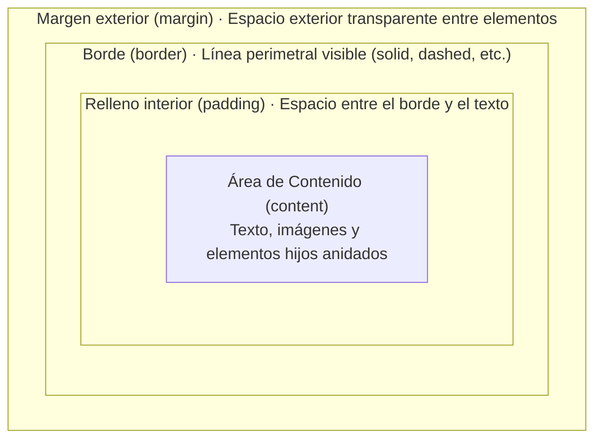

# Unidad 03 · Modelo de caja

Todo elemento renderizado es una **caja rectangular** en el flujo del documento. Entender exactamente cómo se calcula su tamaño es la base de toda maquetación.

!!! note "Conocimientos previos"

    - Distinguir **contenido**, **padding**, **borde** y **margen**.
    - Sumar un ancho sumando `padding` y `border` (unidad 01).
    - Usar `width`, `height` y `margin`.

## 1. Anatomía de la caja

Las **cuatro capas** concéntricas forman el ==modelo de caja==:

```text title="anatomia-caja.txt"
┌──────────────────────────────────────────────┐ ← margen (margin)
│ ┌──────────────────────────────────────────┐ │
│ │ ┌──────────────────────────────────────┐ │ │ ← borde (border)
│ │ │ ┌──────────────────────────────────┐ │ │ │ ← padding
│ │ │ │                                  │ │ │ │
│ │ │ │        CONTENIDO (content)       │ │ │ │
│ │ │ │                                  │ │ │ │
│ │ │ └──────────────────────────────────┘ │ │ │
│ │ └──────────────────────────────────────┘ │ │
│ └──────────────────────────────────────────┘ │
└──────────────────────────────────────────────┘
```



| Capa | Propiedades | Notas |
|---|---|---|
| Contenido | `width`, `height` | Tamaño del contenido (**no de la caja completa**). |
| Padding | `padding`, `padding-top/right/bottom/left`, `padding-inline/block` | Espacio interior; admite `%` (sobre el ancho del contenedor padre). |
| Borde | `border-width/style/color`, `border-*-radius` | El `style` es **obligatorio** para que el borde se pinte. |
| Margen | `margin`, `margin-*`, `margin-inline/block` | Espacio exterior; puede ser **negativo**. |

Propiedades de atajo: `box-shadow` (fuera de la caja pero dentro del «área de pintura»), `outline` (**no ocupa espacio**, se dibuja fuera del borde).

!!! info "Las cuatro áreas que nombra DevTools"

    - **content-box**: solo el contenido; lo que miden `width` y `height`.
    - **padding-box**: contenido + padding; sobre ella recorta el `overflow`.
    - **border-box**: incluye el borde; es el ancho real con `border-box`.
    - **margin-box**: caja + margen; el espacio hasta los vecinos.

## 2. `box-sizing`: el cambio que lo cambia todo

### 2.1. `content-box` (el comportamiento histórico por defecto)

En el modelo tradicional de CSS, cuando escribes `width: 300px`, le estás diciendo al navegador: *«Haz que el área del **contenido de texto** mida 300px»*.

Si luego añades relleno interior (`padding: 20px`) y un borde (`border: 10px solid black`), el navegador suma esas capas hacia el exterior como capas de una cebolla:

```text title="content-box-calculo.txt"
Ancho visual real = width + padding-izq + padding-der + border-izq + border-der
Ancho visual real = 300px + 20px        + 20px        + 10px       + 10px = 360px
```

**El problema para el desarrollador:** Si intentabas crear dos columnas al `50%` de ancho y a una le ponías un poco de padding o borde, la suma superaba el `100%` y la segunda columna saltaba a la línea inferior destrozando la maquetación.

### 2.2. `border-box` (el estándar moderno intuitivo)

Con `box-sizing: border-box`, el valor de `width: 300px` pasa a ser el **tamaño exterior total de la caja** (hasta el borde exterior).

Si declaras `width: 300px`, `padding: 20px` y `border: 10px`, la caja medirá **exactamente 300px**. El navegador encoge el contenido interior automáticamente para que todo quepa dentro de los 300px:

```text title="border-box-calculo.txt"
Ancho visual real = width = 300px
(El contenido interior se reduce a: 300px - 20px - 20px - 10px - 10px = 240px)
```

!!! example "Reset universal recomendado"

    ```css title="reset.css" hl_lines="3"
    /* Reset universal recomendado en todos los proyectos web */
    *, *::before, *::after {                /* (1)! */
      box-sizing: border-box;               /* (2)! */
    }
    ```

    1.  El selector universal `*` junto con los pseudo-elementos garantiza que absolutamente todas las cajas de la web se comporten de forma predecible.
    2.  Con ==`box-sizing: border-box`==, el `width` que defines en tus estilos coincide exactamente con los píxeles reales que la caja ocupa en pantalla.

> **Claves para el examen**: 
> - Con `content-box`, `width` mide solo el contenido (el padding y el borde **se suman por fuera**).
> - Con `border-box`, `width` mide hasta el borde (el padding y el borde **se restan por dentro**).
> - El margen (`margin`) **nunca** forma parte de `width` en ninguno de los dos modelos; el margen siempre es espacio exterior entre cajas vecinas.

### 2.3. ¿Por qué se utiliza siempre `border-box` en la industria?

- **Cero sorpresas matemáticas:** Si una columna debe medir el `50%` o `300px`, mide exactamente eso, sin importar si luego decides cambiar el padding de `10px` a `24px`.
- **Compatibilidad con sistemas de diseño:** Todos los frameworks modernos (Bootstrap, Tailwind, etc.) y sistemas de cuadrícula asumen `border-box` como premisa indispensable.

## 3. Dimensiones: `width` y `height`

### 3.1. Valores

- **Longitudes**: `px`, `rem`, `%`, `vw/vh`, `ch`, `clamp()`…
- **`auto`** (default):
    - En bloque horizontal: llena el contenedor (menos padding/borde propios).
    - En vertical: crece con el contenido.
- **Palabras clave intrínsecas** (solo `width`/`height` en ciertos contextos):
    - `min-content`: el más estrecho posible sin romper contenido.
    - `max-content`: el más ancho posible en una línea.
    - ==`fit-content`==: `min(max(min-content, disponible), max-content)` → «lo justo».

```css title="estilos.css"
.etiqueta { width: fit-content; }      /* se ajusta al texto */
.tabla-col { width: min-content; }     /* columna mínima legible */
```

### 3.2. Límites: `min-*` y `max-*`

```css title="estilos.css"
input {
  width: 100%;
  min-width: 12rem;    /* nunca por debajo */
  max-width: 24rem;    /* nunca por encima */
}
```

Reglas importantes:

- `min-width`/`min-height` **ganan** ante `width`/`height` cuando entran en conflicto.
- `max-width: 100%` en imágenes/media evita desbordes clásicos.
- En flex/grid, `min-width: auto` impide que un item se encoga menos que su contenido (ver unidad 05, problema clásico).

### 3.3. `aspect-ratio`

Mantiene proporción entre anchura y altura:

```css title="estilos.css"
.thumb {
  width: 100%;
  aspect-ratio: 16 / 9;   /* o 1.777 */
}
.avatar { aspect-ratio: 1; }  /* cuadrado */
```

- Funciona con `width` o `height` definidos (o `auto` en reemplazos como ``).
- Se combina con `object-fit` para controlar el relleno de media (unidad 09).
- Permite **reservas de espacio** anti CLS: el contenedor reserva la proporción antes de cargar la imagen (unidad 14).

## 4. Márgenes

### 4.1. Valores y atajos

```css title="estilos.css"
.margen {
  margin: 1rem 2rem;          /* vertical horizontal */
  margin: 1rem 2rem 3rem 4rem;/* arriba derecha abajo izquierda */
  margin-block: 2rem;         /* logical: arriba+abajo */
  margin-inline-start: 1rem;  /* logical: lado de inicio (i18n) */
}
```

!!! info "Márgenes lógicos (i18n)"

    - `margin-inline-*` y `margin-block-*` siguen la **dirección del texto**, no la pantalla.
    - Con `dir="rtl"`, `margin-inline-start` cambia solo de lado: **cero reglas duplicadas**.
    - `margin: a b c d` sigue siendo válido; los lógicos son su versión **internacionalizable**.

### 4.2. Colapso de márgenes (margin collapsing) ⚠️

El ==colapso de márgenes== es uno de los comportamientos que más confunde a los estudiantes de desarrollo web cuando empiezan a maquetar.

#### ¿Por qué diablos inventó el W3C el colapso de márgenes?
Tiene un origen puramente **editorial y tipográfico**. En un libro o artículo de periódico, si un título tiene un margen inferior de `20px` y el párrafo siguiente tiene un margen superior de `16px`, el tipógrafo no quiere un hueco descomunal de `36px` entre ellos; quiere una separación armónica de `20px` (el mayor de los dos). El navegador implementa esta regla por defecto para el texto en flujo normal.

#### La regla básica
Cuando dos márgenes verticales pertenecientes a elementos en bloque en el mismo contexto de formato se tocan directamente, **no se suman**: se funden en un único margen común cuyo tamaño es el **máximo** de los márgenes implicados.

```text title="colapso-hermanos.txt"
<p style="margin-bottom: 30px;">Párrafo 1</p>
<p style="margin-top: 20px;">Párrafo 2</p>

Espacio real resultante entre ambos = Max(30px, 20px) = 30px (¡NO 50px!)
```

#### Los tres escenarios donde ocurre:

1. **Entre hermanos consecutivos en el flujo:**
   Como en el ejemplo anterior, el margen inferior del primer hermano y el margen superior del segundo se tocan y colapsan al mayor.

2. **Entre padre e hijo (el caso del «margen que escapa»):**
   Si un elemento contenedor `<section>` no tiene borde superior (`border-top: 0`) ni relleno superior (`padding-top: 0`), y su primer hijo `<p>` tiene `margin-top: 40px`, **el margen del hijo atraviesa al padre**. Como no hay nada físico que los separe, los márgenes de padre e hijo se tocan y colapsan juntos. El resultado visual es que ¡todo el `<section>` se desplaza hacia abajo 40px en la ventana, en lugar de separarse el párrafo dentro del section!

3. **Bloques vacíos:**
   Si un elemento `<div>` está completamente vacío y no tiene altura ni padding ni bordes, su propio `margin-top` y `margin-bottom` colapsan entre sí.

4. **Márgenes de signos opuestos:**
   Si un margen es positivo (`30px`) y el otro es negativo (`-10px`), el cálculo matemático es su suma algebraica: `30px + (-10px) = 20px`.

!!! warning "Error crítico de examen y de maquetación"

    Pensar que los márgenes horizontales (`margin-left` y `margin-right`) colapsan. **FALSO:** Los márgenes horizontales **NUNCA colapsan**; si pones dos botones inline-block con `margin-right: 10px` y `margin-left: 10px`, la separación siempre es `20px`. El colapso solo ocurre en el eje **vertical** de elementos en bloque.

**No colapsan** cuando:

- Hay algo que separe: padding, borde, `inline-content`, clearance.
- El elemento crea un **nuevo BFC** (`overflow: hidden/auto/scroll`, `display: flow-root/flex/grid/table-caption…`).
- Posicionamiento distinto de `static` (absoluto/fijo no colapsan con nada).
- En flex/grid containers, los márgenes de items **nunca** colapsan.
- Márgenes horizontales **nunca** colapsan (solo verticales de bloques).

**Soluciones habituales**:

```css title="estilos.css" hl_lines="2"
/* 1. flow-root: convierte al bloque en BFC (la más limpia) */
article { display: flow-root; }   /* (1)! */

/* 2. overflow (cuidado: recorta) */
.card { overflow: hidden; }       /* (2)! */

/* 3. padding/borde en el padre */
section { padding-top: 1px; } /* truco feo, evitar */

/* 4. :first-child / :last-child para anular márgenes internos */
.section > :first-child { margin-top: 0; }
.section > :last-child  { margin-bottom: 0; }
```

1.  Crea un **nuevo BFC** sin efectos secundarios: la solución recomendada.
2.  `overflow` también crea un BFC, pero **recorta** el contenido desbordado.

!!! question "El hijo que empuja al padre"

    Un `div` con `margin-top: 3rem` está dentro de un `<section>` sin padding ni borde. ¿Qué ocurre y cómo lo evitas?

    ??? success "Respuesta"

        El margen **escapa** y baja todo el `section` 3 rem al colapsar con el borde del padre. Lo evitas con `display: flow-root`, `overflow: hidden/auto`, un `padding-top` mínimo o `section > :first-child { margin-top: 0 }`.

> **Claves para el examen**: explicar QUÉ colapsa, CUÁNDO no colapsa, y dar dos soluciones distintas. El «hijo que empuja al padre» es el caso favorito de los exámenes.

### 4.3. Márgenes negativos

```css title="estilos.css"
.full-bleed {
  margin-inline: calc(50% - 50vw);  /* rompe el contenedor a ancho total */
}
.overlap { margin-top: -2rem; }     /* superpone con el anterior */
```

Útiles para: full-bleed, solapamientos, corregir spacing de librerías. Cuidado con accesibilidad (contenido tapado) y mantenimiento.

## 5. `overflow`

Controla qué pasa cuando el contenido supera la caja: ==`overflow`== **pinta**, **recorta** o **desplaza**.

| Valor | Comportamiento |
|---|---|
| `visible` (default) | Se desborda pintándose fuera. |
| `hidden` | Se recorta; **no** hay barras. |
| `scroll` | Barras siempre visibles. |
| `auto` | Barras solo si hace falta (el más usado). |
| `clip` | Como `hidden` pero **sin** crear contenedor de scroll (mejor rendimiento, no focusable). |

Detalles:

- Si uno de los ejes es `visible` y el otro no, el `visible` se convierte en `auto` (comportamiento contraintuitivo a recordar).
- `overflow-x` / `overflow-y` independientes.
- `overscroll-behavior` controla el «rubber-band»/propagación de scroll en móviles.
- **Crear `overflow` ≠ visible genera nuevo BFC** → corta colapso de márgenes (ver 4.2).
- `text-overflow: ellipsis` requiere `overflow: hidden` + `white-space: nowrap`.

## 6. Contención (`contain`)

Indica al navegador que ciertas partes del render son **independientes**, permitiendo optimizaciones:

| Valor | Aísla |
|---|---|
| `contain: layout` | Lo que pasa dentro no afecta al layout exterior (y viceversa). |
| `contain: paint` | El contenido no se pinta fuera de la caja (equivale a `overflow: clip` visualmente). |
| `contain: style` | Las `@counter`/`@font-face` internos no escapan. |
| `contain: strict` | layout + paint + size. |
| `contain: content` | layout + paint. |

```css title="estilos.css"
.lista-virtual .item { contain: content; }
```

Advertencia: `contain: size` **ignora el tamaño del contenido** (peligroso sin `contain-intrinsic-size`); la ==contención== se estudia en rendimiento (unidad 14).

## 7. `resize` y `cursor`

```css title="estilos.css"
.editable {
  resize: both;      /* both | horizontal | vertical | none */
  overflow: auto;    /* necesario para que funcione */
}
```

Permite al usuario ==redimensionar== cajas (paneles, widgets): sin `overflow` distinto de `visible` no aparece el tirador.

## 8. Patrones prácticos de caja

### 8.1. Centrado perfecto (bloques)

El ==centrado== es el patrón que más se repite:

```css title="estilos.css"
/* Horizontal */
.centrado { margin-inline: auto; max-width: 60rem; }

/* Vertical + horizontal en un contenedor fijo */
.modal {
  position: absolute; inset: 0;
  margin: auto;
  width: fit-content; height: fit-content;
}
/* (Alternativas con flex/grid en unidades 05–06) */
```

### 8.2. Full-bleed dentro de contenedor centrado

```css title="estilos.css"
.contenido { max-width: 65rem; margin-inline: auto; padding-inline: 1rem; }
.banner {
  margin-inline: calc(50% - 50vw);
  padding-inline: calc(50vw - 50% + 1rem); /* compensa el padding del padre */
}
```

### 8.3. Caja con ratio fijo y contenido fluido

```css title="estilos.css"
.video-frame {
  position: relative;
  width: 100%;
  aspect-ratio: 16/9;
}
.video-frame iframe {
  position: absolute; inset: 0;
  width: 100%; height: 100%; border: 0;
}
```

### 8.4. Limitar reflow de columnas de texto largo

```css title="estilos.css"
.prosa {
  max-width: 68ch;   /* ~68 caracteres por línea: legibilidad óptima */
}
```

---

## 9. Ejemplo práctico: tarjeta de producto con modelo de caja moderno, `aspect-ratio` y contención BFC

El siguiente ejemplo implementa una tarjeta de producto de comercio electrónico profesional donde cada capa del modelo de caja (`content`, `padding`, `border`, `margin`) y las propiedades de dimensionamiento moderno se articulan para evitar desplazamientos de diseño (CLS), colapsos inesperados de márgenes y roturas por textos extensos.

=== "HTML"

    ```html title="tarjeta-producto.html"
    <!DOCTYPE html>
    <html lang="es">
    <head>
      <meta charset="UTF-8">
      <meta name="viewport" content="width=device-width, initial-scale=1.0">
      <title>Modelo de Caja · Tarjeta de Producto</title>
      <link rel="stylesheet" href="css/caja.css">
    </head>
    <body>
      <main class="escaparate">
        <article class="caja-producto">
          <div class="caja-producto__media">
            
            <span class="caja-producto__etiqueta">Nuevo</span>
          </div>
    
          <div class="caja-producto__cuerpo">
            <h2 class="caja-producto__titulo">Auriculares Pro Wireless NC</h2>
            <p class="caja-producto__descripcion">
              Cancelación de ruido adaptativa con 40 horas de autonomía y transductores de titanio de alta fidelidad.
            </p>
    
            <div class="caja-producto__precio-fila">
              <span class="caja-producto__precio">189,99&nbsp;€</span>
              <span class="caja-producto__iva">IVA incl.</span>
            </div>
    
            <button type="button" class="caja-producto__boton">Añadir a la cesta</button>
          </div>
        </article>
      </main>
    </body>
    </html>
    ```

=== "CSS"

    ```css title="css/caja.css"
    /* 1. Reset universal del modelo de caja */
    *, *::before, *::after {
      box-sizing: border-box;
      margin: 0;
      padding: 0;
    }
    
    body {
      font-family: system-ui, -apple-system, sans-serif;
      background-color: #f8fafc;
      color: #0f172a;
      min-height: 100vh;
      display: flex;
      justify-content: center;
      align-items: center;
      padding: 2rem 1rem;
    }
    
    /* 2. Contenedor con BFC y control de dimensiones */
    .caja-producto {
      background-color: #ffffff;
      border: 1px solid #e2e8f0;
      border-radius: 1rem;
      overflow: hidden; /* Evita que la imagen sobresalga de las esquinas redondeadas */
      display: flow-root; /* Crea un nuevo BFC: aísla márgenes internos de externos */
      max-width: 22rem; /* Ancho máximo para evitar tarjetas desproporcionadas */
      width: 100%; /* Adaptable a pantallas más estrechas */
      box-shadow: 0 10px 15px -3px rgb(0 0 0 / 0.08);
    }
    
    /* 3. Media con relación de aspecto estricta anti-CLS */
    .caja-producto__media {
      position: relative;
      width: 100%;
      aspect-ratio: 16 / 9; /* Reserva el espacio exacto antes de descargar la imagen */
      background-color: #e2e8f0; /* Fondo placeholder durante la carga */
    }
    
    .caja-producto__media img {
      width: 100%;
      height: 100%;
      object-fit: cover; /* Ajusta la fotografía recortando excesos sin deformar */
      display: block; /* Elimina el espacio fantasma inferior de los inline */
    }
    
    .caja-producto__etiqueta {
      position: absolute;
      top: 0.75rem;
      left: 0.75rem;
      background-color: rgb(15 23 42 / 0.85);
      color: #ffffff;
      font-size: 0.75rem;
      font-weight: 700;
      padding: 0.25rem 0.6rem;
      border-radius: 9999px;
    }
    
    /* 4. Padding interior y ritmo vertical lógico */
    .caja-producto__cuerpo {
      padding: 1.25rem;
    }
    
    .caja-producto__titulo {
      font-size: 1.25rem;
      line-height: 1.3;
      margin-block-end: 0.5rem; /* Margen lógico inferior */
      color: #0f172a;
    }
    
    .caja-producto__descripcion {
      font-size: 0.9rem;
      color: #64748b;
      line-height: 1.5;
      margin-block-end: 1.25rem;
      max-width: 50ch; /* Limita la longitud visual de la línea a un máximo de 50 caracteres */
    }
    
    /* 5. Fila de precio con márgenes alineados */
    .caja-producto__precio-fila {
      display: flex;
      align-items: baseline;
      gap: 0.5rem;
      margin-block-end: 1.25rem;
    }
    
    .caja-producto__precio {
      font-size: 1.5rem;
      font-weight: 800;
      color: #0f172a;
    }
    
    .caja-producto__iva {
      font-size: 0.8rem;
      color: #94a3b8;
    }
    
    /* 6. Botón de acción con modelo de caja expandido */
    .caja-producto__boton {
      display: block;
      width: 100%;
      padding-block: 0.75rem;
      padding-inline: 1.25rem;
      font-size: 0.95rem;
      font-weight: 600;
      color: #ffffff;
      background-color: #0284c7;
      border: 1px solid transparent;
      border-radius: 0.5rem;
      cursor: pointer;
      transition: background-color 0.2s ease;
    }
    
    .caja-producto__boton:hover {
      background-color: #0369a1;
    }
    
    .caja-producto__boton:focus-visible {
      outline: 2px solid #0284c7;
      outline-offset: 2px;
    }
    ```

---

### 9.1 Explicación detallada: ¿Por qué se usa cada propiedad y para qué sirve?

A continuación se realiza una disección técnica de cada regla y valor del modelo de caja aplicados en la tarjeta:

#### 1. `box-sizing: border-box` en el reset
- **¿Para qué sirve?** Modifica la ecuación fundamental del modelo de caja del navegador.
- **Fórmula matemática estándar (`content-box`):**
  $$\text{Ancho total} = \text{width} + \text{padding} + \text{border}$$
- **Fórmula con `border-box`:**
  $$\text{Ancho total} = \text{width}$$
- **Por qué es indispensable aquí:** Cuando a `.caja-producto__boton` le asignamos `width: 100%` y un `padding-inline: 1.25rem`, con `content-box` el botón se saldría lateralmente de la tarjeta por $2 \times 1.25\text{ rem} = 2.5\text{ rem}$. Con `border-box`, el navegador encoge el área de contenido para que la suma total coincida exactamente con el 100% del contenedor.

#### 2. `display: flow-root` y contención BFC
- **¿Para qué sirve?** Establece un nuevo **Contexto de Formateo de Bloque** (*Block Formatting Context - BFC*).
- **El problema que previene:** Evita el fenómeno del **colapso de márgenes verticales**. En CSS ordinario, el margen superior del primer hijo (`margin-top`) se escapa fuera del contenedor padre, empujando toda la tarjeta hacia abajo. Al declarar `flow-root`, los márgenes interiores quedan estrictamente confinados dentro de los límites de la tarjeta.

#### 3. `aspect-ratio: 16 / 9` frente al Cumulative Layout Shift (CLS)
- **¿Para qué sirve?** Fuerza una relación dimensional constante entre anchura y altura sin necesidad de esperar a que la imagen se descargue de internet.
- **Importancia en rendimiento (*Core Web Vitals*):** En conexiones lentas, el navegador calcula inmediatamente la altura del contenedor (`altura = ancho * 9 / 16`). Cuando la fotografía finalmente termina de cargarse, no se produce ningún salto brusco en la interfaz, eliminando el CLS.

#### 4. `object-fit: cover` y `display: block` en imágenes
- **`object-fit: cover`:** Escala la imagen para llenar todo el marco de 16:9, recortando sutilmente los sobrantes sin distorsionar ni estirar la proporción original de la fotografía.
- **`display: block`:** Por defecto, los elementos `` son de tipo `inline-block`, por lo que el navegador les reserva un espacio inferior de 3 o 4 píxeles para acomodar la línea base tipográfica (*descender space*). Convertirla en bloque elimina ese espacio fantasma.

#### 5. Propiedades lógicas de dirección (`margin-block-end`, `padding-inline`)
- **¿Por qué usarlas frente a `margin-bottom` o `padding-left/right`?**
- Respetan la internacionalización moderna (*i18n*). Si la web se visualiza en un idioma con escritura de derecha a izquierda (árabe, hebreo) o vertical (japonés tradicional), el navegador adapta los márgenes y rellenos automáticamente sin necesidad de reescribir hojas de estilo separadas.

#### 6. Legibilidad óptima con unidades de caracteres (`max-width: 50ch`)
- **¿Para qué sirve?** Fija el ancho máximo del párrafo a la anchura de 50 caracteres del glifo "0" de la tipografía activa.
- **Justificación ergonómica:** La investigación tipográfica demuestra que las líneas de lectura con más de 65-75 caracteres provocan fatiga visual y pérdida de foco al saltar de renglón. Acotar a `50ch` garantiza una lectura cómoda y descansada.

---

## 10. Errores comunes (repaso)

| Error | Síntoma | Causa/solución |
|---|---|---|
| No usar `border-box` | Cajas que «crecen» al añadir padding | Reset global `box-sizing: border-box`. |
| Sorpresa de colapso | El container «baja» solo | Nuevo BFC (`flow-root`) o `:first-child { margin-top: 0 }`. |
| `overflow: hidden` «mágico» | Recorta tooltips/dropdowns | Usar `clip` con cuidado o repensar el layout. |
| Imagen que rompe el layout | Desborde horizontal | `max-width: 100%; height: auto; display: block;`. |
| Altura fantasma bajo inline | Hueco bajo imágenes/frases | `vertical-align: middle` o `display: block` en el media. |

!!! success "Checklist de la unidad"

    - [ ] Calculo el ancho total en **`content-box`** y en **`border-box`**.
    - [ ] Aplico `min-*`/`max-*` y `aspect-ratio` sin que se rompa el layout.
    - [ ] Explico **qué** colapsa, **cuándo** no y **dos soluciones** (BFC y anulación).
    - [ ] Elijo el `overflow` adecuado y reproduzco centrado, full-bleed y caja 16:9.

## 11. Autoevaluación rápida

1. Con `content-box`: `width: 200px; padding: 10px; border: 2px`. ¿Cuánto mide la caja? ¿Y con `border-box`?
2. Dos párrafos con `margin: 2rem 0` seguidos: ¿cuánto espacio hay entre ellos? ¿Cómo harías que fueran 4 rem?
3. Un `div` vacío con `margin-top: 3rem` dentro de una sección sin padding: ¿qué pasa? ¿Tres formas de evitarlo?
4. ¿Qué valor de `overflow` usarías para recortar sin crear scroll ni foco?
5. Explica `fit-content` con la fórmula `min(max(...))`.

!!! tip "Claves para el examen"

    - Las cuatro capas: **contenido, padding, border y margin**; con ==`box-sizing`== `border-box` el `width` declarado es el **ancho total** (300 vs 350 px).
    - `min-width`/`max-width` **ganan** a `width` cuando entran en conflicto.
    - ==Colapso de márgenes==: verticales, se queda el **mayor**; no colapsan con padding/borde ni en flex/grid.
    - Solución estrella: **`display: flow-root`**; `overflow` ≠ visible también crea BFC pero **recorta**.
    - `aspect-ratio` + `width: 100%` = reservar espacio y evitar **CLS**.

*[BFC]: Block Formatting Context
*[CLS]: Cumulative Layout Shift
*[i18n]: Internacionalización
