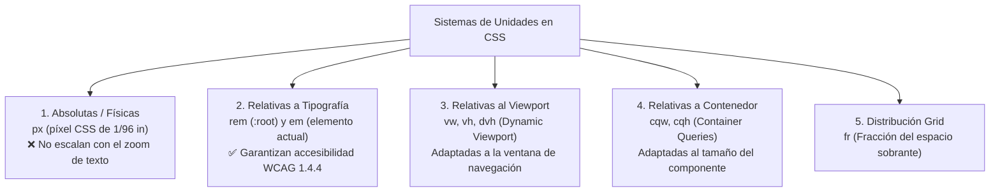

# Unidad 08 · Unidades, tipografía y colores

El RA 1 del módulo 0615 exige «analizar y seleccionar los **colores y tipografías** adecuados para su visualización en pantalla». Esta unidad da el bagaje técnico para hacerlo con criterio profesional.

!!! note "Conocimientos previos"

    - Sintaxis de reglas y **selectores básicos** (unidad 01).
    - Modelo de caja y **unidades relativas** ([unidad 03](03-modelo-de-caja.md)).
    - **Contraste** y escalado de texto (unidad 13).

## PARTE A · UNIDADES

Toda medida CSS es una **magnitud más una unidad**.

### 1. Clasificación general

Toda medida en CSS se divide en familias según cuál sea su **marco de referencia**:



| Familia | Ejemplos | Uso típico |
|---|---|---|
| Absolutas (físicas) | `px`, `cm`, `mm`, `in`, `pt`, `pc`, `Q` | `px` es la referencia práctica de pantalla. |
| Relativas a tipografía | `em`, `rem`, `ex`, `ch` | Tipografía y espaciado rítmico. |
| Relativas al viewport | `vw`, `vh`, `vmin`, `vmax`, `svh/dvh/lvh` | Layouts a pantalla completa, hero. |
| De contenedor | `cqw`, `cqh`, `cqi`, `cqb`, `cqmin`, `cqmax` | Componentes responsivos (container queries, U10). |
| Porcentaje | `%` | Respecto a una propiedad del padre (ver matices). |
| Fracción | `fr` | Solo en grid. |
| Tiempo | `s`, `ms` | Transiciones/animaciones. |
| Ángulo | `deg`, `rad`, `grad`, `turn` | `rotate()`, degradados. |
| Resolución | `dpi`, `dpcm`, `dppx` | Media queries de resolución. |
| Frecuencia | `Hz`, `kHz` | (raro) |

Referencias fijas: `1in = 96px`, `1pt = 1/72in`, `1pc = 12pt`, `1cm ≈ 37.8px`. En pantalla solo `px` importa realmente.

Distingue **absolutas** (no escalan) de **relativas** (dependen de otra medida).

!!! info "Qué unidades conviene memorizar"

    - `px`, `rem`, `em`, `%` y `vw/vh` resuelven el **95 % del CSS real**.
    - `ch` para medida, `fr` en [grid](06-grid.md), `cqw/cqi` en [unidad 10](10-diseno-responsivo.md).

### 2. `px` vs `rem` vs `em` (el debate eterno)

| Unidad | Referencia | Cuándo usarla |
|---|---|---|
| `px` | Pixel CSS (1/96 in) | Bordes finos (1–2 px), detalles donde no quieres escalar. |
| `rem` | `font-size` de `:root` | **Tipografía y espaciado global**: respeta la preferencia de tamaño de texto del usuario (accesibilidad). |
| `em` | `font-size` del propio elemento | Escalado relativo dentro de un componente (iconos `1em`, padding proporcional al tipo). |

Regla de oro: **tipografía y espaciado en `rem`**, **bordes finos en `px`**: así el ==rem== respeta el tamaño del usuario.

Reglas prácticas:

- Define `html { font-size: 100% }` (16 px por defecto) y trabaja en **`rem`**.
- El usuario que sube el texto a 200% (WCAG 1.4.4) escala **todo lo declarado en `rem`** → tu layout debe aguantarlo (pruébalo).
- Cuidado con `em` anidados: **se multiplican** (`1.2em` dentro de `1.2em` = 1.44×). Con `rem` no hay sorpresa.
- `ch` = ancho de la cifra «0» → **medidas tipográficas** perfectas (`width: 20ch` para un input numérico; `max-width: 68ch` para prosa).
- `ex` ≈ altura de la x (poco usado).

### 3. Viewport units y sus variantes dinámicas

| Unidad | Base |
|---|---|
| `vw` / `vh` | 1% del ancho/alto del viewport **inicial**. |
| `vmin` / `vmax` | El menor/mayor de los dos anteriores. |
| `svh` / `dvh` / `lvh` | **small / dynamic / large** viewport height: resuelven el problema de la barra de navegador móvil que aparece/desaparece. |

```css title="hero.css"
.hero { min-height: 100dvh; }   /* llena la pantalla real en móvil */
/* svh: cuando la barra está visible (mínimo)
   lvh: cuando está oculta (máximo)
   dvh: dinámica (reacciona) ← la recomendada hoy */
```

Para bloques a pantalla completa usa ==`100dvh`== y no `100vh`.

> **Claves para el examen**: explicar el problema del `100vh` en móviles (sobra o falta según la URL bar) y la solución `dvh`.

### 4. Porcentajes: ¿respecto a qué?

Depende de la propiedad:

| Propiedad | Referencia del % |
|---|---|
| `width` / `height` | Contenedor padre (content box). |
| `margin-*` / `padding-*` | **Ancho** del contenedor padre (¡también los verticales!). |
| `top/left/right/bottom` (positioned) | Bloque contenedor. |
| `font-size` | `font-size` del padre. |
| `background-position` | Diferencia entre tamaño del fondo y del área. |
| `border-radius` | Radio horizontal respecto al ancho, vertical al alto. |

Trampa clásica: `padding-bottom: 100%` sobre un elemento de 300px de ancho crea 300px de padding (base = **ancho**, no alto). De ahí el truco antiguo de *aspect ratio* con padding (hoy sustituido por ==`aspect-ratio`==).

!!! question "El 50 % que nadie espera"

    `div` de 400 px de ancho con `padding-top: 50%`: ¿qué altura de padding se aplica?

    ??? success "Respuesta"

        **200 px**: los `%` de `padding` se calculan sobre el **ancho**, nunca sobre el alto.

### 5. Funciones de valor

```css title="funciones.css" hl_lines="4"
calc(100% - 2rem);            /* aritmética mixta */
min(100%, 60rem);             /* el menor */
max(100%, 400px);             /* el mayor */
clamp(1rem, 2.5vw, 2rem);     /* min, ideal, max → fluido */
round(nearest 8px, 100%);     /* redondeo a múltiplos (nuevo) */
```

`clamp(min, val, max)` es LA herramienta del **diseño fluido**: un solo valor que crece/decrece con límites (unidad 10).

## PARTE B · TIPOGRAFÍA

La tipografía es el **90 % de la interfaz**: escala, interlínea y medida.

### 6. El stack tipográfico

```css title="tipografia.css"
body {
  font-family: system-ui, -apple-system, "Segoe UI", Roboto, "Helvetica Neue", Arial, sans-serif; /* (1)! */
}
.titulo {
  font-family: "Fraunces", Georgia, "Times New Roman", serif;
}
.codigo {
  font-family: ui-monospace, "Cascadia Code", "JetBrains Mono", Consolas, monospace; /* (2)! */
}
```

1.  `system-ui` primero: **sin descargas** y aspecto nativo.
2.  La genérica final es el **fallback obligatorio**.

Buenas prácticas:

- **Máximo 2 familias** (display + texto) por proyecto; las variantes pesan.
- Siempre **fallback genérico** final (`sans-serif`, `serif`, `monospace`, `system-ui`, `ui-sans-serif`…).
- Nombres con espacios → comillas.
- `font-display` y carga: ver sección 8.

### 7. Propiedades de fuente completas

| Propiedad | Valores/notas |
|---|---|
| `font-family` | Lista con fallback. |
| `font-size` | Longitud; `smaller/larger` (evitar: opacos). |
| `font-weight` | 100–900 (variable fonts: cualquier valor del rango); keywords `normal`=400, `bold`=700. |
| `font-style` | `normal`, `italic`, `oblique [ángulo]`. |
| `font-stretch` | `50%`–`200%` o keywords (`condensed`, `expanded`) — solo si la fuente lo soporta. |
| `font-variant` | Atajo histórico; mejor las específicas: |
| `font-variant-caps` | `small-caps`, `all-small-caps`, `titling-caps`… |
| `font-variant-numeric` | `tabular-nums` (cifras alineadas: tablas, relojes), `oldstyle-nums`, `lining-nums`, `ordinal`, `slashed-zero`. |
| `font-variant-east-asian` | Para CJK. |
| `font-variation-settings` | Ejes de fuentes variables: `"wght" 650, "wdth" 110`. |
| `font-feature-settings` | Características OpenType: `"liga"`, `"tnum"`, `"smcp"`… (crudo; preferible `font-variant-*` cuando exista). |
| `font-kerning` | `normal` / `none`. |
| `font-optical-sizing` | `auto`: la fuente elige corte según tamaño (Display/Text). |
| `line-height` | **Adimensional preferido** (`1.5`): escala con el tipo. `px` solo en casos muy concretos. |
| `letter-spacing` | `em` pequeños (`0.02em`); negativo en display grandes (`-0.02em`). |
| `word-spacing` | Espaciado entre palabras. |
| `text-transform` | `uppercase`, `lowercase`, `capitalize`. |
| `text-indent` | Sangría primera línea (editorial). |
| `text-align` | `start/end` (lógicos) > `left/right` (i18n). |
| `text-align-last` | Alineación de la última línea (`justify` cuidado). |
| `text-justify` | `inter-word` / `inter-character`. |
| `hyphens` | `manual` / `auto` (requiere `lang` correcto). |
| `overflow-wrap` | `break-word` / `anywhere`: evita desbordes de palabras largas. |
| `word-break` | `normal` / `break-all` (CJK). |
| `white-space` | `normal`, `nowrap`, `pre`, `pre-wrap`, `pre-line`, `break-spaces`. |
| `text-shadow` | `x y blur color` (varias capas). |
| `text-decoration-*` | `line`, `color`, `style`, `thickness`, `skip-ink`, `underline-position`. |
| `text-wrap` | `balance` (titulares: líneas parejitas), `pretty` (evita viudas/orfanas). |
| `text-orientation` | Con `writing-mode` vertical. |
| `text-combine-upright` | Combinar caracteres (unidades: ㎡). |
| `font-size-adjust` | Compensa la x-height del fallback (nuevo, soporte parcial). |

Los dos que más se olvidan: ==`tabular-nums`== para **cifras alineadas** y `text-wrap: balance` para **titulares parejitos**.

!!! warning "Error común"

    Declarar `font-size` y `line-height` en **`px`**: el texto deja de escalar (WCAG 1.4.4) y la interlínea se hereda multiplicada. Usa **`rem`** y un **número adimensional** (`1.5`).

### 8. `@font-face` y carga de fuentes

El bloque ==@font-face== es el contrato entre tu CSS y el archivo descargado: familia, `src`, pesos y carga.

```css title="fuentes.css" hl_lines="5 7"
@font-face {
  font-family: "MiFuente";
  src: url("/fonts/mifuente-latin.woff2") format("woff2"), /* (1)! */
       url("/fonts/mifuente-latin.woff")  format("woff");
  font-weight: 100 900;        /* rango → fuente variable */
  font-style: normal;
  font-display: swap;          /* ver abajo (2)! */
  unicode-range: U+0000-00FF;  /* subconjunto latino */
}
```

1.  El navegador usa el **primer formato soportado**: WOFF2 primero, WOFF de red.
2.  `swap` muestra la fallback al instante: **texto visible** mientras carga.

| Aspecto | Recomendación |
|---|---|
| Formato | **WOFF2** siempre (mejor compresión); WOFF como fallback histórico. |
| `font-display` | `swap` (estándar web): muestra fallback y cambia al cargar. `block` (breve espera), `fallback`, `optional` (solo si ya está cacheada), `auto`. |
| Subsets | Divide por `unicode-range` (latino, latin-ext, griego…) para no descargar lo que no se usa. |
| Preload | `<link rel="preload" href="fuente.woff2" as="font" type="font/woff2" crossorigin>` para la fuente crítica. |
| Peso | Limita pesos (400/500/700) o usa variable (un archivo, todos los pesos). |
| Self-hosting vs CDN | Self-hosting: control de privacidad (RGPD), rendimiento y disponibilidad. |

!!! info "Carga de fuentes sin parpadeos"

    - **WOFF2** comprime mejor: basta con servirlo a los actuales.
    - `unicode-range`: **no descargues** lo que no usas.
    - `preload` solo de la **fuente crítica**: un salto de fuente encarece el CLS.

### 9. Escala tipográfica modular

Sistema clásico: ratio fijo (1.2–1.333)[^1] sobre una base:

```css title="escala.css" hl_lines="2 3"
:root {
  --fs-base: 1rem;              /* 16px */
  --ratio: 1.25;                /* quinta justa */
  --fs-sm:   calc(var(--fs-base) / var(--ratio));
  --fs-md:   var(--fs-base);
  --fs-lg:   calc(var(--fs-base) * var(--ratio));
  --fs-xl:   calc(var(--fs-base) * var(--ratio) * var(--ratio));
  --fs-2xl:  calc(var(--fs-base) * pow(var(--ratio), 3));  /* pow(): nuevo */
}
h1 { font-size: var(--fs-2xl); line-height: 1.15; letter-spacing: -0.02em; }
h2 { font-size: var(--fs-xl);  line-height: 1.2; }
h3 { font-size: var(--fs-lg);  line-height: 1.3; }
p  { font-size: var(--fs-md);  line-height: 1.6; max-width: 68ch; }
```

Versión **fluida** con `clamp()` (se combina en unidad 10):

```css title="escala.css"
h1 { font-size: clamp(2rem, 1.5rem + 2vw, 3.5rem); }
```

Métricas de legibilidad (reglas de pulgar):

- Prosa: **16–20 px**, `line-height` 1.5–1.7, medida 45–75 caracteres (`68ch` óptimo).
- Títulos: `line-height` 1.05–1.25, tracking **ligeramente negativo**.
- Contraste mínimo **AA: 4.5:1** (texto normal), 3:1 (grande ≥ 24 px o 18.66 px bold) → WCAG 1.4.3.

## PARTE C · COLORES

Elegir color es un **espacio de color** más una verificación de contraste.

### 10. Formatos de color

Memoriza ==oklch()==: **luz %, croma y matiz en grados**.

| Formato | Ejemplo | Notas |
|---|---|---|
| Nombres | `crimson`, `rebeccapurple` | 148 nombres estándar; legibles pero limitados. |
| Hex | `#fff`, `#fffb`, `#ff0000`, `#ff000080` | 3/4/6/8 dígitos (el 4.º par = alpha). |
| `rgb()` moderno | `rgb(255 0 0 / .5)` | Espacios + `/alpha`; legacy `rgba(255,0,0,.5)` sigue válido. |
| `hsl()` moderno | `hsl(0 100% 50% / .5)` | Matiz, saturación, luz. Alpha con `/`. |
| `hwb()` | `hwb(0 100% 0%)` | Hue, white, black (intuitivo para mezclas). |
| `lab()` / `lch()` | `lch(53% 85 35)` | Perceptual CIE LCh: luz, croma, ángulo. |
| `oklab()` / `oklch()` | `oklch(70% 0.15 250)` | **Perceptualmente uniforme mejorado** (Okabe-Ito). El futuro paletas. |
| `color()` | `color(display-p3 1 0 0)` | Espacios amplios (P3, srgb…). |
| `currentColor` | — | Hereda el `color` actual (iconos SVG, bordes). |
| `transparent` | — | Negro con alpha 0 (cuidado en gradientes: crea banda gris → usa `rgb(0 0 0 / 0)` del color real). |
| System colors | `Canvas`, `Link`, `GrayText`… | Se adaptan al tema del SO (soporte irregular). |

### 11. `color-mix()` — mezclas calculadas

```css title="colores.css"
:root { --marca: oklch(65% 0.2 250); }
.fondo-suave { background: color-mix(in oklab, var(--marca) 10%, white); } /* (1)! */
.borde-medio { border-color: color-mix(in srgb, currentColor 30%, transparent); }
.hover      { background: color-mix(in oklab, var(--marca) 85%, black); }
```

1.  El espacio `in oklab` da mezclas **perceptuales suaves**; `in srgb` es más predecible.

- El espacio de mezcla (`in oklab/srgb/lab…`) afecta al resultado: **oklab** da mezclas perceptuales suaves.
- Casos de uso: generar hover/active/focus desde un único token, fondos derivados, estados de formulario. Elimina el «drenaje» de mantener 5 tonos a mano.

!!! example "Derivar estados desde un solo token"

    Con `--marca: oklch(60% 0.2 260)` no necesitas tonos sueltos:

    ```css
    .suave { background: color-mix(in oklab, var(--marca) 10%, white); }
    .hover { background: color-mix(in oklab, var(--marca) 85%, black); }
    ```

    **Hover y fondo** del mismo token: siempre coherentes.

### 12. `light-dark()` — modo oscuro sin duplicar reglas

```css title="tema.css"
:root {
  --bg: light-dark(#ffffff, #121212);
  --texto: light-dark(#1a1a1a, #eaeaea);
}
@media (prefers-color-scheme: dark) { /* opcional: forzar por clase */ }
:root[data-theme="dark"] { color-scheme: dark; }
```

- `color-scheme: light dark` avisa al navegador de que la página maneja ambos temas (formularios nativos, scrollbars **se adaptan solos**).
- Soporte: Chrome 123+, Firefox 130+, Safari 17.5+.

### 13. Construir una paleta accesible (flujo de trabajo)

1. Define **1–2 colores de marca** en `oklch` (controlas luz/croma/tono por separado).
2. Deriva escalas con `color-mix()` (50…950) o herramientas (Tailwind palette, OKLCH ramps).
3. Verifica **contraste** de cada par texto/fondo contra WCAG:
    - AA: 4.5:1 normal, 3:1 grande; AAA: 7:1 / 4.5:1.
    - No-texto (bordes, iconos funcionales, gráficos): 3:1 (WCAG 1.4.11).
4. Prueba con **daltonismo** (simuladores: Stark, Polotno, browser extensions) y nunca uses color como única información (WCAG 1.4.1): añade icono/texto/patrón.
5. Documenta la paleta como **tokens** (unidad 12).

!!! success "Checklist de paleta accesible"

    - [ ] 1–2 colores de marca en `oklch`.
    - [ ] Escalas derivadas con `color-mix()`.
    - [ ] Contraste **≥ 4,5:1** en cada par texto/fondo.
    - [ ] Probado con simulador de daltonismo y sin color como único dato.

### 14. Errores comunes de color

| Error | Consecuencia | Solución |
|---|---|---|
| `transparent` en gradientes | Banda oscura intermedia | `rgb(color / 0)` del mismo tono. |
| Hex de 3/4 dígitos mal escrito | Color inesperado | Preferir formato largo o `rgb()`. |
| Negros puros `#000`/blancos puros `#fff` | Fatiga visual, halos | Grises suaves (`#111`, `#fafafa`). |
| Paleta solo por matiz HSL | Tonos «sucios» al variar luz | Trabajar en **`oklch`** (croma constante). |
| Estilizar `::selection` sin contraste | Selección ilegible | Comprobar contraste también allí. |

!!! danger "Contraste bajo el mínimo"

    Un texto de 16 px con 3:1 **incumple WCAG 1.4.3**: fallo nivel AA en auditoría. Verifica los pares **texto y fondo juntos**, nunca los colores sueltos.

---

## 15. Ejemplo práctico: tarjeta de cotización con tipografía fluida, números tabulares y paleta OKLCH

El siguiente ejemplo implementa una tarjeta financiera y de analítica que integra las técnicas más avanzadas de la unidad: tamaño de texto fluido con `clamp()`, números alineados sin oscilación mediante `font-variant-numeric: tabular-nums`, un sistema de color científicamente calibrado en el espacio perceptualmente uniforme **OKLCH**, y derivación de estados con `color-mix()`.

=== "HTML"

    ```html title="cotizacion.html"
    <!DOCTYPE html>
    <html lang="es">
    <head>
      <meta charset="UTF-8">
      <meta name="viewport" content="width=device-width, initial-scale=1.0">
      <title>Tipografía y Color · Panel Financiero</title>
      <link rel="stylesheet" href="css/tokens.css">
    </head>
    <body>
      <main class="escenario">
        <article class="tarjeta-finanzas">
          <header class="tarjeta-finanzas__cabecera">
            <span class="ticker">IBEX35 · TECH</span>
            <h1 class="titulo-fluido">Índice Cloud Ibérico</h1>
          </header>
    
          <div class="caja-precio">
            <span class="precio-actual">14.892,40&nbsp;€</span>
            <span class="variacion variacion--positiva" aria-label="Subida de 2.45%">+2,45% ↑</span>
          </div>
    
          <p class="prosa-analisis">
            El volumen de negociación supera los 420 millones de euros impulsado por el sector de computación en la nube y ciberseguridad.
          </p>
    
          <table class="tabla-metricas">
            <caption class="sr-only">Detalle de valores estadísticos de la sesión</caption>
            <thead>
              <tr>
                <th scope="col">Métrica</th>
                <th scope="col">Valor</th>
              </tr>
            </thead>
            <tbody>
              <tr>
                <th scope="row">Máximo diario</th>
                <td class="num-tabular">14.930,15</td>
              </tr>
              <tr>
                <th scope="row">Mínimo diario</th>
                <td class="num-tabular">14.710,80</td>
              </tr>
              <tr>
                <th scope="row">Volumen (títulos)</th>
                <td class="num-tabular">1.849.200</td>
              </tr>
            </tbody>
          </table>
    
          <button type="button" class="btn-operar">Comprar participaciones</button>
        </article>
      </main>
    </body>
    </html>
    ```

=== "CSS"

    ```css title="css/tokens.css"
    /* 1. Tokens de diseño: Paleta OKLCH y tipografía */
    :root {
      /* Color de marca en espacio perceptualmente uniforme OKLCH (Luminosidad, Croma, Matiz) */
      --marca-base: oklch(0.55 0.22 260);
      
      /* Derivaciones armónicas automáticas con color-mix() */
      --marca-hover: color-mix(in oklch, var(--marca-base), black 12%);
      --marca-suave: color-mix(in oklch, var(--marca-base) 15%, white);
      --color-positivo: oklch(0.62 0.19 145);
      --color-positivo-fondo: color-mix(in oklch, var(--color-positivo) 12%, white);
    
      --color-fondo: oklch(0.98 0.01 250);
      --color-superficie: #ffffff;
      --color-texto-base: oklch(0.2 0.03 260);
      --color-texto-muted: oklch(0.48 0.03 260);
      --color-borde: oklch(0.9 0.01 260);
    
      /* Sistema tipográfico */
      --fuente-interfaz: system-ui, -apple-system, sans-serif;
      --fuente-mono: ui-monospace, "SF Mono", "Cascadia Code", monospace;
    }
    
    *, *::before, *::after {
      box-sizing: border-box;
      margin: 0;
      padding: 0;
    }
    
    body {
      font-family: var(--fuente-interfaz);
      background-color: var(--color-fondo);
      color: var(--color-texto-base);
      min-height: 100dvh; /* Altura dinámica que descuenta barras del navegador móvil */
      display: grid;
      place-items: center;
      padding: 1.5rem;
      line-height: 1.6;
    }
    
    .tarjeta-finanzas {
      background-color: var(--color-superficie);
      border: 1px solid var(--color-borde);
      border-radius: 1.25rem;
      padding: 2.25rem;
      max-width: 28rem;
      width: 100%;
      box-shadow: 0 10px 15px -3px oklch(0.2 0.03 260 / 0.06);
    }
    
    .ticker {
      font-family: var(--fuente-mono);
      font-size: 0.75rem;
      font-weight: 700;
      color: var(--marca-base);
      background-color: var(--marca-suave);
      padding: 0.25rem 0.6rem;
      border-radius: 9999px;
      letter-spacing: 0.05em;
    }
    
    /* 2. Titular con escala fluida clamp() */
    .titulo-fluido {
      /* clamp(mínimo, valor preferido según viewport, máximo) */
      font-size: clamp(1.4rem, 1rem + 2vw, 2.1rem);
      line-height: 1.2;
      margin-block: 0.75rem 1rem;
      letter-spacing: -0.02em;
    }
    
    .caja-precio {
      display: flex;
      align-items: baseline;
      gap: 0.75rem;
      margin-block-end: 1rem;
    }
    
    .precio-actual {
      font-size: 2rem;
      font-weight: 800;
      letter-spacing: -0.03em;
      font-variant-numeric: tabular-nums;
    }
    
    .variacion {
      font-size: 0.85rem;
      font-weight: 700;
      padding: 0.2rem 0.5rem;
      border-radius: 0.375rem;
    }
    
    .variacion--positiva {
      color: var(--color-positivo);
      background-color: var(--color-positivo-fondo);
    }
    
    /* 3. Longitud de lectura controlada con unidades ch */
    .prosa-analisis {
      color: var(--color-texto-muted);
      font-size: 0.95rem;
      max-width: 45ch; /* Longitud máxima ergonómica para lectura continuada */
      margin-block-end: 1.5rem;
    }
    
    /* 4. Tabla de datos numéricos con tabular-nums */
    .tabla-metricas {
      width: 100%;
      border-collapse: collapse;
      margin-block-end: 1.75rem;
      font-size: 0.9rem;
    }
    
    .tabla-metricas th,
    .tabla-metricas td {
      padding-block: 0.6rem;
      border-bottom: 1px solid var(--color-borde);
    }
    
    .tabla-metricas th {
      text-align: left;
      font-weight: 500;
      color: var(--color-texto-muted);
    }
    
    /* Dígitos de ancho uniforme para evitar desalineación de cifras */
    .num-tabular {
      text-align: right;
      font-weight: 700;
      font-variant-numeric: tabular-nums;
      color: var(--color-texto-base);
    }
    
    /* 5. Botón interactivo con variantes OKLCH */
    .btn-operar {
      width: 100%;
      padding-block: 0.85rem;
      background-color: var(--marca-base);
      color: #ffffff;
      border: none;
      border-radius: 0.5rem;
      font-size: 1rem;
      font-weight: 600;
      cursor: pointer;
      transition: background-color 0.15s ease;
    }
    
    .btn-operar:hover {
      background-color: var(--marca-hover);
    }
    
    .btn-operar:focus-visible {
      outline: 2px solid var(--marca-base);
      outline-offset: 2px;
    }
    
    .sr-only {
      position: absolute;
      width: 1px;
      height: 1px;
      padding: 0;
      margin: -1px;
      overflow: hidden;
      clip: rect(0, 0, 0, 0);
      border: 0;
    }
    ```

---

### 15.1 Explicación detallada: ¿Por qué se usa cada propiedad y para qué sirve?

A continuación se explican los fundamentos científicos y de diseño detrás de cada propiedad utilizada:

#### 1. Tipografía fluida con `clamp(1.4rem, 1rem + 2vw, 2.1rem)`
- **¿Para qué sirve?** Sustituye decenas de reglas `@media` por una sola función matemática fluida.
- **Cómo opera:**
    - `1.4rem`: Límite inferior garantizado; el titular nunca será más pequeño que este valor en pantallas móviles minúsculas.
    - `1rem + 2vw`: Ecuación de cálculo dinámico donde el texto escala gradualmente a medida que la ventana gráfica (`vw`) se ensancha.
    - `2.1rem`: Límite superior; detiene el crecimiento para que el título no sea desproporcionado en pantallas de escritorio gigantes.

#### 2. Dígitos monoespaciados con `font-variant-numeric: tabular-nums`
- **¿Qué problema resuelve?** En tipografías proporcionales comunes, el número "1" es mucho más estrecho que el número "8". Al mostrar tablas de cotizaciones o relojes numéricos, las columnas bailan horizontalmente y los números no se alinean verticalmente por el punto decimal.
- **La solución técnica:** `tabular-nums` activa una característica tipográfica OpenType que fuerza a que **todos los números del 0 al 9 compartan exactamente la misma anchura física**, manteniendo las columnas de datos alineadas con precisión milimétrica sin cambiar a una fuente de código monospaciada completa.

#### 3. El modelo de color perceptualmente uniforme `oklch()`
- **¿Por qué es superior a `rgb()` y `hsl()`?**
    - En el espacio RGB y HSL tradicional, cambiar el matiz manteniendo la misma luminosidad numérica altera el brillo que el ojo humano realmente percibe (un amarillo puro al 50% de luz parece cegadoramente brillante, mientras que un azul al 50% parece oscuro).
    - **OKLCH** resuelve esto: su eje de Luminosidad ($L$) es perceptualmente uniforme. Un 60% de luz en azul tiene exactamente el mismo brillo percibido que un 60% en verde, permitiendo diseñar interfaces con un contraste predecible y rigurosamente accesible.

#### 4. Mezclas armónicas con `color-mix(in oklch, ...)`
- **¿Para qué sirve?** Permite calcular colores derivados en tiempo real en el navegador sin herramientas externas ni variables hardcodeadas.
- **Ejemplo en el código:**
    - `color-mix(in oklch, var(--marca-base), black 12%)` oscurece sutilmente el color para el estado `:hover`.
    - `color-mix(in oklch, var(--marca-base) 15%, white)` crea un fondo pastel translúcido para el badge corporativo manteniendo la misma familia cromática.

#### 5. Altura de ventana dinámica: `100dvh`
- **¿Qué problema previene en teléfonos móviles?** La unidad clásica `100vh` calcula la altura de la pantalla incluyendo el espacio que ocupan las barras de navegación de Safari o Chrome en iOS/Android, provocando que los botones del fondo queden cortados y requieran scroll forzado. La unidad `100dvh` (*Dynamic Viewport Height*) descuenta en tiempo real la altura de dichas barras del sistema.

---

## 16. Autoevaluación rápida

1. ¿Por qué `rem` es mejor que `em` para espaciado global? ¿Y cuándo sí conviene `em`?
2. Explica `svh/dvh/lvh` con el caso de la URL bar en iOS.
3. ¿A qué se refiere `padding-top: 50%` en un div de 400px de ancho?
4. Escribe `@font-face` con fuente variable, preload y `font-display: swap`. Justifica cada decisión.
5. Genera tres derivados (hover, fondo suave, borde) de `--marca: oklch(60% 0.2 260)` usando `color-mix()`.
6. ¿Qué es `font-variant-numeric: tabular-nums` y dónde lo aplicarías?

!!! tip "Claves para el examen"

    - **`rem`** para tipografía y espaciado; **`px`** solo en bordes y detalles.
    - `100vh` en móvil miente: la solución es `100dvh`.
    - Los `%` de `padding` se calculan sobre el **ancho**, no el alto.
    - `clamp()` = **diseño fluido** con tope mínimo y máximo.
    - `@font-face` + **WOFF2** + `font-display: swap` + `preload`.
    - Paleta en `oklch()` y **AA 4,5:1** verificado.

[^1]: Ratios: **1,2** (tercera menor), **1,25** (quinta justa), **1,333** (cuarta justa): más ratio, más jerarquía.

*[WCAG]: Web Content Accessibility Guidelines
*[CLS]: Cumulative Layout Shift
*[CIE]: Commission Internationale de l'Éclairage
