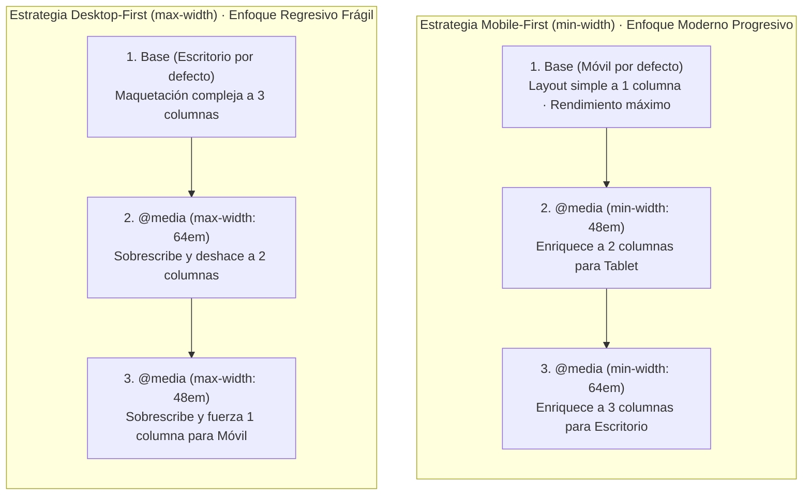

# Unidad 10 · Diseño responsivo

El diseño responsivo (Ethan Marcotte, 2010) parte de tres pilares: **layout fluido**, **imágenes flexibles** y **media queries**. Hoy se completa con `clamp()`, unidades dinámicas y **container queries**. El objetivo: una sola base de código que se adapta a cualquier viewport, orientación y capacidad del dispositivo.

!!! note "Conocimientos previos"

    - Media queries y unidades de la [unidad 08](08-unidades-tipografia-colores.md).
    - Imágenes responsivas con `srcset` de la [unidad 09](09-fondos-imagenes-decoracion.md).
    - Nociones de **accesibilidad**: zoom y movimiento reducido (unidad 13).

## 1. Fundamentos no negociables

### 1.1. El `<meta name="viewport">`

```html title="index.html"
<meta name="viewport" content="width=device-width, initial-scale=1">
```

Sin él, los móviles emulan un viewport de ~980px y «escalan» la página (texto diminuto). Es el **requisito 0**.

### 1.2. Mobile-first

Escribir primero las reglas para pantallas pequeñas y **ampliar** con ==`min-width`==:

```css title="tarjetas.css" hl_lines="2 4"
/* Base = móvil */
.tarjetas { display: grid; gap: 1rem; } /* (1)! */

/* Tablet+ */
@media (min-width: 48em) {
  .tarjetas { grid-template-columns: repeat(2, 1fr); }
}
/* Desktop+ */
@media (min-width: 64em) {
  .tarjetas { grid-template-columns: repeat(3, 1fr); }
}
```

1.  La base ya es usable en móvil: lo demás solo **añade** columnas.

Ventajas: CSS más ligero por defecto, progresivo (los navegadores viejos ven la versión simple), y fuerza a priorizar contenido.



!!! info "Por qué ==mobile-first== gana"

    - **Progresión**: sin `min-width`, el navegador viejo ve la versión simple.
    - **Menos overrides**: nada de deshacer estilos de escritorio en móvil.
    - **Prioridad de contenido**: lo esencial cabe en la columna estrecha.

> **Claves para el examen**: explicar por qué `min-width` (mobile-first) frente a `max-width` (desktop-first): mejora progresiva + menos overrides.

### 1.3. Layouts intrínsecamente fluidos antes que breakpoints

Mucho «responsivo» no necesita media queries:

```css title="fluidos.css"
.contenedor {
  width: min(100% - 2rem, 70rem);   /* fluido con tope */
  margin-inline: auto;
}
.galeria {
  grid-template-columns: repeat(auto-fit, minmax(min(100%, 16rem), 1fr));
}
.prosa { font-size: clamp(1rem, .9rem + .5vw, 1.125rem); }
```

Usa breakpoints solo cuando el **diseño cambia estructuralmente** (nav → hamburguesa, sidebar desaparece…), no para cada detalle.

## 2. Media queries a fondo

### 2.1. Sintaxis

```css title="sintaxis.css"
@media [not|only] tipo y (expresión) { … }
@media (min-width: 40em) and (max-width: 60em), (prefers-color-scheme: dark) { … }
```

- `and` combina; coma = OR.
- `not`/`only`: históricos (evitar `only`; hoy es ruido).
- Múltiples features en una consulta: todas deben cumplirse (`and` implícito entre paréntesis separados por coma NO: usa `and`).

### 2.2. Features principales

| Feature | Valores | Uso |
|---|---|---|
| `width` / `height` | longitudes | Breakpoints clásicos. |
| `aspect-ratio` | `16/9`, `4/3`… | Proporción del viewport. |
| `orientation` | `portrait` / `landscape` | Ajustes por giro. |
| `color` | entero | Bits de profundidad (raro hoy). |
| `color-gamut` | `srgb`, `p3`, `rec2020`… | Servir colores amplios si hay soporte. |
| `resolution` | `dpi/dppx` | Fondos nítidos en retina. |
| `pointer` | `none`, `coarse`, `fine` | ¿Tiene puntero preciso? |
| `hover` | `none`, `hover` | ¿Puede hoverear? (móviles: `hover: none`). |
| `any-pointer` / `any-hover` | Idem pero «algún dispositivo conectado». |
| `update` | `slow`, `fast` | Frecuencia de refresco. |
| `prefers-color-scheme` | `light`, `dark`, `no-preference` | Tema del SO. |
| `prefers-reduced-motion` | `no-preference`, `reduce` | **Accesibilidad**: reducir animaciones. |
| `prefers-reduced-transparency` | `no-preference`, `reduce` | Accesibilidad: evitar transparencias/backdrop. |
| `prefers-reduced-data` | `no-preference`, `reduce` | Ahorro de datos (navegadores con data saver). |
| `prefers-contrast` | `no-preference`, `less`, `more`, `custom` | Modos de alto contraste. |
| `forced-colors` | `active`, `none` | Windows Forced Colors (accesibilidad). |

!!! info "Las que más se usan"

    - `min-width`/`max-width` para **breakpoints** de ancho.
    - `prefers-color-scheme` y ==prefers-reduced-motion==: **tema y movimiento** del usuario.
    - `hover`/`pointer`: distinguen **ratón** de dedo.

### 2.3. Ejemplos combinados

```css title="consultas.css" hl_lines="6 7"
/* Solo dispositivos con puntero fino y hover real */
@media (hover: hover) and (pointer: fine) {
  .card:hover { transform: translateY(-2px); }
}

/* Movimiento reducido: desactivar animaciones no esenciales */
@media (prefers-reduced-motion: reduce) { /* (1)! */
  *, *::before, *::after {
    animation-duration: .01ms !important;
    animation-iteration-count: 1 !important;
    transition-duration: .01ms !important;
    scroll-behavior: auto !important;
  }
}

/* Alto contraste forzado: respetar colores del sistema */
@media (forced-colors: active) {
  .boton { forced-color-adjust: none; border: 1px solid ButtonText; }
}
```

1.  Bloque **globales** (`*`): un único punto de entrada para respetar el ajuste del usuario.

> **Error común**: usar `hover:` como única condición de interacción sin fallback para táctil. Los estados deben funcionar también con `:focus-visible` y toque directo.

## 3. Tipografía y espaciado fluidos con `clamp()`

Fórmula general: ==clamp()== → `clamp(mínimo, valor_ideal_fluido, máximo)`.

Derivación rápida (interpolación lineal entre dos puntos):

```text
quiero 1.5rem a 360px y 3rem a 1200px
pendiente m = (3 - 1.5) / (1200 - 360) rem/px
en vw: m_vw = m * 100 / ancho_base_viewport(1200) ≈ 0.347vw
ordenada b = 1.5rem - m*360 ≈ 1.25rem
→ font-size: clamp(1.5rem, 1.25rem + 0.347vw, 3rem)
```

En la práctica se usan calculadoras (fluid-typography, type-scale-cli) o valores de memoria:

```css title="tokens.css"
:root {
  --fs-h1: clamp(2.25rem, 1.6rem + 2.2vw, 4rem);
  --fs-h2: clamp(1.75rem, 1.4rem + 1.2vw, 2.5rem);
  --space-section: clamp(3rem, 2rem + 4vw, 6rem);
}
```

Reglas:

- Siempre con **topes** (min/max) para no romper en extremos.
- Aplica a `font-size`, `padding`, `gap`, `margin` → todo el ritmo visual escala.
- Combina con escala modular (unidad 08): los tokens ya son fluidos.

!!! example "Tokens fluidos de la guía de estilo"

    ```css
    :root {
      --text:  clamp(1rem, 0.95rem + 0.25vw, 1.125rem);
      --title: clamp(1.75rem, 1.3rem + 1.6vw, 2.75rem);
      --gap:   clamp(1rem, 0.8rem + 1vw, 1.5rem);
    }
    ```

    **Un token por propiedad**: todo escala y el mínimo no baja de 16 px.

## 4. Breakpoints: estrategia

No existen «los» breakpoints universales; se derivan del **contenido**:

1. Diseña mobile-first y busca los puntos donde el layout **se rompe o mejora**.
2. Referencias habituales (ajustar al proyecto): `480px` (móvil landscape), `768px` (tablet), `1024px` (laptop), `1280px` (desktop), `1536px` (grande).
3. Mejor en ==`em`== que `px` (respeta zoom del usuario): `@media (min-width: 48em)`.
4. Documenta la escala en la guía de estilo (tokens de breakpoint).
5. Evita «breakpoint por feature»: agrupa cambios coherentes.

=== "En `em` (recomendado)"

    ```css
    @media (min-width: 48em) {  /* tablet */ }
    @media (min-width: 64em) {  /* desktop */ }
    ```

=== "En `px` (evitar)"

    ```css
    @media (min-width: 768px) { /* tablet */ }
    @media (min-width: 1024px) { /* desktop */ }
    ```

!!! warning "Error común"

    Medir breakpoints y texto en **`px`**: la página rompe antes que el navegador si el usuario amplía la tipografía. Usa **`em`** en consultas y **`rem`** en texto (WCAG 1.4.4).

## 5. Imágenes y media responsivos (repaso operativo)

- `srcset`/`sizes` (unidad 09) para servir el tamaño correcto según viewport.
- `picture` con `media` para arte direccional (cortes distintos móvil/desktop).
- `image-set()` por densidad.
- Video: `<video>` con `poster` y dimensiones; evita autoplay con sonido (usabilidad + baterías).

## 6. Tablas y formularios en pantallas pequeñas

| Técnica | Cuándo |
|---|---|
| `overflow-x: auto` en wrapper | Tablas anchas: scroll horizontal controlado. |
| Columnas ocultas con clases + media query | Datos secundarios en móvil. |
| Transformar fila en bloque (`display:block` + `data-label`) | Tablas simples; cuidar accesibilidad. |
| Formularios: 1 columna → 2 en ancho | `grid-template-columns: repeat(auto-fit, minmax(14rem, 1fr))`. |
| Inputs a `100%` con `max-width` | Evita campos enormes en desktop. |

## 7. Container queries ⭐ (el futuro del componente responsivo)

Las media queries miran el **viewport**; las ==container queries== miran el **contenedor**. Permiten componentes verdaderamente reutilizables que se adaptan al espacio disponible, no al tamaño de pantalla.

### 7.1. Activar un contenedor

```css title="contenedor.css"
.tarjeta-wrap {
  container-type: inline-size;   /* observa el ancho */
  /* container-type: size → observa ancho Y alto (requiere altura definida) */
  container-name: tarjeta;       /* nombre opcional para varias consultas */
}
```

- ==`inline-size`==: solo eje inline (el 95% de los casos).
- `size`: ambos ejes (el contenedor debe tener tamaño definido en ese eje).
- `style`: solo para style queries (ver 7.4).

### 7.2. Consultas `@container`

```css title="tarjetas-cq.css" hl_lines="1"
@container (min-width: 30rem) {
  .tarjeta { grid-template-columns: 12rem 1fr; }  /* horizontal */
}
@container tarjeta (min-width: 40rem) and (orientation: landscape) {
  .tarjeta .titulo { font-size: 1.5rem; }
}
```

Sintaxis idéntica a `@media` (mismas features de tamaño/orientación), pero evaluadas contra el contenedor.

### 7.3. Unidades de contenedor

Dentro del árbol del contenedor:

| Unidad | Significado |
|---|---|
| `cqw` / `cqh` | 1% del ancho/alto del contenedor. |
| `cqi` / `cqb` | 1% del inline/block size. |
| `cqmin` / `cqmax` | Menor/mayor de los anteriores. |

```css title="unidades-cq.css"
@container { .logo { width: 20cqw; } }   /* siempre 20% del contenedor */
```

### 7.4. Style queries (consultas de estilo)

Consultan **custom properties** del contenedor (temas dinámicos):

```css title="style-query.css"
.panel { container-style: --theme-density; }

@container style(--theme-density: compact) {
  .panel .item { padding: .25rem; }
}
```

Soporte reciente (Chrome 111+, Firefox 151+, Safari 18+); aún en consolidación.

### 7.5. ¿MQ o CQ?

| Caso | Herramienta |
|---|---|
| Cambia la estructura de la PÁGINA (nav, sidebar) | Media query. |
| Cambia un COMPONENTE según su hueco (widget, tarjeta, sidebar embeddable) | Container query. |
| Preferecias del USUARIO (tema, movimiento, contraste) | Media query `prefers-*`. |

!!! question "El widget que vive en dos sitios"

    Un widget se inserta en una **sidebar estrecha** y en el **main ancho**, con el mismo CSS. ¿Qué técnica activas?

    ??? success "Respuesta"

        **Container query**: `container-type: inline-size` en el envoltorio y `@container (min-width: 30rem)` para dos columnas. La MQ solo mira el **viewport**, no el hueco real.

> **Claves para el examen**: MQ (viewport) vs CQ (contenedor) y el widget que vive en sidebar (estrecho) y en main (ancho) con el mismo CSS.

## 8. Otras técnicas responsivas

- **`scroll-snap`**: carruseles nativos:

```css title="carrusel.css"
.carrusel {
  display: flex; gap: 1rem;
  overflow-x: auto;
  scroll-snap-type: x mandatory;
  scrollbar-width: none;
}
.carrusel > * { scroll-snap-align: start; }
```

- **Orden responsive con `order`** (flex/grid): cambiar jerarquía visual por breakpoint (cuidado a11y, unidad 05).
- **Nav adaptativa**: lista → menú desplegable con checkbox hack o JS mínimo + `dialog`.
- **Safe areas**: `env(safe-area-inset-*)` para notches.
- **`text-wrap: balance`** en títulos para evitar viudas en columnas estrechas.

??? note "Para saber más"

    `scroll-snap-stop: always` evita saltar dos tarjetas y `overscroll-behavior: contain` impide que el carrusel «robe» el scroll de la página.

## 9. Testing responsivo

1. DevTools → Device Mode (perfiles + viewport libre + velocidad de red).
2. **Dispositivos reales** (mínimo 1 móvil Android + 1 iOS): emulador ≠ realidad (gestos, barras, teclado).
3. Prueba orientaciones, zoom 200%, texto grande, modo oscuro, datos limitados.
4. Lighthouse (mobile) para métricas reales.
5. Checklist: ¿desbordes horizontales? ¿táctiles ≥ 44×44 px? ¿lectura sin zoom?

!!! success "Checklist de entrega responsiva"

    - [ ] Sin **desbordes horizontales** en 320 px.
    - [ ] Objetivos táctiles ≥ **44×44 px** y zoom al **200 %** sin pérdidas.
    - [ ] `prefers-reduced-motion` y modo oscuro comprobados.
    - [ ] Lighthouse móvil sin regresiones de LCP.

---

## 10. Ejemplo práctico: portal de noticias con Container Queries y Media Queries de rango

El siguiente ejemplo implementa una arquitectura responsiva moderna combinando la metodología **Mobile-First**, la sintaxis moderna de rango para Media Queries (`width >= 48em`), y el estándar de **Container Queries** (`@container`), permitiendo que las tarjetas de noticias se reconfiguren visualmente de formato vertical a apaisado según el ancho del contenedor en el que se ubiquen (sea en la columna principal o en una barra lateral estrecha).

=== "HTML"

    ```html title="noticias-responsivo.html"
    <!DOCTYPE html>
    <html lang="es">
    <head>
      <meta charset="UTF-8">
      <meta name="viewport" content="width=device-width, initial-scale=1.0">
      <title>Diseño Responsivo · Portal de Noticias</title>
      <link rel="stylesheet" href="css/responsivo.css">
    </head>
    <body>
      <div class="layout-portal">
        <header class="cabecera-portal">
          <div class="marca">Diario Digital DAW</div>
          <button type="button" class="btn-menu" aria-label="Abrir menú de navegación">☰</button>
        </header>
    
        <div class="rejilla-contenido">
          <!-- Columna Principal ancha -->
          <main class="columna-principal">
            <h1 class="titular-seccion">Actualidad Tecnológica</h1>
            
            <div class="tarjeta-contenedor">
              <article class="noticia-card">
                <div class="noticia-card__media">
                  
                </div>
                <div class="noticia-card__cuerpo">
                  <span class="noticia-card__categoria">Ciberseguridad</span>
                  <h2 class="noticia-card__titular">Nuevos protocolos de autenticación post-cuántica</h2>
                  <p class="noticia-card__resumen">
                    Los organismos de estandarización publican las directrices definitivas para blindar las comunicaciones bancarias e institucionales.
                  </p>
                  <a href="#" class="noticia-card__enlace">Leer artículo completo</a>
                </div>
              </article>
            </div>
          </main>
    
          <!-- Barra Lateral estrecha: reutiliza EXACTAMENTE el mismo componente HTML -->
          <aside class="columna-lateral">
            <h2 class="titular-sidebar">Destacados</h2>
            
            <div class="tarjeta-contenedor">
              <article class="noticia-card">
                <div class="noticia-card__media">
                  
                </div>
                <div class="noticia-card__cuerpo">
                  <span class="noticia-card__categoria">Infraestructura</span>
                  <h2 class="noticia-card__titular">Despliegue de nodos troncales de baja latencia</h2>
                  <p class="noticia-card__resumen">
                    Ampliación de centros de interconexión en el sur de Europa.
                  </p>
                  <a href="#" class="noticia-card__enlace">Leer más</a>
                </div>
              </article>
            </div>
          </aside>
        </div>
      </div>
    </body>
    </html>
    ```

=== "CSS"

    ```css title="css/responsivo.css"
    *, *::before, *::after {
      box-sizing: border-box;
      margin: 0;
      padding: 0;
    }
    
    body {
      font-family: system-ui, -apple-system, sans-serif;
      background-color: #f8fafc;
      color: #0f172a;
      line-height: 1.5;
    }
    
    /* 1. Mobile-First Base (Móviles de 320px a 767px) */
    .layout-portal {
      max-width: 76rem;
      margin-inline: auto;
      padding: 1rem;
    }
    
    .cabecera-portal {
      display: flex;
      justify-content: space-between;
      align-items: center;
      padding-block: 1rem;
      border-bottom: 2px solid #0f172a;
      margin-block-end: 1.5rem;
    }
    
    .marca {
      font-size: 1.4rem;
      font-weight: 900;
      letter-spacing: -0.02em;
    }
    
    /* Objetivo táctil mínimo de 44x44px según WCAG 2.5.5 */
    .btn-menu {
      min-width: 44px;
      min-height: 44px;
      font-size: 1.5rem;
      background: none;
      border: 1px solid #cbd5e1;
      border-radius: 0.375rem;
      cursor: pointer;
      display: grid;
      place-items: center;
    }
    
    .titular-seccion {
      /* Tipografía fluida con clamp() */
      font-size: clamp(1.5rem, 1rem + 2vw, 2.25rem);
      margin-block-end: 1.5rem;
    }
    
    .rejilla-contenido {
      display: grid;
      grid-template-columns: 1fr; /* 1 columna por defecto en móvil */
      gap: 2rem;
    }
    
    /* 2. Media Queries con sintaxis de rango matemática moderna */
    /* A partir de 768px (tablets y pantallas medianas) */
    @media (width >= 48em) {
      .layout-portal {
        padding: 2rem;
      }
    
      .btn-menu {
        display: none; /* Oculta botón hamburguesa en pantallas grandes */
      }
    
      .rejilla-contenido {
        /* 2 columnas asimétricas: 65% para contenido principal y 35% para lateral */
        grid-template-columns: 2fr 1fr;
        gap: 2.5rem;
      }
    }
    
    /* 3. Definición del contexto de contenedor (Container Queries) */
    .tarjeta-contenedor {
      /* Declara que este contenedor será el marco de referencia de tamaño */
      container-type: inline-size;
      container-name: tarjeta-noticia;
    }
    
    /* Estilo por defecto del componente (tarjeta vertical estándar) */
    .noticia-card {
      background: #ffffff;
      border: 1px solid #e2e8f0;
      border-radius: 0.75rem;
      overflow: hidden;
      display: flex;
      flex-direction: column;
      box-shadow: 0 4px 6px -1px rgb(0 0 0 / 0.05);
    }
    
    .noticia-card__media {
      width: 100%;
      aspect-ratio: 16 / 9;
    }
    
    .noticia-card__media img {
      width: 100%;
      height: 100%;
      object-fit: cover;
      display: block;
    }
    
    .noticia-card__cuerpo {
      padding: 1.25rem;
      display: flex;
      flex-direction: column;
      gap: 0.5rem;
    }
    
    .noticia-card__categoria {
      font-size: 0.75rem;
      font-weight: 800;
      text-transform: uppercase;
      color: #0284c7;
    }
    
    .noticia-card__titular {
      font-size: 1.15rem;
      line-height: 1.3;
    }
    
    .noticia-card__resumen {
      font-size: 0.9rem;
      color: #64748b;
    }
    
    .noticia-card__enlace {
      align-self: flex-start;
      margin-top: 0.5rem;
      color: #0284c7;
      font-weight: 600;
      text-decoration: none;
      font-size: 0.85rem;
    }
    
    /* 4. Adaptación reactiva del componente según el ancho de SU PROPIO CONTENEDOR */
    @container tarjeta-noticia (width >= 450px) {
      .noticia-card {
        /* Si el contenedor mide 450px o más, pasa de vertical a horizontal apaisado */
        flex-direction: row;
        align-items: center;
      }
    
      .noticia-card__media {
        width: 40%; /* La foto ocupa el 40% a la izquierda */
        aspect-ratio: 4 / 3;
        flex-shrink: 0;
      }
    
      .noticia-card__cuerpo {
        width: 60%;
        padding: 1.5rem;
      }
    
      .noticia-card__titular {
        font-size: 1.35rem;
      }
    }
    ```

---

### 10.1 Explicación detallada: ¿Por qué se usa cada propiedad y para qué sirve?

A continuación se detalla la justificación técnica de la arquitectura responsiva empleada:

#### 1. Enfoque Mobile-First estricto
- **¿Por qué empezar desde el móvil?** El CSS declarado fuera de las media queries rige para pantallas pequeñas (320-480 px). Los teléfonos móviles cargan menos líneas de código y aplican el renderizado inicial sin sobreescrituras innecesarias. Conforme la pantalla crece, las reglas `@media (width >= 48em)` agregan columnas progresivamente.
- **Sintaxis de rango (`width >= 48em`):** Sustituye la antigua y confusa sintaxis `(min-width: 48em)` por un operador relacional matemático directo y legible.

#### 2. La revolución de las Container Queries (`@container`)
- **La limitación histórica de las Media Queries:** Una Media Query clásica solo puede evaluar el ancho del **viewport entero**. No sabe si un componente está colocado en la columna principal de 900 px o en una barra lateral de 280 px.
- **La solución con Container Queries:**
    - Al declarar `container-type: inline-size` en `.tarjeta-contenedor`, le indicamos al navegador que monitorice el ancho de ese div específico.
    - La regla `@container tarjeta-noticia (width >= 450px)` evalúa **el hueco físico donde vive la tarjeta**.
    - **Resultado profesional:** En la columna principal, la tarjeta detecta que tiene más de 450 px de ancho y se dibuja apaisada (foto a la izquierda, texto a la derecha). En la barra lateral, la misma tarjeta exacta detecta que su contenedor solo mide 280 px y se renderiza en formato vertical compacto, **sin necesidad de duplicar clases ni crear componentes separados**.

#### 3. Tamaño táctil accesible de 44×44 px (Criterio WCAG 2.5.5)
- **`min-width: 44px; min-height: 44px;`:** Las directrices internacionales de accesibilidad establecen que los botones o enlaces interactivos en dispositivos móviles deben ofrecer un área táctil mínima de $44 \times 44\text{ px}$. Esto evita que personas con temblores o dedos grandes pulsen involuntariamente elementos contiguos.

---

## 11. Errores comunes

| Error | Consecuencia | Solución |
|---|---|---|
| Breakpoints en `px` absolutos sin topes | Layout roto en TV/monitores grandes | `max-width` en contenedor + `em` en MQ. |
| Desktop-first con cascada de `max-width` | CSS hinchado, overrides encadenados | Mobile-first con `min-width`. |
| `100vh` fijo en móvil | Barras tapadas / huecos | `100dvh`. |
| Hover como única affordance | Móviles sin feedback | Estados `:active`/`:focus-visible` + color. |
| Imagen gigante servida a móvil | LCP horrible | `srcset`/`sizes` + `loading="lazy"`. |
| Olvidar `prefers-reduced-motion` | Mareos/vértigo | Bloque global de reducción (ver 2.3). |

## 11. Autoevaluación rápida

1. Escribe la consulta: «pantalla ≥ 768px Y modo oscuro preferido».
2. Deriva un `clamp()` para `--space-section` entre 2rem (360px) y 5rem (1200px).
3. ¿Por qué `container-type: inline-size` es suficiente para la mayoría de widgets?
4. Un widget debe verse en 2 columnas si su contenedor supera 400px, sea donde esté. Escríbelo con CQ.
5. ¿Qué features de media query usarías para detectar «dispositivo táctil sin ratón»?
6. Explica la diferencia entre `svh`, `dvh` y `lvh` y cuál usas por defecto.

!!! tip "Claves para el examen"

    - **Mobile-first** con `min-width` (menos overrides).
    - `clamp(min, ideal, max)` = **tipografía y espaciado fluidos** con topes.
    - Breakpoints derivados del **contenido**, en `em`.
    - MQ mira el **viewport**; ==@container== mira el **hueco del componente**.
    - Sin `prefers-reduced-motion` no se publica: es **accesibilidad**.
    - Prueba en **dispositivo real**: el emulador miente.

*[MQ]: Media Query
*[CQ]: Container Query
*[LCP]: Largest Contentful Paint
