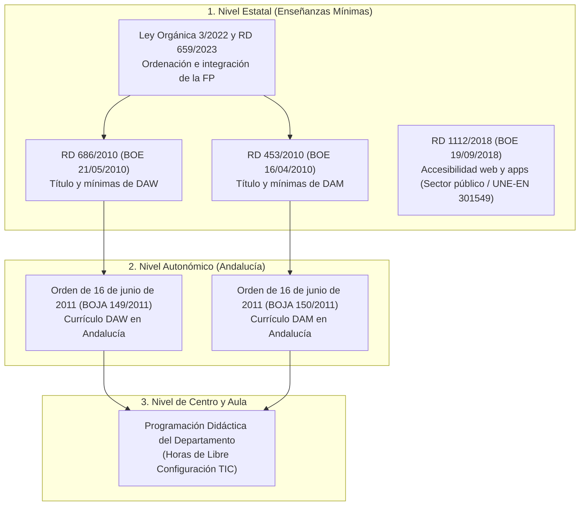
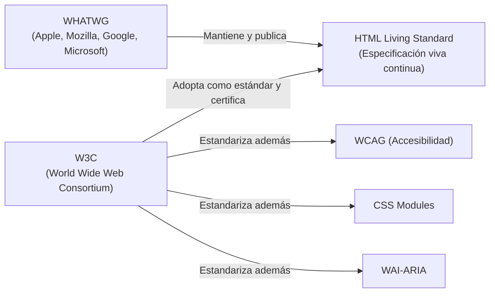

# HTML 00 · Normativa y marco curricular

Antes de escribir código, conviene situar **qué nos exige el currículo educativo oficial**, **dónde se define** y **cómo se justifica** técnicamente cada decisión. En una prueba de evaluación, en un proyecto integrado o en una programación didáctica, saber citar la normativa vigente y justificar el cumplimiento de los estándares y la legislación de accesibilidad es parte esencial de la competencia profesional técnica.

!!! note "Conocimientos previos"

    - Qué es un **módulo profesional**, un **resultado de aprendizaje (RA)** y un **criterio de evaluación (CE)**.
    - Diferenciar entre normativa estatal (**BOE**) y autonómica andaluza (**BOJA**).
    - Conocer tu ciclo formativo: **DAW** (Desarrollo de Aplicaciones Web) o **DAM** (Desarrollo de Aplicaciones Multiplataforma), y tus módulos asociados: **0373 (LMSGI/LMH)** en 1.º curso, **0615 (DIW)** en 2.º de DAW o **0488 (DI)** en 2.º de DAM.

## 1. El marco normativo de la FP en Andalucía

La formación profesional de grado superior en informática se estructura en dos niveles normativos: el marco estatal (que fija las enseñanzas mínimas comunes a todo el Estado) y el marco autonómico de la Junta de Andalucía (que desarrolla y amplía el currículo).



### 1.1. Nivel estatal

| Norma | Qué establece |
|---|---|
| **Real Decreto 686/2010**, de 20 de mayo (BOE 21/05/2010) | Establece el título de **Técnico Superior en Desarrollo de Aplicaciones Web (DAW)** y fija sus enseñanzas mínimas: perfil profesional, objetivos generales, módulos (2.000 h) y criterios de evaluación. |
| **Real Decreto 453/2010**, de 16 de abril (BOE 16/04/2010) | Establece el título de **Técnico Superior en Desarrollo de Aplicaciones Multiplataforma (DAM)** y fija sus enseñanzas mínimas correspondientes. |
| **Ley Orgánica 3/2022** y **Real Decreto 659/2023**, de 18 de julio | Marco general de ordenación del Sistema de Formación Profesional (modelo dual generalizado, competencias digitales, inclusión y sostenibilidad). |
| **Real Decreto 1112/2018**, de 7 de septiembre (BOE 19/09/2018) | Transposición de la Directiva (UE) 2016/2102 sobre **accesibilidad de los sitios web y aplicaciones para dispositivos móviles**, obligando al cumplimiento de la norma **UNE-EN 301549** (equivalente a WCAG 2.1 nivel AA) en el sector público y empresas de interés económico general. |

### 1.2. Nivel autonómico (Andalucía)

| Norma | Qué establece |
|---|---|
| **Orden de 16 de junio de 2011** (DAW, BOJA n.º 149, de 1 de agosto de 2011) | Desarrolla el currículo andaluz para **DAW**: fija los **Resultados de Aprendizaje (RA)**, **Criterios de Evaluación (CE)**, contenidos y orientaciones pedagógicas de los módulos **0373** y **0615**. |
| **Orden de 16 de junio de 2011** (DAM, BOJA n.º 150, de 2 de agosto de 2011) | Desarrolla el currículo andaluz para **DAM**: fija los RA, CE y contenidos de los módulos **0373** y **0488**. |
| Ley 17/2007 (LEA) y Decreto 436/2008 | Marco andaluz de educación y formación profesional inicial. |

> **Cadena de justificación normativa en examen / proyecto**:  
> `Reales Decretos estatales (RD 686/2010 / RD 453/2010) → Órdenes andaluzas de 16/06/2011 (BOJA 149 y 150) → Programación didáctica de departamento`.  
> Las 3 horas de libre configuración autonómica permiten al profesorado justificar la incorporación de APIs nativas avanzadas de HTML5 y tecnologías web modernas.

---

## 2. Resultados de aprendizaje aplicables a HTML

El estudio de HTML se distribuye entre el primer curso (bases de marcado e integración) y el segundo curso (interfaces avanzadas, accesibilidad y usabilidad).

### 2.1. Módulo 0373 — Lenguajes de marcas y sistemas de gestión de información (1.º DAW / DAM - 128 h)

El módulo troncal de 1.º dedica a HTML los siguientes **Resultados de Aprendizaje**:

#### **Resultado de aprendizaje 1:**
> **«Reconoce las características de lenguajes de marcas analizando e interpretando la estructura de documentos.»**
>
> - *CE 1.a:* Se han identificado las características generales de los lenguajes de marcas.
> - *CE 1.b:* Se han reconocido las ventajas que aportan en el tratamiento de la información.
> - *CE 1.c:* Se han clasificado los lenguajes de marcas e identificado los más relevantes.
> - *CE 1.d:* Se ha analizado la estructura de un documento y las reglas sintácticas (**concepto de documento bien formado y válido**).

#### **Resultado de aprendizaje 2:**
> **«Utiliza lenguajes de marcas para la transmisión de información a través de la Web analizando la estructura de los documentos e identificando sus elementos.»**

| Criterio de Evaluación (CE) | Descripción curricular oficial | Unidades de estos apuntes |
|---|---|---|
| **2.a** | Se han identificado las características de **HTML y XHTML**. | **U00**, **U01** (evolución, sintaxis estricta vs tolerante) |
| **2.b** | Se ha identificado la **estructura de un documento** HTML/XHTML y las etiquetas que lo componen. | **U01** (árbol DOM, `head`, `body`, metadatos) |
| **2.c** | Se han utilizado **herramientas en la creación** de documentos Web. | **U01**, **U05** (VS Code, Emmet, linters, validadores) |
| **2.d** | Se han identificado y utilizado etiquetas y atributos de **texto, listas, enlaces, tablas, imágenes y contenido multimedia**. | **U02** (texto), **U03** (enlaces/recursos), **U04** (multimedia), **U05** (tablas) |
| **2.e** | Se han creado **formularios** y definido los controles de entrada de datos. | **U06** (formularios HTML5, inputs, validación) |
| **2.f** | Se han utilizado lenguajes de marcas para la transmisión de información en la Web. | **U01**, **U07**, **U08** |
| **2.i** | Se han utilizado **herramientas para verificar la sintaxis y accesibilidad** de los documentos. | **U01** (Validador W3C), **U07** (DevTools A11y, NVDA) |

#### **Resultado de aprendizaje 6:**
> **«Establece mecanismos de comunicación e integración de información identificando las tecnologías involucradas y aplicando estándares.»**
>
> - *CE 6.a / 6.b:* Canales de contenidos, **sindicación web (RSS / Atom)** y metadatos estructurados en documentos web (**U01**, **U03**).

---

### 2.2. Módulo 0615 — Diseño de interfaces web (2.º DAW - 80 h)

En 2.º curso de DAW, HTML se conecta directamente con el diseño profesional, la accesibilidad legal y la optimización:

| RA | Enunciado y Criterios clave de HTML | Unidades |
|---|---|---|
| **RA 1** | **Planifica la creación de una interfaz web:** estructura, elementos de ordenación, maquetación semántica sin marcos obsoletos. | **U01**, **U07** |
| **RA 3 y 4** | **Prepara e integra contenido multimedia:** formatos de imagen (AVIF, WebP, SVG), audio, vídeo nativo, subtítulos (`<track>`) y verificación multinavegador. | **U03**, **U04** |
| **RA 5** | **Desarrolla interfaces Web accesibles:** W3C, **WCAG 2.1/2.2**, **RD 1112/2018**, ARIA nativo, navegación por teclado, foco visible y lectores de pantalla. | **U03**, **U05**, **U06**, **U07** |
| **RA 6** | **Desarrolla interfaces Web amigables (usabilidad):** estándares web, validación nativa, semántica para SEO y Core Web Vitals. | **U01**, **U06**, **U07**, **U08** |

---

### 2.3. Módulo 0488 — Desarrollo de interfaces (2.º DAM - 140 h)

En 2.º curso de DAM, HTML es el lenguaje base para el diseño de componentes web incrustados (*WebViews*, arquitecturas híbridas y accesibilidad universal):

- **RA 4:** Diseña interfaces gráficas respetando principios de usabilidad y diseño responsivo.
- **RA 5:** Crea componentes de interfaz accesibles y conformes a estándares internacionales.

---

## 3. Organismos de estandarización: W3C y WHATWG

HTML no es propiedad de ninguna empresa ni de ningún navegador comercial: es un **estándar abierto**.



### 3.1. La evolución histórica del estándar

1. **HTML 4.01 (1999, W3C):** Estableció la separación entre estructura y presentación (mediante CSS).
2. **XHTML 1.0 (2000, W3C):** Reformulación de HTML 4.01 bajo las reglas estrictas de XML 1.0. Exigía documentos rígidamente bien formados.
3. **El cisma de XHTML 2.0 y el nacimiento del WHATWG (2004):** Ante el intento del W3C de crear un XHTML 2.0 incompatible con la web real existente, los fabricantes de navegadores fundaron el **WHATWG** (*Web Hypertext Application Technology Working Group*) para crear **HTML5**.
4. **Acuerdo W3C - WHATWG (2019):** Ambos organismos firmaron un memorándum de entendimiento: el WHATWG mantiene la especificación viva (**HTML Living Standard**) y el W3C la avala y publica periódicamente como recomendación formal.

### 3.2. ¿Qué significa «Living Standard»?

Ya **no existen versiones cerradas** como «HTML6» o «HTML7». HTML es un **estándar vivo continuo**: las nuevas características (`<dialog>`, `loading="lazy"`, tipos de input) se incorporan a la especificación en cuanto alcanzan consenso entre fabricantes y se implementan en los motores de navegación (*Blink/Chromium*, *Gecko/Firefox*, *WebKit/Safari*).

---

## 4. Mapa de contenidos: de la norma a las unidades

El siguiente esquema vincula los criterios de evaluación de la normativa andaluza con cada unidad didáctica del bloque de HTML:

```text title="mapa-curricular-html.txt"
Orden de 16 de junio de 2011 (BOJA 149 / BOJA 150)
│
├── Módulo 0373: Lenguajes de marcas y sist. gestión inf.
│   ├── RA 1: Estructura y reglas sintácticas
│   │    ├── Documento bien formado vs válido .......... U00, U01
│   │    └── HTML vs XHTML y parsers XML .............. U01
│   ├── RA 2: Lenguajes de marcas en la Web
│   │    ├── Estructura global, DOCTYPE, head/body ..... U01
│   │    ├── Texto, semántica, listas y agrupación ..... U02
│   │    ├── Enlaces, rutas e imágenes responsivas ..... U03
│   │    ├── Multimedia nativa (audio/video/track) .... U04
│   │    ├── Tablas de datos y matriz bidimensional .... U05
│   │    ├── Formularios y controles de entrada ........ U06
│   │    ├── Validación W3C y verificación sintáctica .. U01, U06
│   │    └── APIs nativas y atributos data-* ........... U08
│   └── RA 6: Sindicación e integración de información
│        └── Metadatos estructurados y feeds RSS/Atom .. U01, U03
│
└── Módulo 0615: Diseño de interfaces web / 0488: DI
    ├── RA 1: Planificación de interfaz y ordenación ..... U01, U07
    ├── RA 3 y 4: Multimedia y optimización web ......... U03, U04
    ├── RA 5: Accesibilidad web legal (RD 1112/2018) .... U03, U04, U05, U06, U07
    └── RA 6: Usabilidad y estándares web ............... U06, U07, U08
```

---

## 5. Resumen ejecutivo

1. **Marco legal en Andalucía:** Los ciclos DAW y DAM se fundamentan en los **RD 686/2010** y **RD 453/2010** (mínimos estatales) y en las **Órdenes de 16 de junio de 2011** (currículo andaluz, BOJA 149 y 150), bajo el marco de la **Ley Orgánica 3/2022** y el **RD 659/2023**.
2. **Distribución modular:** HTML constituye el núcleo del **RA 1 y RA 2 del módulo 0373 (LMSGI)** en primer curso, y sustenta los **RA 1, 3, 4, 5 y 6 del módulo 0615 (DIW)** y **RA 4 y 5 del 0488 (DI)** en segundo curso.
3. **Estandarización viva:** Rige el **HTML Living Standard** del WHATWG/W3C; no existen versiones cerradas tipo «HTML6».
4. **Accesibilidad de obligado cumplimiento:** En España, el **Real Decreto 1112/2018** y la norma **UNE-EN 301549** exigen el cumplimiento de las **WCAG 2.1 nivel AA**. En el código HTML, la accesibilidad no es opcional: forma parte directa de los criterios de evaluación.

!!! success "Checklist de la unidad"

    - [ ] Cito correctamente el **RD 686/2010** (DAW) / **RD 453/2010** (DAM) y la **Orden de 16/06/2011** (BOJA 149/150).
    - [ ] Conozco el **Real Decreto 1112/2018** como marco legal de accesibilidad web en España.
    - [ ] Identifico el **RA 2 del módulo 0373** como el núcleo curricular de HTML en primer curso.
    - [ ] Explico la diferencia entre **W3C** (estándares/WCAG) y **WHATWG** (HTML Living Standard).
    - [ ] Distingo entre documento **bien formado** y documento **válido**.

!!! tip "Claves para el examen"

    - **Cadena normativa oficial:** `RD estatal → Orden andaluza de 16/06/2011 → Programación de aula`.
    - **Módulo 0373:** Exige conocer la diferencia estructural entre HTML y XHTML (parseo y bien formado).
    - **Módulo 0615 / 0488:** Exige accesibilidad demostrable conforme a WCAG 2.1 / 2.2 nivel AA (RD 1112/2018).
    - **Organismo rector:** El estándar de HTML lo redacta el **WHATWG** como *Living Standard* y lo avala el **W3C**.

*[W3C]: World Wide Web Consortium
*[WHATWG]: Web Hypertext Application Technology Working Group
*[RA]: Resultado de aprendizaje
*[CE]: Criterio de evaluación
*[LMSGI]: Lenguajes de marcas y sistemas de gestión de información
*[DIW]: Diseño de interfaces web
*[DI]: Desarrollo de interfaces
*[BOJA]: Boletín Oficial de la Junta de Andalucía
*[BOE]: Boletín Oficial del Estado
