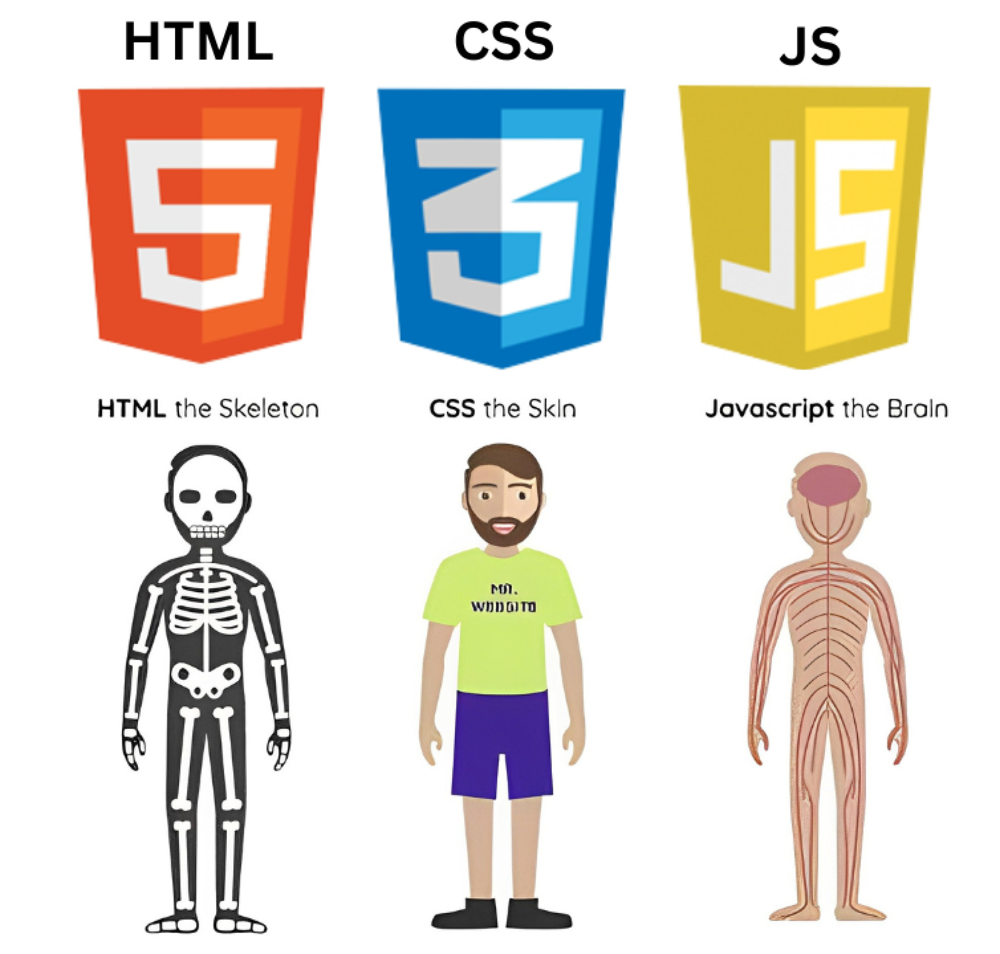
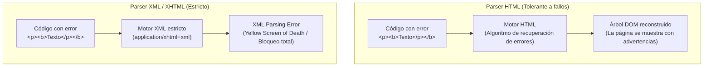

# HTML 01 — Introducción a HTML5 y XHTML

HTML (*HyperText Markup Language*) describe la **estructura** y el **significado** de un documento en la Web: declara qué es cada fragmento de información (un título, un párrafo, un enlace, una tabla), abstrayéndose completamente de cómo debe presentarse visualmente. En este tema se estudia de dónde surge, la distinción técnica y curricular entre HTML y XHTML, cómo se construye un documento bien formado y qué metadatos permiten a los motores de búsqueda, navegadores y tecnologías asistivas interpretar la información con fidelidad.

!!! note "Conocimientos previos"

    - Manejo básico del editor de código (VS Code) y guardado de ficheros con extensión `.html`.
    - Concepto de jerarquía de directorios y rutas relativas (`./`, `../`).
    - Comprensión del protocolo HTTP/HTTPS y el funcionamiento cliente-servidor en la Web.

---

## 1. Qué es HTML y cuál es su papel

### 1.1 Estructura, presentación y comportamiento (Separación de responsabilidades)

En la arquitectura web moderna rige el principio de **Separación Estricta de Responsabilidades** (*Separation of Concerns*):

| Tecnología | Pregunta clave | Capa arquitectónica | Archivo estándar |
|---|---|---|---|
| **HTML** | ¿**Qué** información hay y qué significa? | Estructura y semántica | `.html` |
| **CSS** | ¿**Cómo** se presenta visualmente? | Presentación y diseño | `.css` |
| **JavaScript** | ¿**Qué hace** y cómo interactúa? | Comportamiento y lógica de cliente | `.js` / `.ts` |

HTML constituye los cimientos y los muros maestros de un edificio; CSS aporta los acabados y la pintura; JavaScript instala los mecanismos automáticos e interactivos. **HTML no es un lenguaje de programación** (no posee bucles, estructuras condicionales ni gestión de memoria): es un lenguaje de marcado descriptivo.



---

### 1.2 Evolución histórica: de SGML a HTML5

- **SGML (ISO 8879, 1986):** Metalenguaje estándar del que Tim Berners-Lee derivó la primera versión de HTML en el CERN (1991). De SGML heredó la sintaxis de etiquetas delimitadas por ángulos (`<...>`).
- **HTML 4.01 (1999, W3C):** Consolidó la separación entre contenido y estilo, introduciendo las hojas de estilo CSS e iniciando la retirada de etiquetas meramente decorativas (`<font>`, `<center>`, `<blink>`).
- **XHTML 1.0 (2000, W3C):** Reformulación estricta de HTML 4.01 bajo las reglas sintácticas de **XML 1.0** (*Extensible Markup Language*).
- **El cisma de XHTML 2.0 y el nacimiento del WHATWG (2004):** El W3C intentó desarrollar XHTML 2.0 rompiendo la compatibilidad hacia atrás con la web existente. En respuesta, Apple, Mozilla y Opera fundaron el **WHATWG** (*Web Hypertext Application Technology Working Group*) para crear una evolución pragmática y compatible: **HTML5**.
- **Publicación de HTML5 (2014, W3C) y acuerdo definitivo (2019):** El W3C reconoció al WHATWG como el organismo responsable del mantenimiento de la especificación, denominada formalmente **HTML Living Standard** (estándar vivo continuo sin numeración cerrada).

---

### 1.3 HTML frente a XHTML: «Bien formado» vs «Válido» (Módulo 0373 - RA 1 y 2)

Uno de los conceptos centrales del módulo de *Lenguajes de Marcas* (0373) es la comparativa técnica entre HTML clásico y XHTML:



#### Reglas del «Documento bien formado» en XHTML / XML

Para que un documento sea considerado **bien formado** (*well-formed*) en XML/XHTML, debe cumplir taxativamente:

1. **Cierre obligatorio de todos los elementos:** Todo elemento debe cerrarse explícitamente (`<p>...</p>`), y los elementos vacíos (*void elements*) deben cerrarse en sí mismos con una barra: ``, `<br />`, `<hr />`.
2. **Minúsculas estrictas:** Los nombres de etiquetas y atributos deben escribirse obligatoriamente en minúsculas (`<table class="...">`, no `<TABLE CLASS="...">`).
3. **Entrecomillado estricto de atributos:** Todos los valores de atributos deben ir entre comillas dobles o simples (`id="menu"`, nunca `id=menu`).
4. **Prohibición de atributos booleanos minimizados:** En XHTML no existe la sintaxis minimizada. Debe escribirse `disabled="disabled"`, `checked="checked"`, `readonly="readonly"` o `required="required"`.
5. **Anidamiento no cruzado:** Los elementos deben cerrarse en orden exactamente inverso a su apertura (`<p><strong>...</strong></p>`).
6. **Elemento raíz único:** Todo el documento debe estar contenido en una única etiqueta raíz (`<html xmlns="http://www.w3.org/1999/xhtml">`).

#### Documento Bien Formado vs Documento Válido

- **Documento bien formado (*Well-formed*):** Cumple con las reglas sintácticas universales del lenguaje (etiquetas cerradas, comillas en atributos, anidamiento correcto).
- **Documento válido (*Valid*):** Además de estar bien formado, cumple con la estructura gramatical y semántica definida en una DTD (*Document Type Definition*) o en un esquema (Schema/RelaxNG).

#### Tipos MIME y modos de renderizado

El comportamiento del navegador no depende únicamente del código escrito, sino de la cabecera HTTP `Content-Type` con la que el servidor entrega el archivo:

| Característica | Servido como `text/html` (HTML estándar) | Servido como `application/xhtml+xml` (XHTML real) |
|---|---|---|
| **Parser utilizado** | Parser HTML tolerante a errores | Parser XML estricto |
| **Ante un error sintáctico** | El navegador intenta reparar el árbol DOM | Detiene el renderizado y muestra pantalla de error (*Yellow Screen of Death*) |
| **Sintaxis de elementos vacíos** | `` o `` | Obligatorio `` |
| **DOCTYPE requerido** | `<!DOCTYPE html>` (activa modo estándar) | DOCTYPE XML con DTD formal o declaración XML `<?xml version="1.0"?>` |

=== "Declaración DOCTYPE en HTML5"

    ```html
    <!DOCTYPE html>
    ```
    *No es una etiqueta XML ni requiere DTD externa. Es una instrucción para indicar al navegador que renderice en **modo estándar** (*no-quirks mode*).*

=== "Declaración DOCTYPE en XHTML 1.0 Strict (Histórico)"

    ```html
    <!DOCTYPE html PUBLIC "-//W3C//DTD XHTML 1.0 Strict//EN"
      "http://www.w3.org/TR/xhtml1/DTD/xhtml1-strict.dtd">
    ```

---

### 1.4 Qué aporta HTML5

- **Elementos semánticos estructurales:** `<header>`, `<nav>`, `<main>`, `<article>`, `<section>`, `<aside>`, `<footer>`.
- **Formularios avanzados y validación nativa:** Tipos `email`, `number`, `date`, `url`, `range`, `color` y atributos declarativos `required`, `pattern`, `min`, `max`, `step`.
- **Multimedia nativa sin plugins:** `<video>`, `<audio>` y soporte de subtítulos sincronizados con `<track>` (WebVTT).
- **Lienzo gráfico y dibujo:** `<canvas>` (mapa de bits) y soporte nativo de SVG vectorial integrado en el DOM.
- **APIs web del estándar:** Web Storage (`localStorage`), geolocalización, arrastrar y soltar (*drag & drop*), `fetch`, etc.

---

## 2. Anatomía de un documento HTML5 moderno

### 2.1 Plantilla completa (*boilerplate*) profesional

```html title="index.html" hl_lines="1 2 4 5 6 7 8 13 14 17 21"
<!DOCTYPE html>
<html lang="es">
<head>
    <meta charset="UTF-8"> <!-- (1)! -->
    <meta name="viewport" content="width=device-width, initial-scale=1.0"> <!-- (2)! -->
    <title>Centro Integrado de FP · Ciclo DAW</title>
    <meta name="description" content="Portal oficial de los ciclos de informática en Andalucía.">
    <link rel="canonical" href="https://fp.juntadeandalucia.es/daw/">

    <!-- Metadatos para Redes Sociales (Open Graph / Twitter Cards) -->
    <meta property="og:title" content="Ciclo Superior DAW - Andalucía">
    <meta property="og:description" content="Formación en Desarrollo de Aplicaciones Web.">
    <meta property="og:type" content="website">
    <meta property="og:url" content="https://fp.juntadeandalucia.es/daw/">
    <meta property="og:image" content="https://fp.juntadeandalucia.es/daw/img/og-portada.jpg">

    <!-- Optimización de recursos (Resource Hints) -->
    <link rel="preconnect" href="https://fonts.googleapis.com">
    <link rel="stylesheet" href="css/estilos.css">

    <!-- PWA y Favicon -->
    <link rel="icon" href="https://dummyimage.com/200x200/ccc/000.png&text=favicon.svg" type="image/svg+xml">
    <link rel="manifest" href="manifest.json">
    <meta name="theme-color" content="#0b5fff">

    <!-- Canal de sindicación de contenidos (RA 6 - LMSGI) -->
    <link rel="alternate" type="application/rss+xml" title="Noticias del Ciclo" href="feed.xml">
</head>
<body>
    <a class="skip-link" href="#contenido">Saltar al contenido principal</a>

    <header>
        <h1>Desarrollo de Aplicaciones Web</h1>
        <nav aria-label="Navegación principal">
            <ul>
                <li><a href="index.html" aria-current="page">Inicio</a></li>
                <li><a href="modulos.html">Módulos</a></li>
                <li><a href="contacto.html">Contacto</a></li>
            </ul>
        </nav>
    </header>

    <main id="contenido" tabindex="-1">
        <article>
            <header>
                <h2>Bienvenida al curso 2026/2027</h2>
                <p>Publicado por <cite>Jefatura de Estudios</cite> el <time datetime="2026-10-04">4 de octubre de 2026</time></p>
            </header>
            <p>Comienza el periodo lectivo de los módulos de primer y segundo curso.</p>
        </article>
    </main>

    <footer>
        <p>&copy; 2026 Consejería de Desarrollo Educativo y FP · Junta de Andalucía</p>
    </footer>
</body>
</html>
```

1.  `meta charset="UTF-8"` debe figurar dentro de los primeros 1024 bytes del documento para evitar reinterpretaciones del juego de caracteres.
2.  `meta viewport` es obligatorio para el diseño responsivo en dispositivos móviles.

---

### 2.2 Desglose funcional paso a paso (Línea a línea)

Para un alumno que parte de cero, un documento HTML puede parecer una sopa de etiquetas confusas. Analicemos qué hace cada línea de la plantilla y por qué es indispensable:

#### 1. La declaración `<!DOCTYPE html>`
- **No es una etiqueta HTML**, sino una **instrucción preliminar** para el motor de renderizado del navegador.
- **¿Qué problema resuelve?** En los años 90 (la época de Internet Explorer y Netscape), no existían estándares comunes. Para no romper las webs antiguas, los navegadores inventaron dos modos de funcionamiento: el **Modo Quirks** (*modo de compatibilidad o caprichos*) y el **Modo Estándar**.
- Si omites `<!DOCTYPE html>`, el navegador asume que tu página fue escrita en 1998 y activa el modo Quirks, calculando los tamaños del modelo de caja de forma errónea e ignorando las especificaciones modernas. Escribir `<!DOCTYPE html>` en la primerísima línea le ordena al navegador: *"renderiza esta página siguiendo rigurosamente los estándares web modernos de HTML5 y CSS3"*.

#### 2. La raíz `<html lang="es">`
- Es el nodo padre del que cuelgan todos los demás elementos del documento.
- El atributo `lang="es"` indica el **idioma principal del contenido** (en este caso, español).
- **Importancia crítica en Accesibilidad (A11y):** Los lectores de pantalla que utilizan las personas con discapacidad visual leen el código mediante un sintetizador de voz. Si no declaras `lang="es"`, el software asumirá el idioma por defecto del sistema operativo del usuario (a menudo inglés) y pronunciará las palabras en español con fonética inglesa, convirtiendo el texto en algo completamente ininteligible. Además, su presencia es una exigencia legal vinculante según el **Real Decreto 1112/2018** y la norma **UNE-EN 301549**.

#### 3. El `<head>` (La mente del documento)
Contiene los **metadatos**: información sobre el documento dirigida al navegador, los robots de búsqueda de Google y las redes sociales. **Nada de lo que pongas en el `<head>` se dibuja directamente en la pantalla** (salvo el título en la pestaña).

- `<meta charset="UTF-8">`: Declara la tabla de codificación de caracteres universal UTF-8. Debe ubicarse **dentro de los primeros 1024 bytes** del archivo para que el navegador sepa cómo interpretar los bytes antes de empezar a leer texto; de lo contrario, las tildes, las eñes (`ñ`) y símbolos como el euro (`€`) se corromperán en pantalla mostrando caracteres extraños como `ñ`.
- `<meta name="viewport" content="width=device-width, initial-scale=1.0">`: Es la instrucción que hace que una web sea adaptable a móviles (*responsive*):
    - `width=device-width`: Le dice al navegador que el ancho de la pantalla lógica debe coincidir con el ancho físico del dispositivo (390 px en un móvil, no 1920 px de un monitor).
    - `initial-scale=1.0`: Establece el zoom inicial al 100% (escala 1:1).
    - *¿Qué pasa si falta?* Los navegadores móviles asumen que la página es de escritorio antiguo de 980 px de ancho y la alejan con un zoom diminuto donde las letras parecen hormigas microscópicas.
- `<title>`: El título que aparece en la pestaña del navegador, en la lista de marcadores/favoritos y como titular azul en los resultados de búsqueda de Google. Debe ser único, descriptivo y conciso para cada página.
- `<meta name="description">`: Un resumen de 140-160 caracteres que los buscadores muestran como fragmento explicativo (*snippet*) debajo del enlace en sus resultados.
- `<link rel="canonical">`: Indica a Google cuál es la URL original y oficial de esta página, evitando penalizaciones por "contenido duplicado" cuando se accede con `www`, sin `www`, con `http` o con parámetros de seguimiento.

#### 4. Metadatos de Redes Sociales (Open Graph)
Cuando compartes un enlace por WhatsApp, Telegram, Twitter o LinkedIn, la aplicación no descarga toda la web: busca las etiquetas con prefijo `og:` (*Open Graph*, protocolo creado originalmente por Facebook):

- `og:title` y `og:description`: El titular y la entradilla que decoran la tarjeta visual.
- `og:image`: La imagen destacada que acompaña al enlace.
- `og:url` y `og:type`: La dirección canónica y el tipo de contenido (`website`, `article`, etc.).

#### 5. PWA (Progressive Web Apps) y personalización móvil
- `<link rel="manifest" href="manifest.json">`: Archivo JSON que describe cómo debe comportarse la web si el usuario decide "instalarla" en la pantalla de inicio de su teléfono móvil como si fuera una app nativa.
- `<meta name="theme-color" content="#0b5fff">`: Colorea la barra superior del navegador en dispositivos móviles (Android/Chrome y Safari) con el color corporativo de la marca.

#### 6. El `<body>` (El cuerpo visible de la página)
Contiene todo lo que el usuario ve, lee, escucha y con lo que interactúa:

- En la plantilla profesional se observa el uso de landmarks semánticos: `<header>` (cabecera), `<nav>` (menú), `<main>` (contenido central único), `<article>` (pieza editorial autónoma) y `<footer>` (pie de página).
- El atributo `tabindex="-1"` en `<main id="contenido">`: Permite que el enlace de salto accesible (*skip link*) mueva programáticamente el foco del teclado al contenido principal sin que el usuario tenga que tabular innecesariamente.

---

### 2.3 Metadatos avanzados, rendimiento y SEO estructurado (Módulos 0373 y 0615)

En los módulos de *Diseño de Interfaces Web* (0615) y *Lenguajes de Marcas* (0373 - RA 6), se exige optimizar la carga y la integración de datos:

#### A. Sugerencias de recursos (*Resource Hints*)

Permiten al navegador anticipar conexiones y descargas críticas:

```html title="resource-hints.html"
<!-- 1. Preconnect: Resuelve DNS y establece handshake TLS por adelantado -->
<link rel="preconnect" href="https://api.ejemplo.es">

<!-- 2. Dns-prefetch: Resuelve solo la IP en segundo plano -->
<link rel="dns-prefetch" href="https://cdn.terceros.com">

<!-- 3. Preload: Descarga inmediata con alta prioridad de un recurso crítico (fuente o hero image) -->
<link rel="preload" href="fonts/inter.woff2" as="font" type="font/woff2" crossorigin>
```

#### B. Sindicación web y canales de contenidos (RA 6 - LMSGI)

Para permitir a lectores de noticias o agregadores descubrir el canal de sindicación (**RSS/Atom**):

```html
<link rel="alternate" type="application/rss+xml" title="Canal RSS de Noticias" href="/rss.xml">
```

#### C. Datos estructurados con Schema.org y JSON-LD

Permite a los motores de búsqueda comprender el significado exacto de entidades (cursos, personas, productos):

```html title="schema-jsonld.html"
<script type="application/ld+json">
{
  "@context": "https://schema.org",
  "@type": "Course",
  "name": "Desarrollo de Aplicaciones Web",
  "description": "Ciclo Formativo de Grado Superior en Informática en Andalucía",
  "provider": {
    "@type": "EducationalOrganization",
    "name": "Consejería de Desarrollo Educativo y FP",
    "sameAs": "https://www.juntadeandalucia.es"
  }
}
</script>
```

---

## 3. Elementos, etiquetas y atributos

### 3.1 Diferencia entre etiqueta, elemento y atributo

```text
       ┌────────── Etiqueta de apertura ──────────┐
       │             ┌─── Atributo ───┐            │
       │             │ Nombre   Valor  │            │
       ▼             ▼         ▼      ▼            ▼
      <a            href="matricula.html"            >Solicitar plaza</a>
                                                     ▲                ▲
                                                     └── Contenido ───┤
                                                                      │
                                                          Etiqueta de cierre
      └──────────────────────── Elemento completo ────────────────────┘
```

- **Etiqueta (*Tag*):** El texto delimitado por `<` y `>` (por ejemplo, `<a>` o `</a>`).
- **Atributo (*Attribute*):** Información adicional que modifica o configura el elemento, situada **exclusivamente en la etiqueta de apertura**.
- **Elemento (*Element*):** El conjunto completo formado por la etiqueta de apertura, sus atributos, el contenido interior y la etiqueta de cierre.

---

### 3.2 Elementos vacíos (*Void Elements*)

Los elementos **vacíos** no pueden contener texto ni otros elementos hijos, por lo que carecen de etiqueta de cierre:

```html title="elementos-vacios.html"

<br>
<hr>
<input type="text" name="usuario" id="usuario">
<meta charset="UTF-8">
<link rel="stylesheet" href="css/estilos.css">
```

!!! info "La barra de autocierre `/>` en HTML5"

    En HTML5, escribir `<br />` o `` es sintácticamente tolerado pero **innecesario**. La convención estándar oficial de HTML5 es omitir la barra final (`<br>`, ``).

---

### 3.3 Atributos booleanos

Un atributo booleano representa un valor verdadero/falso. Su mera **presencia** en la etiqueta de apertura establece el valor en verdadero:

```html title="booleanos.html"
<!-- CORRECTO en HTML5: la presencia activa la propiedad -->
<input type="text" name="dni" required disabled>
<input type="checkbox" name="acepto" checked>

<!-- INCORRECTO: los booleanos no evalúan strings "false" -->
<input type="checkbox" name="acepto" checked="false"> <!-- ¡Sigue estando MARCADO! -->
```

---

### 3.4 Anidamiento y construcción del árbol DOM

Los documentos HTML forman un árbol jerárquico (**DOM - Document Object Model**). La regla básica es: **lo que se abre de último debe cerrarse de primero**.

```html title="anidamiento.html"
<!-- CORRECTO: Árbol DOM balanceado -->
<article>
    <h2>Lenguajes de marcas</h2>
    <p>El estándar oficial es <strong>HTML Living Standard</strong>.</p>
</article>

<!-- INCORRECTO (Cierres cruzados): Genera un DOM anómalo -->
<p>El estándar oficial es <strong>HTML Living Standard.</p></strong>
```

---

## 4. Entidades de caracteres y codificación

### 4.1 Caracteres reservados en HTML

Dado que `<`, `>`, `&` y las comillas forman parte de la sintaxis del lenguaje, para representarlos como texto literal se deben emplear **entidades de caracteres**:

| Carácter literal | Entidad nombrada | Entidad numérica | Motivo de uso |
|---|---|---|---|
| `<` | `&lt;` (*less than*) | `&#60;` | Evita que el parser lo interprete como apertura de etiqueta |
| `>` | `&gt;` (*greater than*) | `&#62;` | Evita confusiones en el cierre de etiquetas |
| `&` | `&amp;` (*ampersand*) | `&#38;` | Evita que se interprete como inicio de una entidad |
| `"` | `&quot;` (*quotation mark*) | `&#34;` | Para usar comillas dobles dentro del valor de un atributo |
| `©` | `&copy;` | `&#169;` | Símbolo de copyright |
| Espacio fijo | `&nbsp;` (*non-breaking space*) | `&#160;` | Espacio que impide el salto de línea automático |

```html title="ejemplo-entidades.html"
<!-- En código técnico se deben escapar los caracteres de marcado -->
<p>Para crear un enlace usa la etiqueta <code>&lt;a href="..."&gt;</code>.</p>
<p>Horario: Lunes a Viernes de 8:00&nbsp;h a 14:30&nbsp;h.</p>
```

---

## 5. Herramientas de edición, desarrollo y validación (CE 2.c y 2.i)

### 5.1 Entorno de desarrollo profesional

- **VS Code:** Editor de referencia en el currículo de DAW/DAM.
- **Emmet:** Motor de abreviaturas integrado para generación rápida de código:
    - `!` + Tab $\rightarrow$ Genera el boilerplate completo de HTML5.
    - `header>nav>ul>li*3>a` $\rightarrow$ Genera la estructura completa del menú en una sola pulsación.
- **Linters estáticos:** Extensiones como *HTMLHint* o *axe Accessibility Linter* para detectar etiquetas sin cerrar o faltas de atributos de accesibilidad (`alt`, `lang`) en tiempo de escritura.

---

### 5.2 Validador oficial del W3C (*Nu HTML Checker*)

La validación sintáctica es un criterio de evaluación obligatorio en los módulos 0373 y 0615. El servicio oficial se encuentra en <https://validator.w3.org/>:

```text title="salida-validador-w3c.txt"
Error: An "img" element must have an "alt" attribute, except under certain conditions.
From line 42, column 5; to line 42, column 35

```

---

### 5.3 Pestaña *Elements* y herramientas de desarrollo (DevTools)

Pulsando `F12` o `Ctrl+Shift+I` se accede a las herramientas de desarrollo del navegador:

- **Árbol DOM (*Elements*):** Permite inspeccionar el árbol en tiempo real y comprobar cómo ha resuelto el navegador las etiquetas mal formadas.
- **Pestaña *Accessibility*:** Muestra el árbol de accesibilidad (**A11y Tree**), el rol de cada nodo y su nombre accesible.
- **Auditorías (*Lighthouse*):** Informes automatizados de rendimiento, accesibilidad (WCAG), mejores prácticas y SEO.

---

## 6. Ejemplo práctico: página mínima bien formada y accesible

Matrícula de ciclo formativo, cada línea comentada, semántica y validada.

```html title="matricula.html" hl_lines="12 17"
<!DOCTYPE html> <!-- HTML5: activa modo estándar -->
<html lang="es"> <!-- Idioma declarado: español -->
<head>
    <meta charset="UTF-8"> <!-- Codificación universal -->
    <meta name="viewport" content="width=device-width, initial-scale=1.0"> <!-- Responsivo -->
    <title>Matrícula DAW · Curso 2026-2027</title> <!-- Título de pestaña -->
    <link rel="icon" href="https://dummyimage.com/200x200/ccc/000.png&text=favicon.svg" type="image/svg+xml"> <!-- Favicon -->
    <link rel="stylesheet" href="css/estilos.css"> <!-- CSS externo -->
</head>
<body>
    <header> <!-- Cabecera principal -->
        <h1>Matrícula · Desarrollo de Aplicaciones Web</h1> <!-- Único h1 -->
        <nav aria-label="Navegación del sitio"> <!-- Navegación -->
            <ul>
                <li><a href="index.html">Inicio</a></li>
                <li><a href="horario.html">Horario</a></li>
            </ul>
        </nav>
    </header>

    <main> <!-- Contenido principal único -->
        <h2>Datos del alumno/a</h2>
        <p>Completa los campos para <strong>iniciar</strong> la solicitud de matrícula.</p>
        
        <form action="confirmacion.html" method="post">
            <label for="nombre">Nombre y apellidos:</label> <!-- (1)! -->
            <input type="text" id="nombre" name="nombre" required autocomplete="name">
            
            <label for="correo">Correo electrónico:</label>
            <input type="email" id="correo" name="correo" required autocomplete="email"> <!-- (2)! -->
            
            <button type="submit">Enviar solicitud</button>
        </form>
    </main>

    <footer> <!-- Pie de página -->
        <p>&copy; 2026 IES Ejemplo · Ciclo DAW · Junta de Andalucía</p>
    </footer>
</body>
</html>
```

1.  El atributo `for` del `<label>` coincide exactamente con el `id` del campo: al pulsar sobre el texto se transfiere el foco al control.
2.  `type="email"` activa la validación nativa del navegador y despliega el teclado óptimo en pantallas táctiles.

---

### 6.1 Explicación detallada: ¿Por qué se usa cada etiqueta y para qué sirve?

A continuación se desglosa cada elemento y atributo presente en la plantilla `matricula.html`, justificando su presencia desde los puntos de vista de la arquitectura web, la accesibilidad (WCAG) y los estándares del W3C:

#### 1. `<!DOCTYPE html>` — Activación del modo estándar
- **¿Para qué sirve?** No es una etiqueta HTML, sino un preámbulo o declaración técnica obligatoria que debe figurar siempre en la primera línea absoluta del archivo.
- **¿Por qué se usa aquí?** Le indica al motor de renderizado del navegador que debe interpretar el documento según la especificación estándar moderna (**HTML5 Living Standard**) y no en el modo de compatibilidad histórica (*Quirks Mode*). Sin esta línea, los navegadores emulan comportamientos erráticos de los años 90 (como el modelo de caja roto de Internet Explorer 5).

#### 2. `<html lang="es">` — Raíz del documento e internacionalización
- **¿Para qué sirve?** Es el contenedor raíz (*root*) de todo el árbol DOM. Todo el código de la página (a excepción del `<!DOCTYPE>`) vive dentro de él.
- **¿Por qué se usa con el atributo `lang="es"`?**
    - **Accesibilidad (Criterio WCAG 3.1.1):** Permite a los sintetizadores de voz y lectores de pantalla (como NVDA o VoiceOver) aplicar las reglas fonéticas y de pronunciación del castellano. Si no se declara, el sintetizador intentará leer el texto en el idioma predeterminado del sistema operativo (por ejemplo, en inglés con acento anglosajón ininteligible).
    - **Traducción y tipografía:** Permite a los navegadores ofrecer traducción automática correcta y aplicar reglas de partición de palabras (*hyphenation*) y comillas tipográficas propias del español.

#### 3. `<head>` y sus metadatos nucleares
- **¿Para qué sirve `<head>`?** Es el contenedor de metainformación sobre el documento. Su contenido no es visible directamente en el lienzo (*canvas*) de la página web, pero es fundamental para el navegador, los motores de búsqueda y la seguridad.
- **Desglose de sus etiquetas hijas:**
    - **`<meta charset="UTF-8">`:** Define el juego de caracteres universal. Debe figurar entre los primeros 1024 bytes del documento para evitar que caracteres especiales (tildes, eñes, diéresis, símbolos matemáticos) se muestren como caracteres rotos o corruptos (*mojibake*).
    - **`<meta name="viewport" content="width=device-width, initial-scale=1.0">`:** Activa el diseño responsivo en dispositivos móviles. Ordena al navegador del móvil que establezca el ancho del lienzo al ancho físico de la pantalla (`width=device-width`) y evite el zoom panorámico alejado (*desktop viewport*) por defecto.
    - **`<title>`:** Es el único elemento del `<head>` cuyo texto es directamente percibido por el usuario. Aparece en la pestaña del navegador, en el historial de navegación, en los marcadores/favoritos y como título en los resultados de Google (SEO).
    - **`<link rel="icon" ...>`:** Asocia el favicon (icono de pestaña o marcador). Se utiliza formato vectorial SVG para garantizar nitidez en cualquier densidad de pantalla (Retina, 4K).
    - **`<link rel="stylesheet" href="css/estilos.css">`:** Vincula la hoja de estilos externa, respetando la **separación estricta de responsabilidades (SoC)**: el HTML solo define la estructura y el significado semántico; el CSS se encarga de la presentación visual.

#### 4. `<body>` — El lienzo perceptible
- **¿Para qué sirve?** Delimita todo el contenido perceptible que se renderiza visualmente en la ventana del navegador (texto, imágenes, menús, formularios).

#### 5. `<header>` — Cabecera de contexto
- **¿Para qué sirve?** Representa un contenedor introductorio o de navegación. Al ser hijo directo del `<body>`, actúa como el hito semántico (*landmark*) de cabecera general de la página web (`role="banner"` implícito).
- **¿Por qué se usa aquí?** Agrupa el título principal del sitio y la barra de navegación primaria, aportando coherencia visual y estructural antes de entrar al contenido principal.

#### 6. `<h1>` — Titular de máxima jerarquía
- **¿Para qué sirve?** Identifica el tema o propósito principal de toda la página (*«Matrícula · Desarrollo de Aplicaciones Web»*).
- **Regla de oro:** Solo debe existir **un único `<h1>` por página**. Proporciona el punto de anclaje inicial para el árbol de accesibilidad y es el factor de indexación temática más relevante para los motores de búsqueda.

#### 7. `<nav aria-label="Navegación del sitio">` — Navegación estructurada
- **¿Para qué sirve?** Delimita una sección que contiene enlaces de navegación importantes (`role="navigation"` implícito).
- **¿Por qué se usa con `aria-label`?** Si una página llega a tener varios bloques `<nav>` (por ejemplo, menú principal, migas de pan y paginación), `aria-label` permite al lector de pantalla diferenciarlos claramente (anunciando *"Navegación del sitio, hito"*).
- **¿Por qué usar `<ul>`, `<li>` y `<a>` dentro de `<nav>`?** Porque una barra de navegación es semánticamente una **lista no ordenada de destinos**. Los lectores de pantalla informan al usuario del número total de elementos que componen el menú (ej. *"Lista de 2 elementos"*), facilitando la orientación espacial sin necesidad de ver la pantalla.

#### 8. `<main>` — El hito de contenido principal
- **¿Para qué sirve?** Envuelve el contenido nuclear, exclusivo y no repetitivo del documento (`role="main"` implícito).
- **Regla técnica:** Solo puede haber un único `<main>` visible por documento. Permite a los usuarios de productos de apoyo saltar directamente al contenido prescindiendo de cabeceras y barras laterales.

#### 9. `<h2>` y `<p>` con `<strong>`
- **`<h2>`:** Subdivide el contenido del `<main>` en una sección lógica (*«Datos del alumno/a»*). Mantiene la jerarquía estricta de encabezados (descendiendo ordenadamente de `<h1>` a `<h2>`).
- **`<p>`:** Delimita un párrafo de texto ordinario.
- **`<strong>`:** No es una simple negrita visual (para eso se usa CSS o `<b>`). Aporta **énfasis semántico e importancia**, alertando al sintetizador de voz para que module el tono o avise de la relevancia del término (*«iniciar»*).

#### 10. `<form action="confirmacion.html" method="post">` — Interacción de datos
- **¿Para qué sirve?** Delimita una región interactiva para recopilar datos del usuario y enviarlos a un servidor o a una página de destino.
- **`action="confirmacion.html"`:** Especifica el recurso que procesará los datos enviados.
- **`method="post"`:** Envía la información en el cuerpo de la petición HTTP, garantizando mayor privacidad y capacidad de carga que el método `get` (que expone los parámetros en la barra de direcciones URL).

#### 11. `<label for="...">` y controles `<input>` — Accesibilidad en formularios
- **`label for="nombre"`:** Etiqueta textual visible asociada al control.
    - El valor del atributo `for` debe coincidir con el `id` del `<input>`.
    - **Beneficio ergonómico y accesible:** Al hacer clic sobre el texto de la etiqueta, el foco se transfiere automáticamente a la casilla de entrada. En lectores de pantalla, al posicionarse en el campo se vocaliza automáticamente el nombre del campo.
- **Atributos de los controles `<input>`:**
    - `id="nombre"`: Identificador unívoco en el DOM necesario para la vinculación con el `<label>`.
    - `name="nombre"`: Nombre del parámetro clave que viajará en la petición HTTP hacia el servidor (`nombre=Juan`).
    - `required`: Atributo booleano de validación HTML5 que impide el envío del formulario si el campo está vacío.
    - `autocomplete="name"` y `autocomplete="email"`: Indican al navegador el tipo de dato esperado para permitir el autorrelleno seguro con un solo clic.
    - `type="email"`: Valida nativamente el formato de dirección electrónica y en teclados táctiles muestra la tecla `@` y el dominio `.com` de manera predeterminada.

#### 12. `<button type="submit">` — Disparador de envío
- **¿Para qué sirve?** Botón que activa la validación nativa del formulario y desencadena su envío al destino indicado en `action`.
- **¿Por qué `type="submit"` explícito?** Aunque en HTML un `<button>` dentro de un `<form>` adopta `submit` por defecto, declararlo explícitamente evita ambigüedades con botones de acción JavaScript (`type="button"`) o de limpieza (`type="reset"`).

#### 13. `<footer>` con entidad `&copy;`
- **¿Para qué sirve `<footer>`?** Representa el pie de página o cierre del contexto (`role="contentinfo"` implícito cuando es hijo directo de `<body>`). Contiene información de autoría, derechos de reproducción, políticas y avisos legales.
- **`&copy;`:** Entidad de carácter HTML que renderiza el símbolo de copyright `©` de forma estandarizada y segura.

---

!!! success "Comprueba que tu código cumple los estándares"

    - [ ] `<!DOCTYPE html>` figura en la primera línea.
    - [ ] `lang` y `charset` están correctamente declarados en `<head>`.
    - [ ] Existe un solo `<h1>` en el documento y la jerarquía no salta niveles.
    - [ ] Todas las etiquetas se cierran en orden inverso a su apertura (árbol DOM balanceado).
    - [ ] El validador del W3C no arroja *errors* ni *warnings* críticos.

---

## 7. Claves para el examen

!!! tip "Claves para el examen"

    - `<!DOCTYPE html>` **no es una etiqueta**: es la declaración que activa el modo de renderizado estándar.
    - **Diferencia HTML vs XHTML:** XHTML exige **cierre estricto de todos los elementos** (``), minúsculas obligatorias, entrecomillado de atributos y ausencia de booleanos minimizados (`disabled="disabled"`).
    - **Tipos MIME:** `text/html` activa el parser tolerante de HTML; `application/xhtml+xml` activa el parser estricto XML (los errores detienen la carga).
    - **Atributos booleanos en HTML5:** Se activan por presencia (`required`, `disabled`, `checked`), no evaluando `="true"` o `="false"`.
    - **Tríada esencial del `<head>`:** `charset="UTF-8"`, `name="viewport"` y `<title>`.
    - **Validación:** El código debe superar la validación del W3C sin errores sintácticos ni advertencias críticas de accesibilidad.

!!! success "Practica esta unidad"

    - Enunciados: [Ejercicios de la Unidad 1 — Introducción a HTML5 y XHTML](09-ejercicios.md#u31-rutas-relativas-en-la-tienda) (retos `U1.1` a `U1.4`).
    - Soluciones: [Soluciones de la Unidad 1](10-ejercicios-soluciones.md#sol-u1).

*[HTML]: HyperText Markup Language
*[XHTML]: Extensible HyperText Markup Language
*[SGML]: Standard Generalized Markup Language
*[XML]: Extensible Markup Language
*[W3C]: World Wide Web Consortium
*[WHATWG]: Web Hypertext Application Technology Working Group
*[DOM]: Document Object Model
*[MIME]: Multipurpose Internet Mail Extensions
