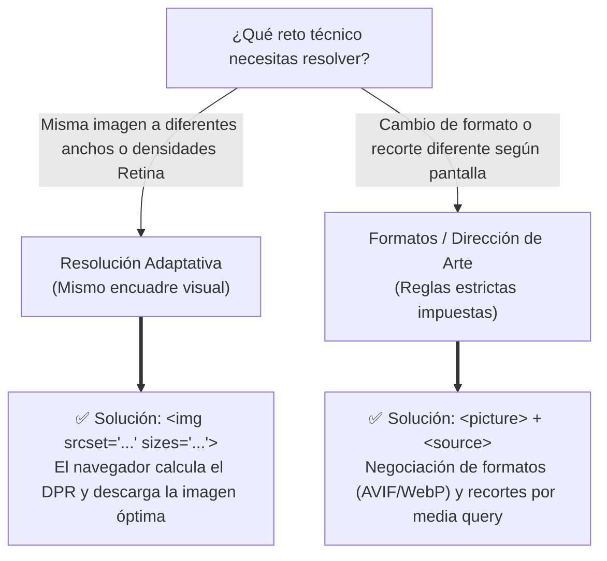

# HTML 03 — Enlaces y recursos

Sin `<a>` no hay hipertexto: destinos, rutas, atributos, accesibilidad, imágenes *responsive* e `<iframe>`.

!!! note "Conocimientos previos"

    - Estructura del documento y atributos globales (`id`, `class`, `lang`).
    - Distinguir ruta absoluta (URL) de relativa (archivo del proyecto).
    - Saber que `id` identifica un bloque de forma única.

## 1. El elemento `<a>`: sintaxis y tipos de destinos

### 1.1 Anatomía de un enlace

```html title="enlace.html" hl_lines="2"
<!-- El destino va siempre en href; sin él <a> no navega -->
<a href="productos.html">Ver el catálogo de productos</a>
```

El destino se declara en ==href== (Hypertext Reference), **obligatorio**: sin él no hay navegación, y el texto interior es **lo que se lee**. `<a>` es de **línea** (*inline*), dentro de los párrafos.

### 1.2 Destinos absolutos, relativos y de raíz

```html title="destinos.html"
<!-- Absoluta: URL completa, sales de tu sitio -->
<a href="https://zensical.org/documentacion/">Documentación de Zensical</a>

<!-- Relativa: MISMA carpeta -->
<a href="aviso-legal.html">Aviso legal</a>

<!-- ./ significa "aquí mismo" (equivale a la anterior) -->
<a href="./contacto.html">Contacto</a>

<!-- ../ sube UN nivel en la estructura -->
<a href="../index.html">Volver a la portada</a> <!-- (1)! -->

<!-- Raíz del sitio: empieza en la carpeta raíz -->
<a href="/documentos/garantia-2-anios.pdf">Garantía de dos años</a> <!-- (2)! -->

<!-- Combinada: ../ + subcarpeta -->
<a href="https://dummyimage.com/800x600/ccc/000.png&text=zapatillas-800w.jpg">Ver la foto en grande</a>
```

1.  **`../`** sube un nivel **desde la página que enlazas**.
2.  **`/`** se ancla a la **raíz del sitio**.

La absoluta **sale del sitio**; la relativa **se mueve dentro**; la de raíz **no depende de la carpeta**.

### 1.3 Destinos especiales: anclas, `mailto:` y `tel:`

```html title="destinos-especiales.html"
<!-- Ancla: destino = id de la MISMA página -->
<h2 id="envios">Política de envíos</h2>
<a href="#envios">Ir a la política de envíos</a>

<!-- Abre el gestor de correo -->
<a href="mailto:soporte@mitienda.es?subject=Duda%20sobre%20un%20pedido">Escribir a soporte</a>

<!-- En un móvil inicia la llamada -->
<a href="tel:+34954123456">Llamar al 954 123 456</a>
```

Las anclas apuntan a `id` **únicos**; con cabecera fija reserva espacio con `scroll-margin-top` en CSS.

!!! info "Destinos que no son páginas"

    - **Ancla** (`#id`): salta a un bloque de la **misma página**.
    - **`mailto:`**: abre el **gestor de correo** con destinatario y asunto opcionales.
    - **`tel:`**: en **móvil inicia la llamada**; en escritorio, la persona elige la aplicación.

## 2. Rutas y estructura de carpetas

### 2.1 Árbol de ejemplo

```text title="arbol.txt"
tienda-ufro/                  <- raíz del sitio
├── index.html                <- página principal
├── producto/
│   ├── zapatillas.html
│   └── mochila.html
├── img/
│   ├── logo.svg
│   └── producto/
│       ├── zapatillas-400w.jpg
│       ├── zapatillas-800w.jpg
│       └── zapatillas-1200w.jpg
├── css/estilos.css
└── documentos/garantia-2-anios.pdf
```

Todas las rutas de este tema se resuelven sobre este **árbol de ejemplo**.

### 2.2 Cómo resolver una ruta paso a paso

1. **Sitúate en la página desde la que enlazas**: la ruta se calcula *desde ahí*, no desde el explorador.
2. **¿Misma carpeta?** → solo el nombre: `aviso-legal.html`.
3. **¿Bajas a una subcarpeta?** → carpeta y nombre: `img/logo.svg`.
4. **¿Subes?** → `../` tantas veces como niveles subas.
5. **¿No depender de dónde estés?** → raíz: `/img/logo.svg`.

```html title="rutas.html"
<!-- CALCULADOS DESDE index.html (raíz) -->
<link rel="stylesheet" href="css/estilos.css">
<a href="producto/zapatillas.html">Zapatillas Run 300</a>

<!-- LOS MISMOS DESDE producto/zapatillas.html (un nivel más abajo) -->
<link rel="stylesheet" href="../css/estilos.css">
<a href="mochila.html">Mochila Trail 25 L</a>   <!-- hermano: misma carpeta -->
<a href="../index.html">Volver a la portada</a> <!-- subo un nivel -->
```

Una ==ruta relativa== depende de la página desde la que se escribe: por eso el paso 1 es **sitúate en esa página** antes de contar niveles.

Mover un fichero rompe las rutas que apuntaban a él y las que salían de él: es **el error más común** en prácticas de FP. En una subcarpeta (`/tienda/`) las rutas de raíz fallan.

!!! question "Autoevaluación: resuelve la ruta"

    Estás en `producto/zapatillas.html` y necesitas enlazar a `img/logo.svg` y a `index.html`. ¿Qué escribes?

    ??? success "Respuesta"

        - `img/logo.svg` → **`../img/logo.svg`**: bajas de la raíz a `img/`.
        - `index.html` → **`../index.html`**: subes un nivel hasta la raíz.

## 3. Atributos del enlace

### 3.1 `download`: forzar la descarga

```html title="descarga.html"
<!-- Con valor: nombre nuevo -->
<a href="documentos/garantia-2-anios.pdf" download="Garantia_2_anios.pdf">
  Descargar la garantía (PDF, 320 KB)
</a>

<!-- Sin valor: conserva el nombre original -->
<a href="https://dummyimage.com/1200x400/ccc/000.png&text=zapatillas-1200w.jpg" download>Foto en alta resolución</a>
```

Solo descarga ficheros del **mismo origen** (o con CORS); con otro dominio el navegador **navega** en vez de guardar.

### 3.2 `target="_blank"` y `rel="noopener"`

```html title="pestana-nueva.html" hl_lines="3"
<a href="https://zensical.org/documentacion/"
   target="_blank"
   rel="noopener noreferrer">
  Ver la documentación (se abre en pestaña nueva)
</a>
```

- `target="_blank"` abre en **pestaña nueva** (por defecto, `_self`); avisa en el texto.
- `rel="noopener"` impide que la página abierta acceda a tu ventana con `window.opener` (riesgo de *tabnabbing* y *phishing*): **obligatorio en examen**.
- `rel="noreferrer"` evita además enviar la cabecera `Referer` (opcional).

Recuerda: `target="_blank"` viaja siempre con ==noopener==.

### 3.3 `title` y `hreflang`

```html title="title-hreflang.html"
<!-- title: complementa el texto visible, nunca lo repite -->
<a href="condiciones.html"
   title="Condiciones generales: plazos de entrega y devoluciones">
  Condiciones de compra
</a>

<!-- hreflang: idioma del documento enlazado (SEO multilingüe) -->
<a href="https://mitienda.es/fr/" lang="fr" hreflang="fr">Version française</a>
```

Usa `title` **con moderación**: no todos los lectores lo anuncian y no aparece en pantallas táctiles. **El texto visible** es lo único garantizado; `hreflang` declara el **idioma del documento enlazado**.

## 4. Accesibilidad de los enlaces

### 4.1 Texto descriptivo: nada de "haz clic aquí"

| Mal | Bien |
|---|---|
| `<a href="ofertas.html">Haz clic aquí</a>` | `<a href="ofertas.html">Ver todas las ofertas de septiembre</a>` |
| `<a href="nota.pdf">Más información</a>` | `<a href="nota.pdf">Descargar la nota de prensa (PDF)</a>` |

El lector de pantalla lista los enlaces **fuera de su contexto**: "haz clic aquí" repetido no dice nada; si es una imagen, su `alt` cumple esa función. Un ==enlace descriptivo== se entiende **sin leer el párrafo**.

!!! quote "WCAG 2.4.4 — Finalidad del enlace (nivel A)"

    "El propósito de cada enlace se puede determinar a partir del texto del enlace o del contexto del enlace determinado programáticamente, excepto cuando el propósito del enlace sería ambiguo para los usuarios en general."

!!! example "Qué oye el lector de pantalla"

    - "Ver todas las ofertas de septiembre — enlace"
    - "Haz clic aquí — enlace" (varias veces): **no dice nada** sin el párrafo.

### 4.2 `aria-label` cuando el texto visible no basta

```html title="enlace-icono.html"
<!-- Enlace-icono: aria-label aporta el nombre accesible -->
<a href="cesta/eliminar-42.html"
   aria-label="Eliminar el producto Zapatillas Run 300 de la cesta">
  
</a>
```

`aria-label` **sobrescribe** el texto visible: debe coincidir con lo que **se ve en pantalla**. En la imagen interior el `alt` queda **vacío**.

### 4.3 Foco visible y *skip link*

Este código ilustra una de las técnicas de accesibilidad (**A11y**) más ingeniosas y fundamentales en el desarrollo web: el **Skip Link** (enlace de salto). Sirve para resolver un problema de usabilidad muy frustrante para las personas que navegan utilizando el teclado (con la tecla <kbd>Tab</kbd>) o un lector de pantalla.

=== "HTML"

    ```html title="skip-link.html"
    <body>
      <!-- Primer enlace del documento: atajo directo al contenido -->
      <a class="skip-link" href="#contenido">Saltar al contenido principal</a>
      <header>
        <nav aria-label="Principal">
          <!-- Menú con decenas de enlaces que el usuario de teclado puede saltarse -->
        </nav>
      </header>
      <main id="contenido">
        <h1>Zapatillas Run 300</h1>
      </main>
    </body>
    ```

=== "CSS"

    ```css title="foco.css"
    /* Regla de oro: el foco nunca se elimina (outline: none sin alternativa está prohibido) */
    a:focus-visible { outline: 3px solid #0b5fff; outline-offset: 2px; }
    
    /* El truco de magia: fuera de pantalla para que no moleste con ratón */
    .skip-link {
      position: absolute;
      left: -9999px;
      z-index: 1000;
    }
    
    /* La interacción: reaparece visiblemente al recibir el foco */
    .skip-link:focus {
      left: 1rem;
      top: 1rem;
      background: #ffffff;
      color: #0b1020;
      padding: 0.6rem 1rem;
      border-radius: 4px;
      font-weight: bold;
      text-decoration: none;
      box-shadow: 0 4px 12px rgba(0, 0, 0, 0.15);
    }
    ```

#### ¿Qué problema resuelve?
En la mayoría de las páginas web modernas, la cabecera (`<header>`) contiene menús de navegación (`<nav>`) con decenas de enlaces, buscadores y desplegables. Si una persona usuaria que navega con teclado entra a tu web, tendría que **pulsar la tecla <kbd>Tab</kbd> 20 o 30 veces en cada página nueva** solo para atravesar el menú y llegar al texto que realmente quiere leer.

#### Cómo funciona (paso a paso según el código)

1. **El HTML (El atajo):** Justo debajo del `<body>`, se coloca el primer enlace interactivo de toda la página. Este enlace (`<a class="skip-link" href="#contenido">`) apunta directamente al `id="contenido"` que tiene la etiqueta `<main>`, saltándose por completo todo el bloque del `<header>`.
2. **El CSS (El truco de magia):** Para que este enlace no estropee el diseño visual de los usuarios que navegan con ratón, la clase `.skip-link` lo expulsa fuera de la pantalla aplicándole un `position: absolute;` y moviéndolo a la izquierda casi diez mil píxeles (`left: -9999px;`). El enlace existe en el DOM, pero permanece invisible.
    *(Importante: no uses `display: none` ni `visibility: hidden`, ya que lo harías inaccesible también para los lectores de pantalla y la navegación por teclado).*
    
3. **La Interacción (`:focus`):** Si un usuario carga la página y pulsa la tecla <kbd>Tab</kbd>, como es el primer enlace del documento, recibe el foco inmediatamente. En ese momento, la regla `.skip-link:focus` entra en acción: lo devuelve a la esquina superior izquierda de la pantalla (`left: 1rem; top: 1rem;`), le pone fondo blanco (`background: #ffffff;`), tipografía destacada y espaciado (`padding`) para que parezca un botón emergente. Además, hereda el borde azul grueso y nítido de la regla `a:focus-visible`.

!!! quote "WCAG 2.4.1 — Evitar bloques (nivel A)"

    "Debe existir un mecanismo para eludir los bloques de contenido que se repiten en múltiples páginas web." El *skip link* es la solución estándar de la industria y la normativa legal (RD 1112/2018) para garantizar este criterio.

En resumen: es un **"botón fantasma"** que permanece oculto para la mayoría de los usuarios de ratón, pero que aparece mágicamente para ofrecer un atajo vital a quienes navegan con teclado o lectores de pantalla. Es un ejemplo perfecto de diseño inclusivo para enseñar al alumnado. La estrategia completa de *skip link*, landmarks y ARIA se desarrolla a fondo en [07-estructura-semantica-y-aria.md](07-estructura-semantica-y-aria.md).

!!! success "Comprueba que tus enlaces son accesibles"

    - [ ] Cada enlace se entiende **sin leer el párrafo**.
    - [ ] Ningún texto repite **"haz clic aquí"** o "más información".
    - [ ] Los enlaces-icono llevan `aria-label` **igual que lo visible**.
    - [ ] El foco se ve con `:focus-visible` y hay **skip link**.
    - [ ] `target="_blank"` va con **`rel="noopener noreferrer"`**.

## 5. Imágenes: `img`, `alt` y buenas prácticas

### 5.1 `alt`: informativa, neutra o vacía

```html title="alt.html"

```

| Tipo | Cuándo ocurre | Ejemplo de `alt` |
|---|---|---|
| **Informativa** | Aporta información que no está en el texto | `alt="Zapatillas Run 300 azules vistas de perfil"` |
| **Neutra / redundante** | El pie de foto o el texto ya lo dicen | `alt="Zapatillas Run 300"` |
| **Decorativa** | No aporta nada al contenido | `alt=""` (vacío, entre comillas) |

Un ==alt== informativo se redacta como **una línea**: si contiene texto, **describe lo que dice**; si es un gráfico, **resume el mensaje** en el `figcaption`. No empieces con **"imagen de…"** ni dejes `alt` vacío en una informativa.

### 5.2 `width`, `height`, `loading` y `decoding`

Insertar una imagen no consiste solo en poner `src` y `alt`. En el desarrollo web profesional, la forma en que se declaran las dimensiones y la carga condiciona de forma directa el **rendimiento web (Core Web Vitals)** y la experiencia de usuario.

```html title="rendimiento.html"
<!-- Imagen principal: carga prioritaria ("above the fold") -->
 <!-- (1)! -->

<!-- Imagen secundaria: carga diferida ("below the fold") -->
 <!-- (2)! -->
```

1.  `eager` + `fetchpriority="high"`: Descarga **inmediata y prioritaria** para la imagen principal visible al entrar.
2.  `lazy` + `decoding="async"`: Descarga **retrasada y no bloqueante** para imágenes fuera de la vista inicial.

#### ¿Por qué son obligatorios `width` y `height` en el HTML?
Cuando el navegador lee el código HTML y encuentra una etiqueta ``, todavía no ha descargado el archivo gráfico por la red, por lo que desconoce sus dimensiones físicas. Si omites `width` y `height`:

- El navegador reserva inicialmente un espacio de 0×0 píxeles.
- Cuando la imagen termina de descargarse segundos después, el navegador se ve obligado a reajustar bruscamente toda la página, desplazando hacia abajo los párrafos, botones y menús.
- Este molesto salto visual se denomina **CLS (*Cumulative Layout Shift*)**, una de las métricas Core Web Vitals más vigiladas por Google (penaliza severamente el posicionamiento SEO y crea una pésima experiencia donde el usuario hace clic por error en el sitio equivocado).

Al incluir los atributos `width="800"` y `height="600"` en el HTML:

1. El navegador calcula inmediatamente la relación de aspecto (*aspect ratio* de 4:3 en este caso).
2. Reserva en el lienzo el hueco en blanco exacto **antes de descargar un solo byte**.
3. Más tarde, la regla CSS clásica `img { max-width: 100%; height: auto; }` permite que la imagen sea perfectamente responsiva sin perder jamás esa reserva previa de espacio.

#### Estrategia de carga con `loading`: *Above the fold* vs. *Below the fold*
- **Por encima del pliegue (*Above the fold*):** Es la zona superior de la pantalla que el usuario ve de inmediato al entrar sin necesidad de hacer scroll. La imagen destacada de esta zona (imagen heroica, cabecera o producto) debe llevar `loading="eager"` (o simplemente omitir `loading`, ya que es el comportamiento por defecto). Esto optimiza el **LCP (*Largest Contentful Paint*)**.
- **Por debajo del pliegue (*Below the fold*):** Son las imágenes que están más abajo y que requieren que el usuario se desplace para verlas. En ellas es obligatorio usar **`loading="lazy"`**. El navegador retiene la petición de red y solo comienza a descargar la imagen cuando esta se aproxima a la ventana visible del usuario. Esto ahorra megabytes en conexiones móviles, disminuye el consumo de batería y acelera notablemente la carga inicial de la página.

#### Decodificación fluida con `decoding="async"`
El procesamiento de descomprimir los datos de una imagen en píxeles de memoria consume tiempo de CPU. El atributo `decoding="async"` le indica al navegador que decodifique la imagen de forma asíncrona en un hilo de ejecución secundario, evitando congelar el hilo principal de renderizado de la interfaz para que el scroll y las animaciones permanezcan totalmente fluidos.

---

### 5.3 `figure` y `figcaption`

El elemento `<figure>` y su leyenda asociada `<figcaption>` resuelven una necesidad semántica clásica del mundo editorial: agrupar contenido ilustrativo autónomo con una descripción explicativa visible para el lector.

```html title="figure.html"
<figure>
  
  <figcaption>Zapatillas Run 300 · Colección primavera 2026 · Fotografía: Estudio Central</figcaption>
</figure>
```

#### ¿Qué significa que `<figure>` sea "contenido autónomo"?
Un elemento `<figure>` representa una **unidad de información independiente** (*self-contained*). Esto significa que el contenido que contiene ilustra el texto principal (como cuando un libro dice *"véase la figura 1"*), pero si el maquetador decide moverlo a una barra lateral, al final del capítulo o a un apéndice de la web, **el significado y la comprensión del texto principal no se alteran ni se rompen**.

!!! tip "`<figure>` no es solo para imágenes"
    Aunque su uso más habitual es envolver fotografías con ``, un `<figure>` puede contener legítimamente cualquier recurso explicativo: fragmentos de código fuente (`<pre><code>`), diagramas o gráficos vectoriales (`<svg>`), citas célebres (`<blockquote>`) o tablas estadísticas completas (`<table>`).

#### La diferencia crucial entre `alt` y `figcaption`
Un error habitual en el alumnado es escribir exactamente lo mismo en ambos lugares. Tienen funciones totalmente distintas:

- **`alt` (Accesibilidad técnica):** Es la alternativa textual que sustituye a la imagen cuando no se puede ver. Describe **qué aparece físicamente** en la imagen (*"Zapatillas Run 300 azules vistas de perfil sobre fondo blanco"*). Es consumido por lectores de pantalla y motores de búsqueda.
- **`figcaption` (Contexto editorial visible):** Es un pie de foto visible para todos los usuarios. Aporta **información contextual que la imagen por sí sola no puede contar** (*"Colección primavera 2026", créditos de autoría, fecha, derechos de uso o acciones secundarias como enlaces de descarga*).

Si duplicas el texto en ambos atributos, las personas con lector de pantalla escucharán la misma frase dos veces seguidas de forma redundante y molesta.

---

## 6. Imagen responsive: `srcset`, `sizes` y `picture`

En la web moderna, los usuarios acceden desde pantallas con tamaños muy dispares (desde un reloj inteligente o un móvil de 360 px hasta monitores 4K de 3840 px) y con densidades de píxeles muy diferentes (pantallas normales 1x vs. pantallas Retina/HiDPI de 2x y 3x). Servir la misma imagen pesada de 2000 px a todos los usuarios es una aberración de rendimiento.



### 6.1 `srcset` + `sizes`: Resolución adaptativa inteligente

Esta técnica permite ofrecer al navegador un abanico de imágenes a diferentes resoluciones para que él mismo elija y descargue automáticamente la más eficiente según el dispositivo del usuario.

```html title="srcset.html"

```

#### El dilema del navegador y por qué necesitamos `sizes`
Cuando el navegador empieza a procesar el documento HTML, activa un motor interno de precarga (*pre-parser*) para iniciar la descarga de imágenes lo antes posible y ganar milisegundos críticos. En ese momento, **el archivo CSS aún no se ha descargado ni procesado**. Por lo tanto, el navegador sabe qué tamaño tiene la pantalla del móvil, pero **no tiene ni idea de qué tamaño en píxeles va a ocupar la imagen en la maquetación final**.

Aquí es donde entra la combinación de ambos atributos:

1. **`srcset` (El catálogo de opciones):** Proporciona la lista de archivos disponibles junto con su **ancho físico real en píxeles**, indicado mediante el descriptor `w` (`400w`, `800w`, `1200w`). Nunca uses `px` aquí, solo el número seguido de `w`.
2. **`sizes` (El presupuesto de maquetación):** Le informa al navegador por adelantado del ancho que ocupará la imagen en pantalla según el ancho de la ventana (*viewport*), utilizando una sintaxis similar a las media queries de CSS:
    - `(max-width: 600px) 100vw`: En pantallas de hasta 600 px (móviles), la imagen ocupará todo el ancho de la pantalla (`100vw`).
    - `(max-width: 1000px) 50vw`: En pantallas de hasta 1000 px (tablets o tarjetas a 2 columnas), ocupará la mitad de la pantalla (`50vw`).
    - `400px`: En pantallas superiores a 1000 px (escritorio), la imagen tendrá un ancho fijo de 400 px.

#### El cálculo mental que realiza el navegador
Con esta información, el navegador realiza una multiplicación matemática instantánea:

$$\text{Píxeles necesarios} = \text{Ancho previsto en CSS (de sizes)} \times \text{Densidad de pantalla (DPR)}$$

Por ejemplo, en un móvil de 400 px con pantalla Retina (DPR 2x):

- De `sizes` obtiene que la imagen ocupa `100vw` = 400 px de ancho.
- Multiplica por su densidad física: $400 \times 2 = 800\text{ px}$.
- Consulta `srcset` y descarga exactamente la versión `zapatillas-800w.jpg`. 

Ni descarga la versión pequeña de 400w (que se vería borrosa), ni desperdicia datos con la de 1200w. **El atributo `src` clásico sigue siendo obligatorio** como respaldo para navegadores antiguos que no reconozcan `srcset`.

---

### 6.2 `picture` con `source`: Formatos de nueva generación y dirección de arte

Mientras que `srcset` le da opciones al navegador para que él elija la mejor resolución de la misma imagen, el elemento `<picture>` permite al **desarrollador imponer reglas estrictas** sobre qué imagen mostrar según el formato de archivo o el diseño de pantalla.

```html title="picture.html"
<picture>
  <!-- 1. Negociación de formatos modernos (de mayor a menor compresión) -->
  <source srcset="https://dummyimage.com/800x600/ccc/000.png&text=zapatillas.avif" type="image/avif">
  <source srcset="https://dummyimage.com/800x600/ccc/000.png&text=zapatillas.webp" type="image/webp">
  
  <!-- 2. Dirección de arte (recorte diferente adaptado a pantallas pequeñas) -->
  <source media="(max-width: 600px)"
          srcset="https://dummyimage.com/800x600/ccc/000.png&text=zapatillas-movil.jpg" 
          type="image/jpeg"> <!-- (1)! -->
          
  <!-- 3. Fallback universal y renderizador obligatorio -->
   <!-- (2)! -->
</picture>
```

1.  El atributo `media` solo se activa si se cumple la condición de pantalla (dirección de arte).
2.  La etiqueta `` es el **único elemento que se dibuja en pantalla** y el único portador del texto alternativo `alt`.

#### Los dos grandes casos de uso de `<picture>`

1. **Negociación de formatos (*Format Switching / Progressive Enhancement*):**
   Los formatos de imagen de última generación como **AVIF** o **WebP** consiguen reducir el peso de las fotografías entre un 50% y un 70% comparados con el clásico JPEG con idéntica calidad visual. Sin embargo, no todos los navegadores antiguos los admiten. Con `<picture>`, incluimos elementos `<source type="...">` ordenados de arriba a abajo: el navegador prueba el primero (`image/avif`), si no lo soporta pasa a `image/webp`, y si tampoco, recurre al `` clásico con JPEG.

2. **Dirección de arte (*Art Direction*):**
   Si tienes una fotografía panorámica horizontal de un paisaje con una persona en el centro, al encogerla en la pantalla vertical y estrecha de un móvil la persona se verá como una mancha minúscula. Con la dirección de arte no queremos reescalar la foto, sino servir una **versión recortada verticalmente en primer plano**. Esto se consigue mediante el atributo `media="(max-width: 600px)"`.

#### Regla de oro de `<picture>`: Es solo un selector, no una imagen
El elemento `<picture>` es una envoltura invisible: **no renderiza nada por sí mismo en el navegador**. 

- El navegador evalúa los `<source>` de arriba hacia abajo y el primero que sea compatible "inyecta" su URL dentro del `` interior.
- Por tanto, la etiqueta `` dentro de `<picture>` es **estrictamente obligatoria**: es la que recibe el estilo CSS, la que pinta los píxeles y la que porta el atributo de accesibilidad `alt`.

### 6.3 Formatos modernos y soporte

| Formato | Uso | Comentario |
|---|---|---|
| `image/avif` | Foto | Máxima compresión moderna (derivado del códec AV1). |
| `image/webp` | Foto | Soporte universal moderno, admite transparencia y animación. |
| `image/jpeg` | Foto | Respaldo universal clásico (fallback). |
| `image/svg+xml` | Iconos y logotipos | Gráfico vectorial escalable matemáticamente sin pixelarse. |

Comprueba siempre el soporte en **`caniuse.com`** antes de prescindir de un formato de respaldo; `alt`, `width` y `height` van siempre en el **`` final**.

---

## 7. Los marcos `<iframe>`

### 7.1 ¿Qué es un `<iframe>` y cómo funciona?

El elemento `<iframe>` (*Inline Frame* o marco en línea) es una de las herramientas más potentes y delicadas de HTML. Su propósito es **incrustar un documento HTML completo e independiente dentro de tu propia página web actual**.

Para que el alumnado lo entienda con claridad: imagina que tu página web es la pared de una habitación y el `<iframe>` es una ventana abierta al exterior. A través de esa ventana puedes ver e interactuar con otro sitio web completo, el cual cuenta con su propio árbol DOM, sus propios estilos CSS, sus propios scripts de JavaScript y sus propias cookies de sesión.

#### Usos habituales en el mundo real
- **Mapas interactivos:** Incrustar ubicaciones de Google Maps u OpenStreetMap en la página de contacto o pie de página.
- **Reproductores multimedia de terceros:** Incrustar vídeos de YouTube o Vimeo, o música de Spotify, sin necesidad de alojar los pesados archivos multimedia en tu propio servidor.
- **Pasarelas de pago y seguridad bancaria:** Plataformas como Redsys o Stripe utilizan iframes aislados para que el usuario introduzca los datos confidenciales de su tarjeta de crédito sin que la tienda web pueda leerlos ni manipularlos (cumpliendo la estricta normativa PCI-DSS).
- **Widgets interactivos:** Gráficos bursátiles en tiempo real, encuestas o previsiones meteorológicas.

```html title="iframe.html" hl_lines="3"
<iframe
  src="https://www.openstreetmap.org/export/embed.html?bbox=-5.99,37.37,-5.97,37.39"
  title="Mapa interactivo con la ubicación de la tienda en el centro de Sevilla"
  width="600" height="400"
  loading="lazy"
  allowfullscreen
  referrerpolicy="no-referrer-when-downgrade"
  sandbox="allow-scripts allow-same-origin allow-popups">
</iframe>
```

#### Atributos esenciales y accesibilidad

| Atributo | Función y Buenas Prácticas |
|---|---|
| `src` | URL del documento web que se va a cargar en el interior del marco (propio o de un dominio externo). |
| `title` | **ESTRICTAMENTE OBLIGATORIO POR ACCESIBILIDAD (WCAG 4.1.2)**. Los lectores de pantalla anuncian la presencia de un marco antes de que el usuario decida entrar en él. Si no tiene `title`, el lector solo dirá *"Marco"* o leerá la URL completa en crudo, desorientando al usuario ciego. |
| `width` / `height` | Dimensiones iniciales del marco en píxeles para reservar el espacio en pantalla antes de que cargue el contenido. |
| `loading="lazy"` | Retrasa la conexión y descarga del marco hasta que el usuario se desplaza con el scroll cerca de él. Incrustar un mapa o un vídeo de YouTube sin `lazy` puede descargar de golpe más de 1 MB de scripts y rastreadores externos, ralentizando la web entera. |
| `allowfullscreen` | Permite que el contenido del marco (por ejemplo, un vídeo o un mapa interactivo) pueda expandirse a pantalla completa si el usuario pulsa su botón de maximizar. |
| `sandbox` | **Caja de arena de seguridad**. Aísla el documento incrustado para proteger a tu sitio web de posibles ataques de código malicioso o publicidad invasiva. |

#### Seguridad con `sandbox`: El principio de mínimo privilegio
Incrustar contenido de una web externa siempre supone un riesgo potencial de seguridad (la web incrustada podría intentar redirigir tu página principal, robar información del usuario o abrir ventanas emergentes).

Cuando incluyes el atributo `sandbox` sin ningún valor (`sandbox=""`), el navegador activa el nivel de restricción máxima:

- Bloquea la ejecución de JavaScript dentro del marco.
- Bloquea el envío de formularios.
- Bloquea el acceso a cookies y almacenamiento local.
- Impide que el marco abra ventanas emergentes o nuevas pestañas.

Para que servicios interactivos como un mapa o un vídeo funcionen, se deben conceder permisos de forma granular y acumulativa mediante sus modificadores permitidos:

- `allow-scripts`: Permite ejecutar los scripts necesarios para que el mapa o el reproductor funcionen.
- `allow-same-origin`: Permite que el contenido trate su origen como su propio dominio (necesario para gestionar sesiones o recursos propios).
- `allow-popups`: Permite que los enlaces del marco abran nuevas pestañas al hacer clic.

### 7.2 Cuándo NO usar `<iframe>`

- **Contenido tuyo**: vídeo, PDF o mapa que controlas → incrusta el fichero (ver [04-multimedia.md](04-multimedia.md)); el marco añade HTTP y seguridad de más.
- **Rendimiento y seguridad**: cada `<iframe>` crea un documento completo y muchos sitios bloquean la incrustación (`X-Frame-Options`, `frame-ancestors`).
- **SEO y usabilidad**: el buscador rara vez indexa el marco y, en móvil, los marcos pequeños son incómodos.
- **Diseño**: la maquetación con marcos o tablas está retirada; se maqueta con CSS, ver [../css/10-diseno-responsivo.md](../css/10-diseno-responsivo.md).

## 8. Ejemplo práctico: galería de producto con pies de foto

El siguiente ejemplo integra las mejores prácticas de la unidad para maquetar la galería de una ficha de producto en comercio electrónico. Combina semántica estructural, rendimiento web (*Core Web Vitals*), adaptabilidad responsive y negociación de formatos modernos mediante referencias web públicas totalmente funcionales (para que puedas copiar el código y probarlo directamente en tu navegador sin depender de archivos locales):

```html title="galeria.html"
<main id="contenido">
  <h1>Zapatillas Running Speed Pro 300</h1>

  <!-- Primera fotografía: Imagen destacada (Above the fold) con resolución adaptativa -->
  <figure>
    
    <figcaption>
      Vista lateral · 
      <a href="https://images.unsplash.com/photo-1542291026-7eec264c27ff?auto=format&fit=crop&w=1200&q=80" download="zapatillas-speedpro-hd.jpg">
        Descargar en alta resolución
      </a>
    </figcaption>
  </figure>

  <!-- Segunda fotografía: Detalle técnico (Below the fold) con negociación de formatos -->
  <figure>
    <picture>
      <!-- Formatos de última generación (evaluados de mayor a menor compresión) -->
      <source srcset="https://images.unsplash.com/photo-1608231387042-66d1773070a5?fm=avif&fit=crop&w=800&q=80" type="image/avif">
      <source srcset="https://images.unsplash.com/photo-1608231387042-66d1773070a5?fm=webp&fit=crop&w=800&q=80" type="image/webp">
      
      <!-- Imagen de respaldo universal y portadora del renderizado físico -->
      
    </picture>
    <figcaption>Detalle de la suela de goma con taco de tracción técnica (foto: laboratorio de pruebas)</figcaption>
  </figure>
</main>
```

---

### 8.1 Explicación detallada: ¿Por qué se usa cada etiqueta y para qué sirve?

A continuación se analiza minuciosamente cada elemento HTML empleado en el ejemplo, explicando la justificación arquitectónica de su elección y la función técnica que desempeña:

#### 1. `<main id="contenido">` — El hito de contenido nuclear
- **¿Para qué sirve?** Representa el contenedor del contenido temático principal y exclusivo del documento, excluyendo elementos repetitivos como barras de navegación, cabeceras del sitio o pies de página corporativos. Solo debe existir **un único `<main>` visible** por página.
- **¿Por qué se usa aquí con `id="contenido"`?** Cumple una doble función esencial de usabilidad y accesibilidad:
    - Actúa como el **destino directo del enlace de salto (*skip link*)** (`<a href="#contenido" class="skip-link">`) estudiado en la sección 4.3. Los usuarios que navegan mediante teclado (<kbd>Tab</kbd>) o lectores de pantalla pueden saltarse la cabecera completa y aterrizar directamente en la ficha del producto con una sola pulsación.
    - Facilita a los lectores de pantalla anunciar el hito (*landmark*) principal de la interfaz nada más cargar la página.

#### 2. `<h1>` — La cabecera de máxima jerarquía
- **¿Para qué sirve?** Es el titular principal y más importante del documento.
- **¿Por qué se usa aquí?** Identifica unívocamente el producto (*«Zapatillas Running Speed Pro 300»*). Para los motores de búsqueda (SEO) y las tecnologías de asistencia, el `<h1>` define de qué trata la página. Un documento estructurado no debe saltarse jerarquías (no pasar de `<h1>` a `<h3>` sin un `<h2>` intermedio).

#### 3. `<figure>` — Contenedor semántico de contenido autónomo
- **¿Para qué sirve?** Es una etiqueta semántica introducida en HTML5 para agrupar contenido ilustrativo, diagramas, fotos o fragmentos de código que guardan relación directa con el texto principal pero que son **autónomos** (podrían extraerse, moverse al final de la página o colocarse en un anexo sin que el documento pierda sentido).
- **¿Por qué se usa en vez de un simple `<div>`?** Porque un `<div>` es una caja genérica y muda que no aporta ningún significado semántico. Al usar `<figure>`, los navegadores y lectores de pantalla reconocen que el bloque contiene un elemento gráfico ilustrativo con su correspondiente explicación.

#### 4. `` — El renderizador físico y sus atributos clave
- **¿Para qué sirve?** Es la etiqueta encargada de pintar físicamente los píxeles de la imagen en la pantalla. Incluso cuando se utiliza dentro de `<picture>`, `` es la única etiqueta que dibuja la imagen.
- **Desglose de cada uno de sus atributos:**
    - **`src`:** Es la URL de reserva universal. Si el navegador es antiguo o no soporta `srcset` ni `<picture>`, recurre siempre a esta dirección para cargar la imagen. Al usar una URL web pública de CDN (`https://images.unsplash.com/...`), el archivo se descarga inmediatamente sin necesidad de tener carpetas locales en tu equipo.
    - **`srcset`:** Proporciona un **catálogo de resoluciones disponibles** junto a sus anchos físicos mediante el descriptor `w` (`400w`, `800w`, `1200w`). Permite que el navegador elija la versión más eficiente sin forzar a un teléfono móvil a descargar un archivo pesado de alta resolución.
    - **`sizes`:** Define el **presupuesto de maquetación**. Dado que el navegador lee el HTML antes de que se descargue la hoja de estilos CSS, `sizes` le anticipa qué porcentaje de la pantalla ocupará la imagen (`100vw` en móviles, `50vw` en tabletas o `600px` fijo en escritorio), permitiendo calcular exactamente qué foto de `srcset` debe pedir.
    - **`alt` (Texto alternativo):** Es **estrictamente obligatorio** por accesibilidad (WCAG). Describe con precisión lo que se observa físicamente en la fotografía. Es leído por los lectores de pantalla para personas ciegas y se muestra en pantalla si la conexión a internet falla.
    - **`width` y `height`:** Indican las dimensiones intrínsecas de aspecto de la imagen (por ejemplo, `1200` y `800`, ratio 3:2). Su presencia permite al navegador **reservar el espacio exacto en el lienzo antes de descargar la imagen**, eliminando los saltos bruscos de maquetación (*Cumulative Layout Shift - CLS*).
    - **`loading="eager"` (en la primera foto):** Indica descarga inmediata y de alta prioridad. Como la primera imagen está situada por encima del pliegue (*above the fold*) y es lo primero que el usuario ve, acelerar su carga mejora directamente el *Largest Contentful Paint* (LCP).
    - **`loading="lazy"` (en la segunda foto):** Aplica carga diferida. Como el detalle de la suela está más abajo (*below the fold*), el navegador no descarga la imagen hasta que el usuario hace scroll y se acerca a ella, ahorrando ancho de banda y batería.
    - **`decoding="async"`:** Permite al navegador decodificar los píxeles de la imagen en un hilo de procesamiento secundario, evitando bloqueos o tirones en el hilo principal de la interfaz mientras el usuario se desplaza.

#### 5. `<figcaption>` — Leyenda visible y complementariedad con `alt`
- **¿Para qué sirve?** Define el pie de foto o leyenda visible para cualquier visitante que consulta la página. Debe situarse como primer o último hijo directo de un `<figure>`.
- **¿Por qué se usa aquí y cuál es la diferencia con `alt`?**
    - `alt` describe **lo que se ve físicamente** para quien no puede ver la imagen (*"Zapatillas de running rojas Speed Pro 300 vistas de perfil..."*).
    - `<figcaption>` aporta **contexto informativo complementario** (*"Vista lateral"*, créditos del fotógrafo, fecha o enlaces de acción).  
    *Regla de oro:* Nunca deben tener exactamente el mismo texto para no generar redundancia en lectores de pantalla.

#### 6. `<a>` con el atributo `download` — Enlace de descarga directa
- **¿Para qué sirve?** El atributo `download` transforma un hipervínculo convencional en una **directiva de guardado**: en lugar de abrir la imagen en el visor del navegador sustituyendo la página actual, indica al navegador que guarde el archivo directamente en la carpeta de descargas del usuario con el nombre sugerido (`download="zapatillas-speedpro-hd.jpg"`).

#### 7. `<picture>` y `<source>` — Negociación de formatos de nueva generación
- **¿Para qué sirve `<picture>`?** No dibuja ningún píxel por sí mismo; actúa como un **árbol de decisión condicional** invisible para aplicar mejora progresiva (*progressive enhancement*).
- **¿Para qué sirve cada `<source>`?** Cada etiqueta `<source>` contiene una alternativa evaluada en estricto orden de arriba hacia abajo:
    - `type="image/avif"`: Si el navegador del usuario soporta el formato AVIF (máxima compresión moderna), descarga la versión optimizada en AVIF.
    - `type="image/webp"`: Si no soporta AVIF pero sí WebP, descarga la versión WebP.
    - Si el navegador no soporta ninguno de los anteriores (navegadores antiguos), ignora los `<source>` y salta a la etiqueta `` final, que entrega el formato universal JPEG.

---

!!! tip "Integración en un documento completo"
    En una página real de producción, este bloque `<main>` se integraría dentro de la plantilla completa vista en la **sección 4.3**, acompañado por la cabecera institucional `<header>`, el menú de navegación `<nav>`, el enlace de salto de accesibilidad (*skip link*) y el pie de página `<footer>`. Puedes practicar este montaje en [09-ejercicios.md](09-ejercicios.md).

## 9. Errores frecuentes y claves del examen

### 9.1 Error común

!!! warning "Error común"

    - **`alt=""` en imagen informativa**: el lector la salta; `alt=""` solo vale para **decorativas**.
    - **`target="_blank"` sin `rel="noopener"`**: la pestaña accede a tu ventana con `window.opener`; usa `target="_blank" rel="noopener noreferrer"`.
    - **Rutas relativas mal calculadas**: contar mal los `../` al mover un fichero o calcular la ruta desde el explorador.

### 9.2 Claves para el examen

!!! tip "Claves para el examen"

    - `href` obligatorio: sin él `<a>` no es enlace; `href="#id"` salta a un id de la misma página.
    - Relativas: `archivo.html` = misma carpeta, `carpeta/…` = bajar, `../` = subir, `/ruta/` = raíz.
    - Destinos: `mailto:`, `tel:` y `#ancla`; `title` con moderación e `hreflang` para el idioma.
    - `download` solo del mismo origen; `target="_blank"` con `rel="noopener noreferrer"`.
    - Texto descriptivo y `aria-label` si el visible no basta; no elimines el foco; usa *skip link*.
    - `alt` descriptivo si informa, vacío si decora; `width`/`height` evitan el CLS; `lazy` fuera del pliegue.
    - Responsive: `srcset` + `sizes`, `<picture>` para formatos; `<iframe>` con `title`.


!!! success "Practica esta unidad"

    - Enunciados: [Ejercicios de la Unidad 3 — Enlaces y recursos](09-ejercicios.md#u51-clasificacion-de-la-liga) — cuatro retos (`U3.1` a `U3.4`) — del más básico al más avanzado.
    - Comprueba tu trabajo con [las soluciones de esta unidad](10-ejercicios-soluciones.md#sol-u3).

*[URL]: Uniform Resource Locator
*[srcset]: Source Set
*[CLS]: Cumulative Layout Shift
