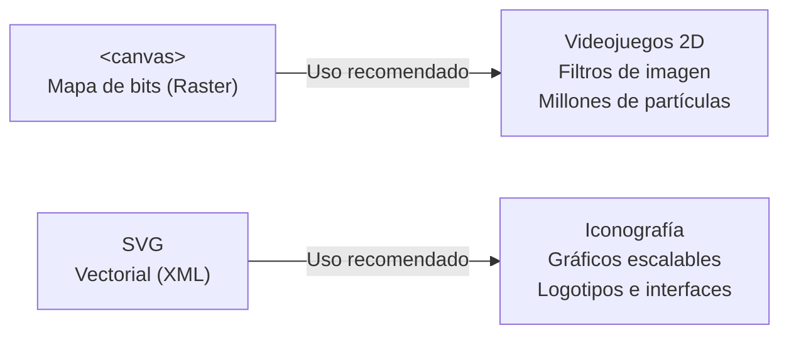

# HTML 08 — Elementos interactivos y APIs nativas

HTML5 no se limita a estructurar texto plano: incorpora **elementos interactivos nativos** (modales, acordeones, plantillas) y un conjunto de **APIs del navegador** estandarizadas por el WHATWG y el W3C. Estas tecnologías permiten resolver en el propio cliente tareas que antes requerían librerías externas pesadas (gestión de diálogos accesibles, almacenamiento local, validación de formularios, geoposicionamiento y renderizado en lienzo).

!!! note "Conocimientos previos"

    - Formularios HTML5 y atributos de validación: [06-formularios-html5.md](06-formularios-html5.md).
    - Estructura semántica del documento y accesibilidad WAI-ARIA: [07-estructura-semantica-y-aria.md](07-estructura-semantica-y-aria.md).
    - Fundamentos de JavaScript: selectores DOM (`querySelector`), eventos (`addEventListener`) y promesas (`async/await`).

---

## 1. Atributos `data-*`: el puente con JavaScript

### 1.1 Qué son y cómo funcionan

Cualquier atributo cuyo nombre comience por ==`data-*`== es válido en HTML5. El navegador no los procesa ni los valida, pero expone su valor a JavaScript mediante la propiedad `elemento.dataset`. Permiten asociar datos de negocio al marcado sin recurrir a clases CSS artificiales ni a atributos no estándar.

```html title="ficha-modulo.html"
<!-- Los datos de estado e identificación viajan en el propio marcado -->
<article class="tarjeta-modulo"
         data-codigo="0373"
         data-curso="1"
         data-horas-totales="128"
         data-estado="activo">
  <h3>Lenguajes de Marcas</h3>
  <button type="button" class="btn-detalles">Ver detalles</button>
</article>

<script>
const tarjeta = document.querySelector('.tarjeta-modulo');

// Los guiones se transforman automáticamente a camelCase
console.log(tarjeta.dataset.codigo);        // "0373" (SIEMPRE devuelve STRING)
console.log(tarjeta.dataset.horasTotales); // "128"
console.log(tarjeta.dataset.estado);       // "activo"

// Modificación dinámica desde JavaScript
tarjeta.dataset.estado = 'archivado';      // Escribe data-estado="archivado" en el DOM
</script>
```

```css title="estilos-data.css"
/* Selección por atributos data en CSS */
.tarjeta-modulo[data-estado="activo"] {
  border-left: 4px solid #146c2e;
}
.tarjeta-modulo[data-estado="archivado"] {
  opacity: 0.6;
}
```

---

## 2. Elementos interactivos nativos de HTML5

Antes de HTML5, crear un modal o un acordeón requería decenas de líneas de JavaScript para gestionar la visibilidad, el foco y los lectores de pantalla. Hoy el estándar incluye elementos interactivos nativos accesibles de serie.

### 2.1 El elemento `<dialog>`: Ventanas modales nativas

El elemento `<dialog>` representa una caja de diálogo o ventana emergente.

```html title="modal-nativo.html" hl_lines="6 12 17"
<!-- Botón que abre el modal -->
<button type="button" id="btnAbrir">Configurar preferencias</button>

<!-- Ventana modal nativa -->
<dialog id="modalAjustes" aria-labelledby="tit-modal">
  <form method="dialog"> <!-- (1)! -->
    <h2 id="tit-modal">Preferencias de usuario</h2>
    <p>Elige el tema de la interfaz:</p>
    
    <label><input type="radio" name="tema" value="claro" checked> Claro</label>
    <label><input type="radio" name="tema" value="oscuro"> Oscuro</label>
    
    <menu>
      <button type="button" id="btnCancelar">Cancelar</button>
      <button type="submit" value="guardar">Guardar cambios</button> <!-- (2)! -->
    </menu>
  </form>
</dialog>

<script>
const dialog = document.getElementById('modalAjustes');
const btnAbrir = document.getElementById('btnAbrir');
const btnCancelar = document.getElementById('btnCancelar');

// 1. showModal() abre en modo MODAL (con captura de foco y ::backdrop)
btnAbrir.addEventListener('click', () => dialog.showModal());

// 2. Cierre manual por JavaScript
btnCancelar.addEventListener('click', () => dialog.close('cancelado'));

// 3. Evento al cerrar: dialog.returnValue contiene el valor del botón submit
dialog.addEventListener('close', () => {
  console.log('Modal cerrado con resultado:', dialog.returnValue);
});
</script>
```

1.  `method="dialog"` en un `<form>` hace que el botón de envío cierre automáticamente el `<dialog>` sin recargar la página ni enviar datos por HTTP.
2.  El atributo `value` del botón que envía el formulario se transfiere a la propiedad `dialog.returnValue`.

#### Diferencia entre `showModal()` y `show()`

| Método | Modo | Captura de foco (*Focus Trap*) | Fondo oscuro (*Backdrop*) | Cierre con tecla <kbd>Esc</kbd> |
|---|---|---|---|---|
| `dialog.showModal()` | **Modal** | **Sí** (el resto de la página queda inerte / `inert`) | **Sí** (estilable con `::backdrop`) | **Sí** (nativo) |
| `dialog.show()` | **No modal** (emergente) | No (se puede interactuar con el resto) | No | No |

```css title="dialog-estilos.css"
/* Estilado del telón de fondo generado por showModal() */
dialog::backdrop {
  background-color: rgba(0, 0, 0, 0.6);
  backdrop-filter: blur(4px);
}
dialog {
  border: none;
  border-radius: 8px;
  padding: 1.5rem;
  box-shadow: 0 10px 25px rgba(0, 0, 0, 0.2);
}
```

---

### 2.2 `<details>` y `<summary>`: Acordeones y contenido desplegable

Permiten crear desplegables interactivos sin una sola línea de JavaScript:

```html title="acordeon.html"
<!-- Acordeón básico: abierto/cerrado con clic o teclado -->
<details>
  <summary>¿Qué requisitos de acceso tiene el ciclo DAW?</summary>
  <p>Haber superado Bachillerato, una prueba de acceso a grado superior o un ciclo de grado medio relacionado.</p>
</details>

<!-- Acordeón exclusivo: solo uno abierto a la vez (atributo name en HTML moderno) -->
<details name="faq-daw" open>
  <summary>¿Cuántas horas lectivas tiene el ciclo?</summary>
  <p>El ciclo consta de 2.000 horas repartidas en dos cursos académicos.</p>
</details>

<details name="faq-daw">
  <summary>¿Dónde se realizan las prácticas en empresa?</summary>
  <p>En el marco de la nueva FP dual, se realizan estancias en empresas del sector tecnológico andaluz.</p>
</details>
```

- **`<summary>`** es el encabezado interactivo. Recibe foco de teclado y conmuta con <kbd>Espacio</kbd> o <kbd>Intro</kbd>.
- El atributo booleano **`open`** indica si el contenido está desplegado.
- El atributo **`name`** agrupa varios `<details>` para que al abrir uno se cierren los demás (comportamiento de acordeón exclusivo nativo).

---

### 2.3 `<template>` y `<slot>`: Plantillas inertes y componentes

El elemento `<template>` contiene fragmentos de HTML que **no se renderizan** en la carga inicial ni ejecutan scripts ni cargan imágenes hasta que son instanciados mediante JavaScript:

```html title="template.html"
<!-- Plantilla inerte en el DOM -->
<template id="plantilla-fila">
  <tr>
    <td class="col-modulo"></td>
    <td class="col-horas"></td>
    <td><button type="button" class="btn-matricular">Matricular</button></td>
  </tr>
</template>

<table id="tablaModulos">
  <thead><tr><th>Módulo</th><th>Horas</th><th>Acción</th></tr></thead>
  <tbody></tbody>
</table>

<script>
const plantilla = document.getElementById('plantilla-fila');
const tbody = document.querySelector('#tablaModulos tbody');

const datos = [
  { nombre: 'Lenguajes de Marcas', horas: 128 },
  { nombre: 'Programación', horas: 256 }
];

datos.forEach(mod => {
  // Clonar el contenido del template (true = clonado profundo)
  const clon = plantilla.content.cloneNode(true);
  clon.querySelector('.col-modulo').textContent = mod.nombre;
  clon.querySelector('.col-horas').textContent = mod.horas;
  tbody.appendChild(clon);
});
</script>
```

---

## 3. Almacenamiento en el cliente: `localStorage` y `sessionStorage`

### 3.1 Comparativa de mecanismos

| Mecanismo | Capacidad | Persistencia | Viaja al servidor | Ámbito |
|---|---|---|---|---|
| **Cookies** | ~4 KB | Según fecha de expiración | **Sí** (en cada cabecera HTTP) | Dominio y ruta |
| **`sessionStorage`** | ~5 MB | Se destruye al cerrar la pestaña | No | Pestaña actual y origen |
| **`localStorage`** | ~5 MB | Indefinida (hasta borrado explícito) | No | Mismo origen (todas las pestañas) |

!!! danger "Seguridad y datos sensibles"

    **Nunca almacenes contraseñas, tokens JWT no cifrados, DNIs o números de tarjeta en Web Storage.** Cualquier script ejecutado en la página (incluido código inyectado por vulnerabilidades XSS) tiene acceso total de lectura a `localStorage` y `sessionStorage`.

---

### 3.2 Manejo de objetos con serialización JSON

Web Storage almacena exclusivamente pares clave-valor de tipo **texto** (*strings*):

```js title="storage-json.js"
// 1. Guardar objetos complejos: Serializar a JSON
const configuracion = {
  tema: 'oscuro',
  tamanoFuente: 16,
  modulosFavoritos: ['0373', '0615']
};

localStorage.setItem('cfg_usuario', JSON.stringify(configuracion));

// 2. Recuperar y parsear defensivamente
function obtenerConfiguracion() {
  const raw = localStorage.getItem('cfg_usuario');
  if (!raw) return null; // No existía la clave

  try {
    return JSON.parse(raw);
  } catch (error) {
    console.error('Error al deserializar JSON corrupto en localStorage', error);
    return null;
  }
}

// 3. Eliminación
localStorage.removeItem('cfg_usuario'); // Borra una clave
localStorage.clear();                   // Borra todo el origen
```

---

## 4. Constraint Validation API

La validación nativa estudiada en [06-formularios-html5.md](06-formularios-html5.md) se puede controlar y extender mediante JavaScript:

```js title="validacion-api.js"
const inputEmail = document.getElementById('email');

// Comprobar validez global
if (!inputEmail.checkValidity()) {
  // Inspeccionar el motivo exacto del error en el objeto validity
  if (inputEmail.validity.valueMissing) {
    inputEmail.setCustomValidity('El correo electrónico es obligatorio para matricularte.');
  } else if (inputEmail.validity.typeMismatch) {
    inputEmail.setCustomValidity('Por favor, introduce una dirección de correo válida (ejemplo@ies.es).');
  }
} else {
  // IMPORTANTE: Cadena vacía para restablecer el estado a válido
  inputEmail.setCustomValidity('');
}

// Mostrar el globo de validación nativo del navegador
inputEmail.reportValidity();
```

---

## 5. Geolocalización (Geolocation API)

Permite obtener las coordenadas geográficas del dispositivo previa **autorización explícita del usuario** y únicamente bajo **contextos seguros (HTTPS o localhost)**:

```js title="geolocalizacion.js"
if ('geolocation' in navigator) {
  const opciones = {
    enableHighAccuracy: true, // Mayor precisión (GPS)
    timeout: 5000,            // Tiempo máximo de espera (5 s)
    maximumAge: 0             // No usar posiciones en caché
  };

  navigator.geolocation.getCurrentPosition(
    (posicion) => {
      const { latitude, longitude, accuracy } = posicion.coords;
      console.log(`Latitud: ${latitude}, Longitud: ${longitude} (Precisión: ±${accuracy} m)`);
    },
    (error) => {
      switch (error.code) {
        case error.PERMISSION_DENIED:
          console.warn('El usuario denegó el permiso de ubicación.');
          break;
        case error.POSITION_UNAVAILABLE:
          console.warn('Ubicación no disponible.');
          break;
        case error.TIMEOUT:
          console.warn('Tiempo de espera agotado.');
          break;
      }
    },
    opciones
  );
}
```

---

## 6. Arrastrar y soltar (*Drag and Drop* nativo)

Permite convertir elementos en arrastrables mediante el atributo `draggable="true"`:

```html title="dnd.html"
<div id="origen" draggable="true">Arrastra este módulo</div>
<div id="destino">Zona de entrega</div>

<script>
const origen = document.getElementById('origen');
const destino = document.getElementById('destino');

origen.addEventListener('dragstart', (e) => {
  e.dataTransfer.setData('text/plain', 'Módulo 0373 - LMSGI');
  e.dataTransfer.effectAllowed = 'move';
});

destino.addEventListener('dragover', (e) => {
  // OBLIGATORIO: preventDefault() permite la acción de soltar (drop)
  e.preventDefault();
  e.dataTransfer.dropEffect = 'move';
});

destino.addEventListener('drop', (e) => {
  e.preventDefault();
  const datos = e.dataTransfer.getData('text/plain');
  destino.textContent = `Entregado con éxito: ${datos}`;
});
</script>
```

---

## 7. Gráficos en el cliente: `<canvas>` vs SVG



```html title="canvas-basico.html"
<canvas id="miLienzo" width="300" height="150">
  Tu navegador no soporta el elemento canvas.
</canvas>

<script>
const canvas = document.getElementById('miLienzo');
const ctx = canvas.getContext('2d');

// Dibujar rectángulo relleno
ctx.fillStyle = '#0b5fff';
ctx.fillRect(10, 10, 100, 60);

// Dibujar texto
ctx.fillStyle = '#ffffff';
ctx.font = '14px sans-serif';
ctx.fillText('DAW / DAM', 20, 45);
</script>
```

---

## 8. El ecosistema JavaScript que acompaña

### 8.1 Tres APIs clave del navegador

```js title="fetch.js" hl_lines="2 4"
// Fetch: peticiones asíncronas modernas (sustituye al clásico XMLHttpRequest)
const respuesta = await fetch('/api/modulos.json');
if (!respuesta.ok) throw new Error('Error HTTP: ' + respuesta.status);
const modulos = await respuesta.json(); // Deserialización directa
console.log(modulos);
```

- **Web Workers:** Permiten ejecutar scripts en un **hilo en segundo plano** (*background thread*) para procesar cálculos pesados sin congelar la interfaz de usuario. No pueden manipular directamente el árbol DOM.
- **Intersection Observer API:** Notifica de forma eficiente cuándo un elemento entra o sale del área visible (*viewport*). Es el mecanismo estándar para *lazy loading* y animaciones de scroll.

### 8.2 ¿Qué NO es HTML5? (Desmitificación técnica)

| Concepto | Realidad técnica |
|---|---|
| *"HTML5 incluye CSS3 y JavaScript"* | HTML5 es el **lenguaje de marcado**. CSS y JavaScript son especificaciones independientes. |
| *"localStorage, Fetch y Workers son HTML5"* | Son **APIs de la plataforma web** (W3C/WHATWG) que conviven y se integran con HTML. |
| *"React, Vue o Angular son HTML5"* | Son **librerías y frameworks** de JavaScript construidos sobre la API del DOM. |
| *"HTML5 sustituye al backend"* | HTML/JS opera en el cliente. La persistencia relacional y la seguridad crítica residen en el servidor. |

---

## 9. Ejemplo práctico: mini-app de notas con Web Storage

Aplicación cliente completa con persistencia local, sanitización y manejo defensivo de JSON.

```html title="notas.html"
<!DOCTYPE html>
<html lang="es">
<head>
  <meta charset="UTF-8">
  <meta name="viewport" content="width=device-width, initial-scale=1.0">
  <title>Gestor de Notas Rápidas · DAW</title>
</head>
<body>
  <main>
    <h1>Mis Notas de Clase</h1>

    <form id="formNota">
      <label for="textoNota">Nueva anotación:</label>
      <input type="text" id="textoNota" name="textoNota" required maxlength="100" placeholder="Ej: Repasar selectores de CSS">
      <button type="submit">Añadir nota</button>
    </form>

    <section aria-labelledby="tit-lista">
      <h2 id="tit-lista">Listado de tareas</h2>
      <ul id="listaNotas"></ul>
    </section>
  </main>

  <script>
    const CLAVE_STORAGE = 'apuntes_notas_daw';
    const form = document.getElementById('formNota');
    const inputTexto = document.getElementById('textoNota');
    const lista = document.getElementById('listaNotas');

    // 1. Lectura defensiva con valor por defecto
    const leerNotas = () => {
      try {
        return JSON.parse(localStorage.getItem(CLAVE_STORAGE)) || [];
      } catch (e) {
        console.warn('Error al leer de localStorage, reiniciando lista', e);
        return [];
      }
    };

    // 2. Renderizado reactivo en el DOM
    const renderizar = () => {
      const notas = leerNotas();
      lista.innerHTML = notas.map((nota, indice) => `
        <li>
          <span>${nota}</span>
          <button type="button" data-indice="${indice}" aria-label="Eliminar ${nota}">✕</button>
        </li>
      `).join('');
    };

    // 3. Añadir nueva nota con persistencia
    form.addEventListener('submit', (e) => {
      e.preventDefault();
      const texto = inputTexto.value.trim();
      if (!texto) return;

      const notas = leerNotas();
      notas.push(texto);
      localStorage.setItem(CLAVE_STORAGE, JSON.stringify(notas));
      
      inputTexto.value = '';
      renderizar();
    });

    // 4. Eliminación mediante delegación de eventos
    lista.addEventListener('click', (e) => {
      if (e.target.tagName !== 'BUTTON') return;
      const indice = Number(e.target.dataset.indice);
      const notas = leerNotas();
      notas.splice(indice, 1);
      localStorage.setItem(CLAVE_STORAGE, JSON.stringify(notas));
      renderizar();
    });

    // Render inicial al cargar la página
    renderizar();
  </script>
</body>
</html>
```

---

### 9.1 Explicación detallada: ¿Por qué se usa cada etiqueta y para qué sirve?

A continuación se examina minuciosamente la arquitectura de la mini-aplicación `notas.html`, desglosando los elementos del marcado HTML5, sus atributos de interacción y la lógica de consumo de la API Web Storage:

#### 1. `<main>` y `<h1>` — Contenedor de la aplicación
- **`<main>`:** Delimita el núcleo funcional de la aplicación interactiva, aislándola de cabeceras o barras externas.
- **`<h1>`:** Título de primer nivel que define la identidad del software (*«Mis Notas de Clase»*).

#### 2. `<form id="formNota">` — Captura accesible de datos
- **¿Para qué sirve?** Aunque la aplicación no envía datos a ningún servidor PHP o Node.js externo, se utiliza un elemento `<form>` nativo.
- **¿Por qué usar `<form>` si todo se gestiona con JavaScript en el cliente?**
    - **Usabilidad nativa por teclado:** Al envolver el campo y el botón en un `<form>`, el usuario puede escribir la nota y pulsar directamente la tecla <kbd>Intro</kbd> para guardarla. Si solo se usara un `<input>` y un `<div>` con evento de clic, habría que programar a mano listeners para detectar la tecla `Enter`.
    - **Validación nativa:** Permite aprovechar los atributos de validación de HTML5 (`required`, `maxlength`) antes de que el script procese el contenido.
- **`e.preventDefault()` en JavaScript:** Es la instrucción clave que intercepta el evento de envío, impidiendo que el navegador recargue la página en blanco.

#### 3. `<label for="textoNota">` e `<input id="textoNota">`
- **`<label for="textoNota">`:** Garantiza que el campo de texto disponga de nombre accesible para lectores de pantalla y amplíe la superficie táctil de activación.
- **Atributos de validación del `<input>`:**
    - `id="textoNota"`: Permite la vinculación con el `label` y la captura directa desde JavaScript con `document.getElementById('textoNota')`.
    - `name="textoNota"`: Identifica semánticamente el control.
    - `required`: Impide que se guarden notas vacías activando la burbuja de aviso del navegador si el campo no contiene texto.
    - `maxlength="100"`: Regla de contención de datos en el cliente que restringe la longitud a 100 caracteres, protegiendo el espacio disponible en `localStorage` y garantizando que las tarjetas de notas no desborden la interfaz.
    - `placeholder="..."`: Proporciona un ejemplo ilustrativo de lo que se espera que el usuario escriba.

#### 4. `<section aria-labelledby="tit-lista">` y `<ul id="listaNotas">`
- **`<section aria-labelledby="tit-lista">`:**
    - Delimita la región donde se muestran las notas guardadas.
    - Mediante `aria-labelledby="tit-lista"`, se asocia semánticamente con el encabezado `<h2 id="tit-lista">Listado de tareas</h2>`, creando un hito accesible anunciado por los sintetizadores de voz.
- **`<ul id="listaNotas">`:**
    - Semánticamente, las tareas o anotaciones constituyen una **lista no ordenada de elementos**.
    - Servirá como contenedor vacío que el motor de JavaScript poblará reactivamente mediante `innerHTML`.
    - Los lectores de pantalla anunciarán cuántas notas hay almacenadas (ej. *"Lista de 4 elementos"*), aportando orden estructurado a la interfaz.

#### 5. Componentes dinámicos generados: `<li>`, `<span>` y `<button>`
- **`<li>`:** Representa cada una de las notas individuales dentro de la lista.
- **`<span>`:** Encapsula el texto de la anotación, separándolo del botón de borrado para facilitar la estilización con CSS (por ejemplo, alineación con Flexbox).
- **`<button type="button" data-indice="..." aria-label="...">`:**
    - `type="button"`: Esencial para evitar que este botón actúe como disparador de envío de formulario involuntario.
    - `data-indice="${indice}"`: **Atributo de datos personalizado (Custom Data Attribute)** de HTML5. Almacena la posición de la nota en el array para que el script sepa exactamente cuál debe borrar al pulsar la cruz.
    - `aria-label="Eliminar ${nota}"`: **Accesibilidad crítica**. Visualmente el botón solo muestra una cruz (`✕`), lo que para un usuario de lector de pantalla sería ininteligible. `aria-label` proporciona un nombre accesible descriptivo (ej. *"Eliminar Repasar selectores de CSS"*).

#### 6. Arquitectura JavaScript y Web Storage (`localStorage`)
- **`CLAVE_STORAGE`:** Constante que define el identificador bajo el cual se guardan los datos en el dominio del navegador.
- **`localStorage.getItem()` y `JSON.parse()` con `try/catch`:** Manejo defensivo contra datos corruptos. Como `localStorage` solo almacena cadenas de texto plano (*strings*), es necesario serializar con `JSON.stringify()` al guardar y deserializar con `JSON.parse()` al recuperar.
- **Delegación de eventos en `lista.addEventListener('click', ...)`:**
    - En lugar de añadir un escuchador de eventos a cada botón individual conforme se crea la nota (lo cual malgasta memoria), se asigna **un único listener al elemento padre `<ul>`**.
    - Al hacer clic, se verifica si el elemento pulsado es un botón (`e.target.tagName === 'BUTTON'`), se lee `e.target.dataset.indice` y se actualiza el almacenamiento.

---

!!! success "Checklist previo a producción con Web Storage"

    - [ ] ¿El dato almacenado es **no confidencial**? (Nada de contraseñas, DNIs o datos sensibles).
    - [ ] ¿Se escribe siempre con `JSON.stringify` y se lee con `JSON.parse` dentro de un bloque `try/catch`?
    - [ ] ¿Se maneja el estado inicial cuando la clave aún no existe en el almacenamiento?
    - [ ] ¿Se distingue correctamente entre `localStorage` (persistente) y `sessionStorage` (volátil por pestaña)?

---

## 10. Claves para el examen

!!! tip "Claves para el examen"

    - **`<dialog>`:** `showModal()` abre el modal con foco atrapado y `::backdrop`; `show()` lo abre como ventana emergente simple. Cierra con `dialog.close()` o con `<form method="dialog">`.
    - **`<details>` y `<summary>`:** Crean desplegables nativos accesibles sin JavaScript. Se sincronizan con el atributo `open` y con `name` para acordeones mutuamente excluyentes.
    - **`<template>`:** Contenido inerte no renderizado; se clona con `template.content.cloneNode(true)`.
    - **`data-*`:** Atributos personalizados accesibles en JS por `dataset` en *camelCase* (`data-horas-totales` $\rightarrow$ `dataset.horasTotales`).
    - **Almacenamiento:** `localStorage` persiste indefinidamente; `sessionStorage` se borra al cerrar la pestaña. Ambos son por origen (~5 MB) y solo almacenan texto (usar `JSON.stringify` y `JSON.parse`).
    - **Geolocalización:** Exige **HTTPS** (o localhost) y permiso explícito del usuario.
    - **Drag and Drop:** Es obligatorio ejecutar `e.preventDefault()` en el evento **`dragover`** para que el evento **`drop`** pueda dispararse.

!!! success "Practica esta unidad"

    - Enunciados: [Ejercicios de la Unidad 8 — Elementos interactivos y APIs nativas](09-ejercicios.md#ejercicio-7-formulario-de-matricula) (retos `U8.1` a `U8.4`).
    - Soluciones: [Soluciones de la Unidad 8](10-ejercicios-soluciones.md#sol-u8).

*[API]: Application Programming Interface
*[DOM]: Document Object Model
*[JSON]: JavaScript Object Notation
*[XSS]: Cross-Site Scripting
*[SVG]: Scalable Vector Graphics
*[PWA]: Progressive Web App
