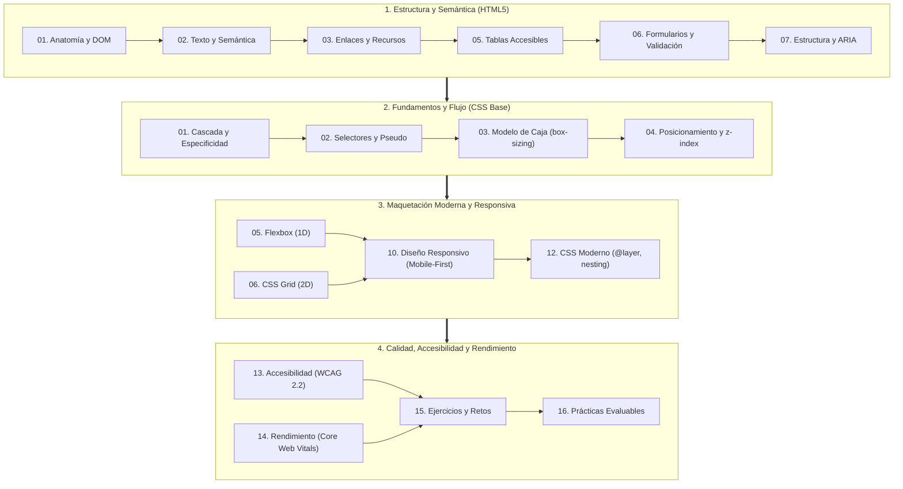

# HTML y CSS · Apuntes de interfaces

HTML5 Living Standard
CSS Moderno
Currículo FP Andalucía

Material de estudio de **HTML5** y **CSS** elaborado como **apoyo a las clases presenciales** de los módulos profesionales de desarrollo e interfaces web en los ciclos formativos de **DAW** (*Desarrollo de Aplicaciones Web*) y **DAM** (*Desarrollo de Aplicaciones Multiplataforma*) en Andalucía.

Todo el contenido está concebido con enfoque de ingeniería: teoría concisa, estándares oficiales W3C/WHATWG, ejemplos comentados, esquemas visuales y baterías de ejercicios resueltos.

| Módulo Profesional | Código | Ciclo | Enfoque y relación curricular |
|---|---|---|---|
| **Lenguajes de marcas y sistemas de gestión de información** | **0373** (LMH) | DAW | HTML5 integral: semántica, formularios, tablas, multimedia, accesibilidad y APIs nativas. |
| **Diseño de interfaces web** | **0615** (DIW) | DAW | CSS de principio a fin: cascada, especificidad, modelo de caja, Flexbox, Grid, diseño responsivo y optimización. |
| **Desarrollo de interfaces** | **0488** (DI) | DAM | Consolidación de maquetación HTML5/CSS previa al desarrollo de SPAs con frameworks (Angular). |

---

## Itinerario formativo de interfaces

El siguiente mapa conceptual ilustra el flujo de aprendizaje recomendado para dominar la construcción de interfaces web accesibles y mantenibles:

---

## Contenidos por módulo

=== "Ruta HTML5 (LMH 0373)"

    Diez capítulos con el temario completo de HTML5 estructurado para clase y laboratorio:

    1. [00. Normativa y marco curricular](html/00-normativa-y-marco-curricular.md) — Resultados de aprendizaje y criterios de evaluación.
    2. [01. Introducción a HTML5](html/01-introduccion-html5.md) — Boilerplate, sintaxis y validación en W3C.
    3. [02. Texto y semántica](html/02-texto-y-semantica.md) — Encabezados `h1-h6`, listas, elementos en línea e ISO 8601.
    4. [03. Enlaces y recursos](html/03-enlaces-y-recursos.md) — Rutas relativas/absolutas, `srcset` y `<picture>`.
    5. [04. Multimedia](html/04-multimedia.md) — `<video>`, `<audio>`, subtítulos WebVTT y accesibilidad.
    6. [05. Tablas de datos](html/05-tablas.md) — `caption`, `thead`, `tbody`, `th scope` y tablas responsivas.
    7. [06. Formularios HTML5](html/06-formularios-html5.md) — Tipos de `input`, Constraint Validation API y `fieldset`.
    8. [07. Estructura semántica y ARIA](html/07-estructura-semantica-y-aria.md) — Landmarks, skip links y accesibilidad.
    9. [08. APIs y funcionalidades nativas](html/08-apis-html5.md) — Web Storage, Canvas y APIs del Living Standard.
    10. [09. Ejercicios](html/09-ejercicios.md) y [10. Soluciones](html/10-ejercicios-soluciones.md) — Retos por niveles con criterios de corrección.
    11. [11. Prácticas](html/11-practicas.md) — Proyectos guiados integrales de aula.

=== "Ruta CSS (DIW 0615 / DI 0488)"

    Diecisiete unidades desde la base hasta la arquitectura CSS contemporánea:

    - **Fundamentos y Modelo de Caja:**
      - [00. Normativa y marco curricular](css/00-normativa-y-marco-curricular.md) · [01. Fundamentos](css/01-fundamentos-de-css.md) · [02. Selectores](css/02-selectores.md) · [03. Modelo de caja](css/03-modelo-de-caja.md)
    - **Sistemas de Maquetación:**
      - [04. Posicionamiento y z-index](css/04-posicionamiento-y-z-index.md) · [05. Flexbox](css/05-flexbox.md) · [06. Grid](css/06-grid.md) · [07. Flujo y display](css/07-flujo-multicolumna-tablas-display.md)
    - **Diseño Visual y Responsividad:**
      - [08. Unidades, tipografía y colores](css/08-unidades-tipografia-colores.md) · [09. Fondos y decoración](css/09-fondos-imagenes-decoracion.md) · [10. Diseño responsivo](css/10-diseno-responsivo.md) · [11. Transiciones y animaciones](css/11-transiciones-animaciones.md)
    - **Arquitectura y Calidad:**
      - [12. CSS moderno y arquitectura](css/12-css-moderno-arquitectura.md) · [13. Accesibilidad](css/13-accesibilidad-usabilidad.md) · [14. Rendimiento](css/14-rendimiento-buenas-practicas.md)
    - **Banco de Práctica:**
      - [15. Ejercicios, glosario y recursos](css/15-ejercicios-glosario-recursos.md) · [15. Soluciones](css/15-ejercicios-soluciones.md) · [16. Prácticas](css/16-practicas.md)

---

## Metodología y claves de preparación

!!! note "Metodología de trabajo en aula y laboratorio"

    - **Separación estricta de responsabilidades (SoC):** HTML estructura el contenido, CSS define la presentación visual y JavaScript añade dinamismo.
    - **Validación continua:** Todo código debe validarse contra el estándar oficial en el [W3C Nu HTML Validator](https://validator.w3.org/nu/) y el [W3C CSS Validation Service](https://jigsaw.w3.org/css-validator/).
    - **Diseño accesible desde el inicio:** La accesibilidad no se añade al final; se construye con semántica nativa, contraste suficiente y foco navegable por teclado.

!!! tip "Recomendaciones para exámenes y proyectos"

    - Cada capítulo cuenta con apartados destacados de **«Claves para el examen»** y avisos de **«Error común»**: son los conceptos donde se concentra la mayor tasa de fallos en evaluaciones.
    - Los ejercicios disponen de soluciones explicadas paso a paso; consulta las soluciones únicamente tras haber completado una implementación propia.
    - Inspecciona el árbol de accesibilidad (*Accessibility Tree*) en las herramientas de desarrollo del navegador para verificar cómo perciben tus interfaces las tecnologías asistivas.
